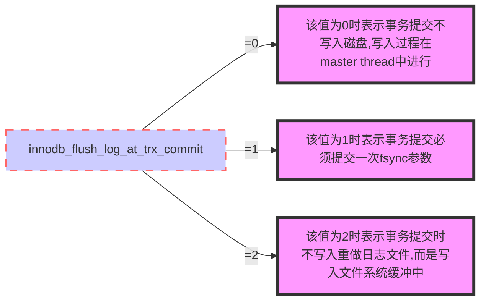

```sql
SHOW DATABASES:
USE 数据库名 :
SHOW TABLES:
SHOW COLUMNS FROM 数据表:
SHOW INDEX FROM 数据表:
SHOW TABLE STATUS  FROM RUNOOB;

CREATE TABLE IF NOT EXISTS `runoob_tbl`(
   `runoob_id` INT UNSIGNED AUTO_INCREMENT,
   `runoob_title` VARCHAR(100) NOT NULL,
   `runoob_author` VARCHAR(40) NOT NULL,
   `submission_date` DATE,
   PRIMARY KEY ( `runoob_id` )
)ENGINE=InnoDB DEFAULT CHARSET=utf8;

INSERT INTO runoob_tbl
(runoob_title, runoob_author, submission_date)
VALUES
("学习 MySQL", "菜鸟教程", NOW());

INSERT INTO runoob_tbl
VALUES
(0, "JAVA 教程", "RUNOOB.COM", '2016-05-06');

// BINARY 关键字，是区分大小写的，
SELECT * from runoob_tbl WHERE BINARY runoob_author='runoob.com';
SELECT * from runoob_tbl WHERE runoob_author='RUNOOB.COM';

UPDATE runoob_tbl SET runoob_title='Study C++' WHERE runoob_id=3;

DELETE FROM runoob_tbl WHERE runoob_id=3;

SELECT * from runoob_tbl  WHERE runoob_author LIKE '%COM';

用于将不同表中相同列中查询的数据展示出来；（不包括重复数据）
SELECT country FROM Websites
UNION
SELECT country FROM apps
ORDER BY country;

用于将不同表中相同列中查询的数据展示出来；（包括重复数据）
SELECT country, name FROM Websites
WHERE country='CN'
UNION ALL
SELECT country, app_name FROM apps
WHERE country='CN'
ORDER BY country;

SELECT *
FROM runoob_tbl
ORDER BY CONVERT(runoob_title using gbk);

SELECT name, COUNT(*) FROM   employee_tbl GROUP BY name;
SELECT name, SUM(singin) as singin_count FROM  employee_tbl GROUP BY name WITH ROLLUP;
SELECT coalesce(name, '总数'), SUM(singin) as singin_count FROM  employee_tbl GROUP BY name WITH ROLLUP;

select coalesce(a,b,c);
如果a==null,则选择b；如果b==null,则选择c；如果a!=null,则选择a；如果a b c 都为null ，则返回为null（没意义）

INNER JOIN
SELECT a.runoob_id, a.runoob_author, b.runoob_count FROM runoob_tbl a INNER JOIN tcount_tbl b ON a.runoob_author = b.runoob_author;
SELECT a.runoob_id, a.runoob_author, b.runoob_count FROM runoob_tbl a, tcount_tbl b WHERE a.runoob_author = b.runoob_author;

MySQL LEFT JOIN
SELECT a.runoob_id, a.runoob_author, b.runoob_count FROM runoob_tbl a LEFT JOIN tcount_tbl b ON a.runoob_author = b.runoob_author;

MySQL RIGHT JOIN
SELECT a.runoob_id, a.runoob_author, b.runoob_count FROM runoob_tbl a RIGHT JOIN tcount_tbl b ON a.runoob_author = b.runoob_author;

NULL
IS NULL: IS NOT NULL: <=>
SELECT * FROM runoob_test_tbl WHERE runoob_count = NULL;
SELECT * FROM runoob_test_tbl WHERE runoob_count IS NULL;

REGEXP
SELECT name FROM person_tbl WHERE name REGEXP '^[aeiou]|ok$';

ALTER
ALTER TABLE testalter_tbl  DROP i;
ALTER TABLE testalter_tbl ADD i INT;
ALTER TABLE testalter_tbl  DROP i;
ALTER TABLE testalter_tbl ADD i INT FIRST;
ALTER TABLE testalter_tbl DROP i;
ALTER TABLE testalter_tbl ADD i INT AFTER c;
ALTER TABLE testalter_tbl MODIFY c CHAR(10);

ALTER TABLE testalter_tbl CHANGE i j BIGINT;
ALTER TABLE testalter_tbl CHANGE j j INT;

ALTER TABLE testalter_tbl
MODIFY j BIGINT NOT NULL DEFAULT 100;

ALTER TABLE testalter_tbl ALTER i SET DEFAULT 1000;

ALTER TABLE testalter_tbl RENAME TO alter_tbl;

SHOW CREATE TABLE runoob_tbl \G;

--创建索引
ALTER TABLE table_name ADD INDEX index_name (column_list)；
CREATE INDEX index_name ON table_name (column_list)；
在create table时创建

第一、只复制表结构到新表
create table 新表 select * from 旧表 where 1=2
create table 新表 like 旧表

第二、复制表结构及数据到新表
create table新表 select * from 旧表

SELECT VERSION()	服务器版本信息
SELECT DATABASE()	当前数据库名 (或者返回空)
SELECT USER()	当前用户名
SHOW STATUS	服务器状态
SHOW VARIABLES	服务器配置变量

AUTO_INCREMENT
CREATE TABLE insect
    -> (
    -> id INT UNSIGNED NOT NULL AUTO_INCREMENT,
    -> PRIMARY KEY (id),
    -> name VARCHAR(30) NOT NULL, # type of insect
    -> date DATE NOT NULL, # date collected
    -> origin VARCHAR(30) NOT NULL # where collected
);

重置序列
ALTER TABLE insect DROP id;
ALTER TABLE insect
ADD id INT UNSIGNED NOT NULL AUTO_INCREMENT FIRST,
ADD PRIMARY KEY (id);

设置序列的开始值
CREATE TABLE insect
    -> (
    -> id INT UNSIGNED NOT NULL AUTO_INCREMENT,
    -> PRIMARY KEY (id),
    -> name VARCHAR(30) NOT NULL,
    -> date DATE NOT NULL,
    -> origin VARCHAR(30) NOT NULL
)engine=innodb auto_increment=100 charset=utf8;
or
ALTER TABLE t AUTO_INCREMENT = 100;

INSERT IGNORE INTO person_tbl (last_name, first_name)
    -> VALUES( 'Jay', 'Thomas');
Query OK, 1 row affected (0.00 sec)
mysql> INSERT IGNORE INTO person_tbl (last_name, first_name)
    -> VALUES( 'Jay', 'Thomas');
Query OK, 0 rows affected (0.00 sec)

```
[国庆肝了8天整整2W字的数据库知识点 三太子敖丙](https://mp.weixin.qq.com/s/J3kCOJwyv2nzvI0_X0tlnA)

# 0. B+ Tree 原理

## 0.1 数据结构

### 0.1.1 Balance

B Tree 指的是 Balance Tree，也就是平衡树，平衡树是一颗查找树，并且所有叶子节点位于同一层。

**B+ Tree 是 B 树的一种变形，它是基于 B Tree 和叶子节点顺序访问指针进行实现，通常用于数据库和操作系统的文件系统中。**

B+ 树有两种类型的节点：内部节点（也称索引节点）和叶子节点，内部节点就是非叶子节点，内部节点不存储数据，只存储索引，数据都存在叶子节点。

非叶子结点不存data，只存key，查询更稳定，增大了广度(B+树出度更大，树高矮，节点小，磁盘IO次数少)；叶子结点下一级指针（范围查询）；索引冗余。

内部节点中的 key 都按照从小到大的顺序排列，对于内部节点中的一个 key，左子树中的所有 key 都小于它，右子树中的 key 都大于等于它，叶子节点的记录也是按照从小到大排列的。

每个叶子节点都存有相邻叶子节点的指针。

B+ 树的叶子节点存储真正的记录，而非叶子节点的存在是为了更快速的找到对应记录所在的叶子节点。

B树
B树（Balance Tree）是一种多路搜索树，它的特点是每个节点包含了多条记录，并且每个节点都尽可能地被填满。在B树中，每个节点最多有m个子节点，其中m称为阶数（order），通常设置为几百或者几千。B树通常用于数据库和文件系统中，能够高效地支持随机访问和范围查询等操作。

B+树
B+树是在B树的基础上进行改进的一种数据结构，它的特点是将非叶子节点中存储的索引和叶子节点中存储的数据分离开来，所有数据记录都存储在叶子节点中。在B+树中，所有叶子节点之间按照顺序连接起来，形成一个链表，因此可以高效地进行范围查询和遍历。同时，B+树还具有良好的稳定性和可扩展性，在实际应用中非常广泛。

**B+ 树是为磁盘或其他直接存取辅助设备设计的一种平衡查找树。在 B+ 树中，所有记录节点都是按键值的大小顺序存放在同一层的叶子节点上，各叶子节点之间通过双向链表进行连接。**


**B+ 树索引并不能找到一个给定键值的具体“行”！B+ 树索引能找到的只是被查找数据行所在的“页”。然后数据库通过把页读入到内存，再在内存中进行查找，最后得到要查找的数据**。

### 0.1.2 表空间

InnoDB 存储引擎中，所有数据都被逻辑地存放在一个空间中，称之为 **表空间（tablespace）**，也就是说我们常说的表，可以看作是 InnoDB 存储引擎逻辑结构的最高层。表空间又由 **段（segment）**、**区（extent）**、**页（page）** 组成（页有时也称为块 block）。


**页是 InnoDB 磁盘管理的最小单位**，在 InnoDB 存储引擎中，默认每个页的大小为 16KB。而页里面存放的东西就是一行一行的记录。
### 0.1.3 B+Tree B+树节点的组成
在数据库的索引结构中，B+树（B-Plus Tree）是一种广泛使用的数据结构，尤其适用于磁盘存储。B+树的主要目标是在保持良好的查找、插入和删除性能的同时，最小化磁盘I/O操作。下面详细解释B+树索引中的元素：

B+树的每个节点由以下部分组成：

1. **键（Keys）**：
   - B+树的内部节点和叶节点都存储键，这些键按照升序排列，用于在树中进行查找和导航。
   - 键用于唯一标识数据项，并且是索引查找的基础。

2. **数据指针（Data Pointers）**：
   - 只存在于叶节点中。每个键对应一个数据指针，指向实际数据行的物理位置（在关系数据库中）或数据本身（在键值存储中）。
   - 数据指针使得B+树能够直接定位到具体的数据记录，而无需进一步的搜索。

3. **子节点指针（Child Node Pointers）**：
   - 内部节点除了存储键之外，还存储指向子节点的指针。这些指针帮助构建树的层次结构，使得树可以进行深度遍历。
   - 子节点指针用于导航到树的下一层，从而逐步缩小查找范围。

4. **相邻节点指针（Sibling Pointers）**：
   - 叶节点之间通常有双向链接，即每个叶节点都有一个指向前一个和后一个叶节点的指针。
   - 这些链接简化了范围查询，因为一旦到达范围内的第一个叶节点，就可以沿着链接快速遍历所有相关节点。

### 0.1.4 B+树的特性

- **所有数据都在叶节点**：在B+树中，所有的数据记录都存储在叶节点上，而内部节点仅用于索引和导航。
- **叶节点的连续性**：叶节点之间的链接使得范围查询非常高效。
- **高扇出度**：B+树通常设计成每个节点可以存储很多键，这减少了树的高度，进而减少了查找所需的磁盘I/O次数。
- **平衡性**：B+树是自平衡的，所有叶节点都位于同一层，确保了所有查找操作的时间复杂度都是对数级别的。

B+树的这些设计特点使其成为数据库索引的理想选择，尤其是在处理大量数据和频繁的磁盘I/O操作时。

## 0.2 操作

### 0.2.1 查找

查找以典型的方式进行，类似于二叉查找树。起始于根节点，自顶向下遍历树，选择其分离值在要查找值的任意一边的子指针。在节点内部典型的使用是二分查找来确定这个位置。

### 0.2.2 插入

- Perform a search to determine what bucket the new record should go into.

- If the bucket is not full(a most b - 1 entries after the insertion，b 是节点中的元素个数，一般是页的整数倍),add tht record.

- Otherwise,before inserting the new record

- - original node has 「(L+1)/2」items
    - new node has 「(L+1)/2」items
    - split the bucket.
    - Move  「(L+1)/2」-th key to the parent,and insert the new node to the parent.
    - Repeat until a parent is found that need not split.

- If the root splits,treat it as if it has an empty parent ans split as outline above.

B-trees grow as the root and not at the leaves.

### 0.2.3 删除

和插入类似，只不过是自下而上的合并操作。

## 0.3 树的常见特性

### 0.3.1 **AVL 树**

平衡二叉树，一般是用平衡因子差值决定并通过旋转来实现，左右子树树高差不超过1，那么和红黑树比较它是严格的平衡二叉树，平衡条件非常严格（树高差只有1），只要插入或删除不满足上面的条件就要通过旋转来保持平衡。由于旋转是非常耗费时间的。所以 AVL 树适用于插入/删除次数比较少，但查找多的场景。

### 0.3.2 **红黑树**

通过对从根节点到叶子节点路径上各个节点的颜色进行约束，确保没有一条路径会比其他路径长2倍，因而是近似平衡的。所以相对于严格要求平衡的AVL树来说，它的旋转保持平衡次数较少。适合，查找少，插入/删除次数多的场景。（现在部分场景使用跳表来替换红黑树，可搜索“为啥 redis 使用跳表(skiplist)而不是使用 red-black？”）

### 0.3.3 **B/B+ 树**

多路查找树，出度高，磁盘IO低，一般用于数据库系统中。

## 0.4 B + 树与红黑树的比较

红黑树等平衡树也可以用来实现索引，但是文件系统及数据库系统普遍采用 B+ Tree 作为索引结构，主要有以下两个原因：

### 0.4.1 磁盘 IO 次数-更少查询次数

B+ 树一个节点可以存储多个元素，相对于红黑树的树高更低，磁盘 IO 次数更少。B+树出度更大，树高更低，查询次数更少

### 0.4.2 磁盘预读特性

为了减少磁盘 I/O 操作，磁盘往往不是严格按需读取，而是每次都会预读。预读过程中，磁盘进行顺序读取，顺序读取不需要进行磁盘寻道。每次会读取页的整数倍。

B+树叶子**结点存储相临**，**读取会快一些**。

操作系统一般将内存和磁盘分割成固定大小的块，每一块称为一页，内存与磁盘以页为单位交换数据。数据库系统将索引的一个节点的大小设置为页的大小，使得一次 I/O 就能完全载入一个节点。

### 0.4.3 存储更多索引结点：

B+树只在叶子结点储存数据，非叶子结点存索引，而一个结点就是磁盘一个内存页，内存页大小固定，那么相比B树这些可以·存更多的索引结点，出度更大，树高矮，查询次数少，磁盘IO少。

## 0.5 B + 树与 B 树的比较

### 0.5.1 B+ 树的磁盘 IO 更低

B+ 树的内部节点并没有指向关键字具体信息的指针。因此其内部节点相对 B 树更小。如果把所有同一内部结点的关键字存放在同一盘块中，那么盘块所能容纳的关键字数量也越多。一次性读入内存中的需要查找的关键字也就越多。相对来说IO读写次数也就降低了。

### 0.5.2 B+ 树的查询效率更加稳定

由于非叶子结点并不是最终指向文件内容的结点，而只是叶子结点中关键字的索引。所以任何关键字的查找必须走一条从根结点到叶子结点的路。所有关键字查询的路径长度相同，导致每一个数据的查询效率相当。

### 0.5.3 B+ 树元素遍历效率高

B 树在提高了磁盘IO性能的同时并没有解决元素遍历的效率低下的问题。正是为了解决这个问题，B+树应运而生。B+树只要遍历叶子节点就可以实现整棵树的遍历。而且在数据库中基于范围的查询是非常频繁的，而 B 树不支持这样的操作（或者说效率太低）。

# 1. 三个范式是什么

## 1.0 定义
### 范式
是“符合某一种级别的关系模式的集合，表示一个关系内部各属性之间的联系的合理化程度”。
一张数据表的表结构所符合的某种设计标准的级别

> 第一范式（1NF）：**数据库表中的字段都是单一属性的，不可再分**。这个单一属性由基本类型构成，包括整型、实数、字符型、逻辑型、日期型等。
> 第二范式（2NF）：数据库表中不存在非关键字段对任一候选关键字段的部分函数依赖（部分函数依赖指的是存在组合关键字中的某些字段决定非关键字段的情况），也即**所有非关键字段都完全依赖于任意一组候选关键字。**
> 第三范式（3NF）：在第二范式的基础上，数据表中如果**不存在非关键字段对任一候选关键字段的传递函数依赖**则符合第三范式。所谓传递函数依赖，指的是如果存在"A → B → C"的决定关系，则C传递函数依赖于A。因此，满足第三范式的数据库表应该不存在如下依赖关系： 关键字段 → 非关键字段x → 非关键字段y “非主键字段不能相互依赖，任何非主属性不依赖于其它非主属性。”
上面的文字我们肯定是看不懂的，也不愿意看下去的。接下来我就总结一下：

首先要明确的是：满足着第三范式，那么就一定满足第二范式、满足着第二范式就一定满足第一范式
## 1.1 第一范式：字段是最小的的单元不可再分
学生信息组成学生信息表，有年龄、性别、学号等信息组成。这些字段都不可再分，所以它是满足第一范式的
## 1.2 第二范式：满足第一范式,表中的字段必须完全依赖于全部主键而非部分主键。
其他字段组成的这行记录和主键表示的是同一个东西，而主键是唯一的，它们只需要依赖于主键，也就成了唯一的
学号为1024的同学，姓名为Java3y，年龄是22岁。姓名和年龄字段都依赖着学号主键。
## 1.3 第三范式：满足第二范式，非主键外的所有字段必须互不依赖
就是数据只在一个地方存储，不重复出现在多张表中，可以认为就是消除传递依赖
比如，我们大学分了很多系（中文系、英语系、计算机系……），
这个系别管理表信息有以下字段组成：系编号，系主任，系简介，系架构。
那我们能不能在学生信息表添加系编号，系主任，系简介，系架构字段呢？
不行的，因为这样就冗余了，非主键外的字段形成了依赖关系(依赖到学生信息表了)！
正确的做法是：学生表就只能增加一个系编号字段。
## 1.4 4NF：满足3NF,消除表中的多值依赖

## 1.5 范式的目标
应用数据库范式可以带来许多好处，但是最重要的好处归结为三点：


1. **减少数据冗余**：
    - 减少数据冗余（这是最主要的好处，其他好处都是由此而附带的）
    - 减少数据库中数据的重复存储，以减少存储空间的需求。
    - 通过减少冗余数据，可以降低更新数据时出错的概率。
2. **提高数据一致性**：
    - 确保数据在数据库中的表示是统一和一致的。
    - 减少数据冗余可以减少数据冲突和不一致的可能性。
3. **简化数据维护**：
    - 通过减少数据冗余，简化了数据库的维护工作。
    - 数据更新、插入和删除操作变得更加简单和直接。
4. **支持模块化设计**：
    - 促进数据库设计的模块化，使得数据库更容易扩展和修改。
    - 各个表之间的职责清晰，便于维护和管理。
5. **提高查询效率**：
    - 尽管规范化可能会导致更多的表和更复杂的查询，但在合理设计的情况下，规范化可以提高查询效率。
    - 规范化可以减少不必要的数据加载和更新操作。
6. **支持数据完整性**：
    - 规范化有助于实施数据完整性约束，如外键约束，从而确保数据的一致性和准确性。
7. 消除异常（插入异常，更新异常，删除异常）
8. 让数据组织的更加和谐…


  [数据库范式那些事](https://www.cnblogs.com/CareySon/archive/2010/02/16/1668803.html)


## **1.6 范式优点与缺点：**

**优点：**

范式化，重复冗余数据少，更新快，修改少，查询时更少的distinck kt
1. **减少数据冗余**：通过规范化，相同的数据不会在多个地方重复存储，这减少了存储空间的需求，同时也减少了更新数据时需要维护的地点数量。
2. **提高数据一致性**：规范化减少了数据冗余，也就减少了数据不一致的可能性。当数据分布在多个表中时，更新操作只需在一个地方进行，降低了数据冲突的风险。
3. **简化数据维护**：规范化的设计使数据库更容易维护，因为数据的完整性约束（如外键）可以更有效地实施，减少了数据维护的复杂性。
4. **提高查询效率**：虽然规范化可能导致更多的表和更复杂的查询，但对于大型数据集和复杂查询，规范化设计通常可以提供更有效的查询路径，尤其是在使用合适的索引时。
5. **支持模块化设计**：规范化促进了数据库设计的模块化，使得数据库可以更轻松地扩展和修改，而不会影响到其他部分的功能。

**缺点：**

因为一个表不存在冗余重复数据，**查询可能造成很多关联**，效率变低，可能使一些**索引策略无效**，范式化将列存在不同表中，这些列若在同一个表中可以是一个索引。
1. **性能开销**：规范化可能导致数据分布到多个表中，这增加了连接操作的需要，可能会降低查询性能，尤其是对于需要从多个表中提取数据的复杂查询。
2. **设计复杂性**：遵循高阶范式可能使数据库设计变得更加复杂，需要更多的表和更复杂的关联关系，这可能会增加开发和维护的成本。
3. **数据加载和更新开销**：规范化设计可能需要在数据加载或更新时执行更多的操作，以确保跨表的一致性和完整性，这可能增加系统的总体延迟。
4. **可能的查询优化困难**：虽然规范化有助于减少数据冗余，但它也可能使某些查询的优化变得更具挑战性，特别是在需要从多个表中提取数据的情况下。
5. **反规范化的需求**：在某些情况下，为了提高性能，可能需要反规范化（denormalization）一些数据，即有意引入冗余来减少查询时的连接操作，但这会增加数据维护的复杂性。

# 2. 什么是存储过程？有哪些优缺点？
存储过程就像我们编程语言中的函数一样，封装了我们的代码(PLSQL、T-SQL)。
## 2.1 存储过程的优点：
1. 能够将代码封装起来，通过存储过程能够使没有权限的用户在控制之下间接地存取数据库，从而确保数据的安全。
2. 保存在数据库之中
3. 让编程语言进行调用
4. 存储过程是一个预编译的代码块，执行效率比较高，（由于数据库执行动作时，是先编译后执行的。然而存储过程是一个编译过的代码块，所以执行效率要比T-SQL语句高。）
5. 一个存储过程替代大量T_SQL语句 ，可以降低网络通信量，提高通信速率
## 2.2 存储过程的缺点：
每个数据库的存储过程语法几乎都不一样，十分难以维护（不通用）
业务逻辑放在数据库上，难以迭代

## 2.3 触发器

触发器是特殊的存储过程，它在特定的数据库活动发生时自动执行。触发器可以与特定表上的`INSERT` 、`UPDATE` 和`DELETE` 操作（或组合）相关联。

与存储过程不一样（存储过程只是简单的存储SQL语句），触发器与单个的表相关联。与`Orders` 表上的`INSERT` 操作相关联的触发器只在`Orders` 表中插入行时执行。

常见用途。

- 保证数据一致。例如，在`INSERT` 或`UPDATE` 操作中将所有州名转换为大写。
- 基于某个表的变动在其他表上执行活动。例如，每当更新或删除一行时将审计跟踪记录写入某个日志表。
- 进行额外的验证并根据需要回退数据。例如，保证某个顾客的可用资金不超限定，如果已经超出，则阻塞插入。
- 计算计算列的值或更新时间戳。

# 3. 什么是视图？以及视图的使用场景有哪些？
## 3.1 视图是一种基于数据表的一种虚表
（1）视图是一种虚表
（2）视图建立在已有表的基础上, 视图赖以建立的这些表称为基表
（3）向视图提供数据内容的语句为 SELECT 语句,可以将视图理解为存储起来的 SELECT 语句
（4）视图向用户提供基表数据的另一种表现形式
（5）视图没有存储真正的数据，真正的数据还是存储在基表中
（6）程序员虽然操作的是视图，但最终视图还会转成操作基表
（7）一个基表可以有0个或多个视图

## 3.2 视图使用场景
有的时候，我们可能只关系一张数据表中的某些字段，而另外的一些人只关系同一张数据表的某些字段...
那么把全部的字段都都显示给他们看，这是不合理的。
我们应该做到：他们想看到什么样的数据，我们就给他们什么样的数据...一方面就能够让他们只关注自己的数据，另一方面，我们也保证数据表一些保密的数据不会泄露出来...

视图（View）是数据库中的一种虚拟表，它并不实际存储数据，而是代表一个SQL查询的结果集。视图可以简化复杂的查询，提供数据的安全访问，并允许用户以不同的视角查看数据。下面是视图的一些典型使用场景：

1. 简化复杂查询
- **场景描述**：当需要执行复杂的查询操作时，视图可以将这些复杂的查询封装起来，使得用户可以使用简单的查询语句来访问数据。
- **应用场景**：例如，一个报表系统可能需要从多个表中汇总数据并进行复杂的计算。创建一个视图来封装这些操作可以让用户直接从视图中获取所需的数据，而无需了解底层的复杂性。
2. 数据安全和权限控制
- **场景描述**：视图可以被设计为只展示特定的数据子集，从而实现数据的安全访问。
- **应用场景**：例如，在一个企业中，可能希望某些员工只能看到他们部门的数据，而不是整个公司的数据。通过创建一个视图来限制数据访问范围，可以确保数据安全。
3. 数据抽象
- **场景描述**：视图可以隐藏底层表的结构，提供一个更高层次的数据抽象。
- **应用场景**：例如，在一个面向客户的系统中，可能希望客户只能看到他们关心的数据字段，而不是所有可能的数据字段。视图可以隐藏不必要的细节，使用户界面更加简洁。
4. 提供一致的数据视图
- **场景描述**：视图可以确保所有用户看到的数据是一致的，即使底层数据发生了变化。
- **应用场景**：例如，在一个报告系统中，可能需要显示过去一周的销售数据。创建一个视图来封装这些数据，可以确保所有使用该视图的用户看到的数据是一致的，无论何时查询。
5. 提高查询效率
- **场景描述**：通过创建索引或使用物化视图（Materialized View），可以提高特定查询的性能。
- **应用场景**：例如，如果某个查询非常频繁地被执行，并且数据变化不大，可以创建一个物化视图来存储查询结果，从而减少查询时间和I/O操作。
6. 简化多表联接
- **场景描述**：当需要频繁地联接多个表时，可以创建一个视图来封装这些联接操作。
- **应用场景**：例如，在一个订单处理系统中，可能需要联接订单表、客户表和产品表。创建一个视图来封装这些联接操作可以让用户直接查询视图，而无需编写复杂的联接语句。
7. 数据汇总和聚合
- **场景描述**：视图可以用来执行数据汇总和聚合操作。
- **应用场景**：例如，一个销售报告可能需要显示每个产品的总销售额。创建一个视图来执行这些汇总操作可以让用户直接查询视图来获取结果。
8. 数据备份和恢复
- **场景描述**：视图可以用来创建数据的快照，用于备份和恢复。
- **应用场景**：例如，在数据迁移过程中，可以创建一个视图来捕获特定时间点的数据状态，以便在需要时恢复。
9. 数据治理和合规性
- **场景描述**：视图可以用来控制数据的访问和使用，确保数据治理和合规性要求得到满足。
- **应用场景**：例如，在医疗保健行业中，可能需要确保只有授权人员才能访问患者数据。通过创建特定的视图来控制数据访问，可以满足这些要求。
10. 应用程序接口
- **场景描述**：视图可以作为应用程序和数据库之间的接口，提供一个统一的数据访问层。
- **应用场景**：例如，在一个Web应用程序中，可以创建视图来封装所有需要的数据查询，从而使应用程序代码更加简洁和易于维护。
综上所述，视图是一种非常有用的工具，可以简化复杂的查询、提高数据安全性、提供数据抽象、简化多表联接等，从而提高应用程序的性能和用户体验。
# 4. 事务

## 4.1 什么是事务？

MySQL 事务主要用于处理操作量大，复杂度高的数据。
> 比如说，在人员管理系统中，你删除一个人员，你既需要删除人员的基本资料，也要删除和该人员相关的信息，如信箱，文章等等，这样，这些数据库操作语句就构成一个事务！
事务简单来说：一个Session中所进行所有的操作，要么同时成功，要么同时失败

事务（Transaction）是<u>并发控制的基本单位</u>。
所谓的事务，它是一个操作序列，这些操作要么都执行，要么都不执行，它是一个不可分割的工作单位。
事务是数据库维护数据一致性的单位，在每个事务结束时，都能保持数据一致性。

是指满足 ACID 特性的一组操作，可以通过 Commit 提交一个事务，也可以使用 Rollback 进行回滚。

- 在 MySQL 中只有使用了 Innodb 数据库引擎的数据库或表才支持事务。
- 事务处理可以用来维护数据库的完整性，保证成批的 SQL 语句要么全部执行，要么全部不执行。
- 事务用来管理 insert,update,delete 语句

## 4.2 ACID — 数据库事务正确执行的四个基本要素
事务是必须满足4个条件（ACID）：
- **原子性**（Atomicity，或称不可分割性）、
  * 事务中的所有元素作为一个整体提交或回滚，事务的个元素是不可分的，事务是一个完整操作。只有执行成功和失败回滚两种状态，没有中间态.
- **一致性**（Consistency）、
    * 事物完成时，数据必须是一致的，也就是说，和事物开始之前，数据存储中的数据处于一致状态。保证数据的无损。
- **隔离性**（Isolation，又称独立性）
  * 对数据进行修改的多个事务是彼此隔离的。这表明事务必须是独立的，不应该以任何方式以来于或影响其他事务。
- **持久性**（Durability）
  * 事务完成之后，它对于系统的影响是永久的，该修改即使出现系统故障也将一直保留，真实的修改了数据库

> 只有满足**一致性**，事务的结果才是正确的。
>
> 在<u>无并发</u>的情况下，事务串行执行，**隔离性**一定能够满足。此时只要能满足**原子性**，就一定能满足**一致性**。
>
> 在<u>并发</u>的情况下，多个事务并行执行，事务不仅要满足**原子性**，还需要满足**隔离性**，才能满足**一致性**。
>
> 事务满足**持久化**是为了能应对数据库崩溃的情况。
>
> **C(一致性)是目的，A(原子性)、I(隔离性)、D(持久性)是手段**。

## 4.3 事务的语句
### 4.3.1 语句
显示事务被用begin transaction 与 end transaction 标识起来，其中的 update 与 delete 语句或者全部执行或者全部不执行。
  `BEGIN` 或 `START TRANSACTION` 显式地开启一个事务；
  `COMMIT` 也可以使用 `COMMIT WORK`，不过二者是等价的。COMMIT 会提交事务，并使已对数据库进行的所有修改成为永久性的；
  `ROLLBACK` 也可以使用 `ROLLBACK WORK`，不过二者是等价的。回滚会结束用户的事务，并撤销正在进行的所有未提交的修改；
  `SAVEPOINT identifier`，`SAVEPOINT` 允许在事务中创建一个保存点，一个事务中可以有多个 SAVEPOINT；
  `RELEASE SAVEPOINT identifier` 删除一个事务的保存点，当没有指定的保存点时，执行该语句会抛出一个异常；
  `ROLLBACK TO identifier` 把事务回滚到标记点；
  `SET TRANSACTION` 用来设置事务的隔离级别。InnoDB 存储引擎提供事务的隔离级别有`READ UNCOMMITTED`、`READ COMMITTED`、`REPEATABLE READ` 和 `SERIALIZABLE`,包括读未提交（Read uncommitted）、读提交（read committed）、可重复读（repeatable read）和串行化（Serializable）


>  更改默认的提交行为

> 正如所述，默认的MySQL行为是自动提交所有更改。换句话说，任何时候你执行一条MySQL语句，该语句实际上都是针对表执行的，而且所做的更改立即生效。
>
> 为指示MySQL不自动提交更改，需要使用以下语句：
>
> 输入`SET autocommit=0;`分析autocommit标志决定是否自动提交更改，不管有没有COMMIT语句。设置autocommit为0（假）指示MySQL不自动提交更改（直到autocommit被设置为真为止）。

## 4.4 事务的保存点
### 4.4.1 savepoint保存点定义
用户在事务（transaction）内可以声明（declare）被称为保存点（savepoint）的标记。保存点将一个大事务划分为较小的片断。
SAVE TRANSACTION 保存点名称 --自定义保存点的名称和位置
ROLLBACK TRANSACTION 保存点名称 --回滚到自定义的保存点
### 4.4.2 回滚过程
将事务（transaction）回滚（roll back）到某个保存点（savepoint）的过程如下：
1. Oracle 回滚指定保存点之后的语句
2. Oracle 保留指定的保存点，但其后创建的保存点都将被清除
3. Oracle 释放此保存点后获得的表级锁（table lock）与行级锁（rowlock），但之前的数据锁依然保留。
### 4.4.3 删除 SAVEPOINT
保留点再事务处理完成（执行一条 ROLLBACK 或 COMMIT）后自动释放。
MySQL5 以来，可以用:
RELEASE SAVEPOINT savepoint_name;  // 删除指定保留点

## 4.5 MYSQL 事务处理主要有两种方法：
### 4.5.1 用 BEGIN, ROLLBACK, COMMIT来实现
BEGIN 开始一个事务
ROLLBACK 事务回滚
COMMIT 事务确认
### 4.5.2 直接用 SET 来改变 MySQL 的自动提交模式:
SET AUTOCOMMIT=0 禁止自动提交
SET AUTOCOMMIT=1 开启自动提交

## 4.6 脏读、不可重复读、幻读、
### 4.6.1 脏读：
一个事务读取到另外一个事务未提交的数据

例子：A向B转账，A执行了转账语句，但A还没有提交事务，B读取数据，发现自己账户钱变多了！B跟A说，我已经收到钱了。A回滚事务【rollback】，等B再查看账户的钱时，发现钱并没有多。
设想一个事务已经将一些数据写入数据库，但还没有提交。另一个事务可以看到未提交的数据吗？如果是的话，这就叫做脏读。

T1 修改一个数据，T2 随后读取这个数据。如果 T1 撤销了这次修改，那么 T2 读取的数据是脏数据。


如果两个事务尝试更新数据库中的相同数据，会发生什么情况？通常后面的写入会覆盖前面的写入。但是，如果先前的写入尚未提交，后面的写入又覆盖了这个尚未提交的值，会怎么样呢？这就叫做脏写。

### 4.6.2 不可重复读：
一个事务读取到另外一个事务已经提交的数据，也就是说一个事务可以看到其他事务所做的修改
注：T2查询数据库得到数据，T1去修改数据库的数据，导致T2多次查询数据库的结果都不一样【危害：T2每次查询的结果都是受T1的影响的，那么T2查询出来的信息就没有意义了】

T2 读取一个数据，T1 对该数据做了修改。如果 T2 再次读取这个数据，此时读取的结果和第一次读取的结果不同。


### 4.6.3 虚读(幻读)Phantom Proble：
是指在一个事务内读取到了别的事务插入的数据，导致前后读取不一致。
注：和不可重复读类似，但虚读(幻读)会读到其他事务的插入的数据，导致前后读取不一致

简单总结：
脏读是不可容忍的，不可重复读和虚读在一定的情况下是可以的【做统计的肯定就不行】。

[Mysql架构&事务原理与锁机制&MVCC日志（undo log redolog binlog）两阶段提交&组提交](https://blog.csdn.net/qq_43666365/article/details/117390850?spm=1001.2014.3001.5501)

## 4.7 事务隔离级别
数据库定义了4个隔离级别：

未提交读、提交读、可重复读、可串行化

- Serializable（可串行化）【可避免脏读，不可重复读，虚读】
    - 强制事务串行执行。需要加锁实现，而其它隔离级别通常不需要。读加共享锁，写加排他锁，串行执行

- Repeatable Read（可重读）【可避免脏读，不可重复读】
    - 保证在同一个事务中多次读取同样数据的结果是一样的。
    - MVCC实现，只有事务开始时会创建Read View，之后事务里的其他查询都用这个Read View。解决了脏读、不可重复读，快照读（普通查询，读取历史数据）使用MVCC解决了幻读，当前读（读取最新提交数据）通过间隙锁解决幻读（lock in share mode、for update、update、detete、insert），间隙锁在可重复读下才生效。（**默认隔离级别**）

- Read Committed（读取提交内容） 【可避免脏读】
    - 一个事务只能读取已经提交的事务所做的修改。换句话说，一个事务所做的修改在提交之前对其他事务是不可见的。
    - 读操作不加锁，写操作加排他锁，解决了脏读。原理：利用MVCC实现，每一句语句执行前都会生成Read View（一致性视图）

- Read Uncommitted（读取未提交内容）【级别最低，什么都避免不了】
    - 事务中的修改，即使没有提交，对其他事务也是可见的。


**总结：**读已提交和可重复读实现原理就是MVCC Read View不同的生成时机。可重复读只在事务开始时生成一个Read View，之后都用的这个；读已提交每次执行前都会生成Read View。


|     隔离级别     | 脏读 | 不可重复读 | 幻读 |
| --------------- | ---- | --------- | ---- |
| Read uncommited | O    | O         | O    |
| Read commited   | x    | O         | O    |
| Repeatableread  | x    | x         | O    |
| Serializable    | x    | x         | x    |

在事务的隔离级别中，"可重读"（Repeatable Read）级别是比较常用的一种级别。Repeatable Read可以避免脏读和不可重复读，但无法完全避免幻读。

脏读是指一个事务读取到了另一个事务未提交的数据，可能会导致不一致的结果。在Repeatable Read级别下，事务会对读取的每一行数据加共享锁（Shared Lock），从而确保其他事务无法修改这些数据，从而避免了脏读。

不可重复读是指一个事务在同一查询中多次读取同一行数据时，得到了不同的结果，这是由于其他事务修改了这些数据。在Repeatable Read级别下，事务会对读取的范围加共享锁，从而保证其他事务无法修改或删除这些数据，从而避免了不可重复读。

然而，Repeatable Read级别无法完全避免幻读。幻读是指一个事务在同一查询中多次读取到了不同数量的行，这是由于其他事务插入了符合查询条件的数据。在Repeatable Read级别下，只对读取的范围加共享锁，并没有锁定整个表，因此其他事务可以在该范围内插入新数据，导致出现幻读。

要解决幻读问题，可以使用更高级别的隔离级别，例如Serializable（串行化）级别，或者使用乐观锁或悲观锁来进行控制。在Serializable级别下，事务会对整个查询的范围加表级锁，避免了幻读的发生。而乐观锁和悲观锁可以通过额外的字段或锁机制来确保数据的一致性，进一步避免幻读的问题。

因此，虽然Repeatable Read级别可以避免脏读和不可重复读，但无法完全避免幻读。根据具体的业务需求，可以选择相应的隔离级别和锁机制来权衡一致性和并发性。

[MySQL 四种隔离级别](https://zhuanlan.zhihu.com/p/76743929)
[我以为我对Mysql事务很熟，直到我遇到了阿里面试官](https://zhuanlan.zhihu.com/p/148035779)
[事务、ACID、脏读、脏写、幻读、读已提交、快照隔离、读写锁、两阶段锁定 的区别与联系](https://zhuanlan.zhihu.com/p/69380112)


## 4.8 ACID实现原理

原子性：undolog（记录事务开始前的老版本数据，可以保证原子操作，回滚，实现MVCC版本链）

隔离性：MVCC

持久性：redo log（记录事务开启后对数据的修改，可用于crash-safe）

ACID是数据库事务处理的基本原则，代表着Atomicity（原子性）、Consistency（一致性）、Isolation（隔离性）、Durability（持久性）。ACID特性的实现涉及多种数据库技术和机制，下面逐一介绍：

### 4.8.1. 原子性（Atomicity）

原子性要求事务中的所有操作要么全部成功，要么全部失败，不能部分执行。如果事务在执行过程中因某种原因中断，那么所有已完成的操作将被回滚，数据库回到事务开始前的状态。

- **实现原理**：
  - **日志（Logging）**：使用redo和undo日志记录事务的更改。如果事务成功，redo日志用于持久化更改；如果事务失败，undo日志用于撤销更改。
  - **检查点（Checkpoint）**：定期将内存中的数据和日志写入磁盘，确保在崩溃时可以从日志恢复数据。

### 4.8.2. 一致性（Consistency）

一致性确保事务执行前后，数据库必须处于一致状态，满足所有预定义的约束和业务规则。

- **实现原理**：
  - **约束检查**：在事务执行过程中，数据库检查所有预定义的约束，如主键、外键、唯一性和检查约束。
  - **事务隔离级别**：通过不同的隔离级别（如READ UNCOMMITTED、READ COMMITTED、REPEATABLE READ、SERIALIZABLE）控制事务间的可见性和并发冲突。

### 4.8.3. 隔离性（Isolation）

隔离性防止并发事务之间的相互干扰，确保事务独立执行，如同系统中只有该事务在运行一样。

- **实现原理**：
  - **锁机制**：使用共享锁（S锁）和排他锁（X锁）控制并发事务对数据的访问。
  - **多版本并发控制（MVCC）**：允许并发读取而无需加锁，通过保存数据的多个版本来实现。

### 4.8.4. 持久性（Durability）

持久性保证一旦事务被提交，即使系统崩溃，其对数据库的更改也不会丢失。

- **实现原理**：
  - **日志先写（Write-Ahead Logging，WAL）**：在数据修改写入磁盘之前，先将redo日志写入磁盘，确保在系统崩溃时可以恢复数据。
  - **检查点**：定期将缓冲池中的脏页（已修改但未写入磁盘的页面）写入磁盘，减少崩溃恢复时需要处理的日志量。

### 4.8.5 综合机制

ACID特性的实现是通过多种机制的综合运用，包括但不限于日志、锁、检查点、缓冲区管理、事务管理器和恢复管理器等。例如，事务管理器负责事务的开始、提交和回滚，而恢复管理器在系统崩溃后使用日志恢复数据。

在现代数据库系统中，如PostgreSQL、Oracle、MySQL的InnoDB存储引擎等，都实现了复杂的ACID特性支持，确保了数据的可靠性和事务的一致性。

# 5.索引

## 5.0 索引是什么？

索引是对数据库表中一或多个列的值进行排序的结构，是帮助MySQL高效获取数据的数据结构

你也可以这样理解：索引就是加快检索表中数据的方法。数据库的索引类似于书籍的索引。

在书籍中，索引允许用户不必翻阅完整个书就能迅速地找到所需要的信息。

在数据库中，索引也允许数据库程序迅速地找到表中的数据，而不必扫描整个数据库。
索引加快数据库的检索速度
索引降低了插入、删除、修改等维护任务的速度
唯一索引可以确保每一行数据的唯一性
通过使用索引，可以在查询的过程中使用优化隐藏器，提高系统的性能
索引需要占物理和数据空间

## 5.1 索引实现

索引是在存储引擎层实现的，而不是在服务器层实现的，所以不同存储引擎具有不同的索引类型和实现。

### 5.1.1 B+ Tree 索引

是大多数 MySQL 存储引擎的默认索引类型。

- 因为不再需要进行全表扫描，只需要对树进行搜索即可，所以查找速度快很多。
- 因为 B+ Tree 的有序性，所以除了用于查找，还可以用于排序和分组。
- 可以指定多个列作为索引列，多个索引列共同组成键。
- 适用于全键值、键值范围和键前缀查找，其中键前缀查找只适用于最左前缀查找。如果不是按照索引列的顺序进行查找，则无法使用索引。

InnoDB 的 B+Tree 索引分为主索引和辅助索引。主索引的叶子节点 data 域记录着完整的数据记录，这种索引方式被称为聚簇索引。因为无法把数据行存放在两个不同的地方，所以一个表只能有一个聚簇索引。

辅助索引的叶子节点的 data 域记录着主键的值，因此在使用辅助索引进行查找时，需要先查找到主键值，然后再到主索引中进行查找，这个过程也被称作回表。

### 5.1.2 哈希索引

哈希索引能以 O(1) 时间进行查找，但是失去了有序性：

- 无法用于排序与分组；
- 只支持精确查找，无法用于部分查找和范围查找。

那么对于这样一个索引结构，现在来执行下面的sql语句：

`select * from sanguo where name='鸡蛋'`

可以直接对‘鸡蛋’按哈希算法算出来一个数组下标，然后可以直接从数据中取出数据并拿到所对应那一行数据的地址，进而查询那一行数据， 那么如果现在执行下面的sql语句：

`select * from sanguo where name>'鸡蛋'`

则无能为力，因为哈希表的特点就是**可以快速的精确查询，但是不支持范围查询**。无法用于排序分组，无法模糊查询

如果做成了索引，那速度也是很慢的，要全部扫描。多列索引的最左前缀匹配原则，总要回表操作等。

InnoDB 存储引擎有一个特殊的功能叫“自适应哈希索引”，当某个索引值被使用的非常频繁时，会在 B+Tree 索引之上再创建一个哈希索引，这样就让 B+Tree 索引具有哈希索引的一些优点，比如快速的哈希查找。

### 5.1.3 全文索引

MyISAM 存储引擎支持全文索引，用于查找文本中的关键词，而不是直接比较是否相等。

查找条件使用 MATCH AGAINST，而不是普通的 WHERE。

全文索引使用倒排索引实现，它记录着关键词到其所在文档的映射。

InnoDB 存储引擎在 MySQL 5.6.4 版本中也开始支持全文索引。

全文索引（Full-text Index）是一种特殊的数据库索引类型，用于在大量文本数据中高效地进行关键字搜索。它允许执行复杂的全文搜索查询，包括自然语言搜索、近义词搜索、布尔运算符搜索等。全文索引在文档检索、搜索引擎、内容管理系统等领域有广泛应用。

#### 5.1.3.1 全文索引的实现原理

全文索引的实现通常涉及以下几个关键步骤：

1. **分词（Tokenization）**：将文本分割成单个词汇或短语，这是建立全文索引的第一步。分词算法可以简单（如按空格分割）或复杂（如基于语言规则和词典的分词）。
2. **标准化（Normalization）**：将分词后的词汇转换为统一的形式，如小写化、去除标点符号、词干提取（Stemming）和词形还原（Lemmatization），以减少索引的大小并提高搜索效率。
3. **倒排索引（Inverted Index）**：这是全文索引的核心数据结构。倒排索引是一种将词汇映射到包含该词汇的文档列表的数据结构。与正向索引（将文档映射到词汇列表）相反，倒排索引可以快速找出包含特定关键词的所有文档。
4. **权重计算**：为了确定搜索结果的相关性，全文索引通常使用TF-IDF（Term Frequency-Inverse Document Frequency）或其他相似度算法来计算关键词在文档中的重要性。
5. **查询解析**：解析用户的查询请求，将其转换为可以与索引进行比较的格式，然后执行搜索。
6. **结果排序**：根据文档与查询的相关性对搜索结果进行排序，相关性越高的文档排名越靠前。

#### 5.1.3.2 全文索引的特点

- **高效搜索**：全文索引允许快速检索包含特定词汇的文档集合。
- **高级搜索功能**：支持近义词搜索、短语搜索、布尔搜索等复杂查询。
- **高存储成本**：与传统索引相比，全文索引可能占用更多的存储空间，尤其是倒排索引。
- **实时性限制**：全文索引的更新可能不是即时的，特别是在大型数据库中，可能需要批量更新或定期重建。

#### 5.1.3.3 实现示例

在MySQL中，InnoDB存储引擎支持全文索引。创建全文索引的SQL语法如下：

```sql
CREATE TABLE articles (
    id INT PRIMARY KEY,
    title VARCHAR(255),
    content TEXT,
    FULLTEXT(content)
);
```

或者在现有表上添加全文索引：

```sql
ALTER TABLE articles ADD FULLTEXT(content);
```

在查询时，可以使用MATCH AGAINST语句：

```sql
SELECT * FROM articles WHERE MATCH(content) AGAINST ('search query');
```

全文索引的实现和优化是数据库管理系统中的一个重要领域，不同的数据库产品和搜索平台（如Elasticsearch、Solr）可能采用不同的技术和算法来提供全文搜索功能。

### 5.1.4 空间数据索引

MyISAM 存储引擎支持空间数据索引（R-Tree），可以用于地理数据存储。空间数据索引会从所有维度来索引数据，可以有效地使用任意维度来进行组合查询。

必须使用 GIS 相关的函数来维护数据。

### 5.1.5 索引存储
一条索引记录中包含的基本信息包括：键值（即你定义索引时指定的所有字段的值）+逻辑指针（指向数据页或者另一索引页）。
1. **Key**：
    - 这是索引条目的基础，通常是表中一列或多列的值。例如，如果在一个员工表上创建了一个基于`employee_id`的索引，那么索引中的键就是每个员工的`employee_id`。
    - 索引键是唯一标识数据行的部分，允许数据库管理系统(DBMS)快速定位到特定行。
2. **逻辑指针或物理地址**：
    - 除了键值之外，索引还存储指向实际数据行的指针。这种指针可以是逻辑的（如B树中的位置）或物理的（如磁盘块地址）。
    - 当DBMS找到正确的键值时，它使用该指针直接访问实际数据行，这避免了全表扫描。
对于聚集索引（也称为聚簇索引），数据行是按索引键顺序物理存储的，因此聚集索引实际上包含了数据行的所有字段，而不是简单的指针。在这种情况下，索引本身就是数据的组织方式。

非聚集索引（也称为辅助索引或二级索引）则不按照数据行的实际物理顺序存储数据，而是维护一个独立的索引结构，其中每个条目包括键值和指向实际数据行的指针。

当你为一张空表创建索引时，数据库系统将为你分配一个索引页，该索引页在你插入数据前一直是空的。此页此时既是根结点，也是叶结点。
每当你往表中插入一行数据，数据库系统即向此根结点中插入一行索引记录。
当根结点满时，数据库系统大抵按以下步骤进行分裂：
A）创建两个儿子结点
B）将原根结点中的数据近似地拆成两半，分别写入新的两个儿子结点
C）根结点中加上指向两个儿子结点的指针

通常状况下，由于索引记录仅包含索引字段值（以及4-9字节的指针），索引实体比真实的数据行要小许多，索引页相较数据页来说要密集许多。
一个索引页可以存储数量更多的索引记录，这意味着在索引中查找时在I/O上占很大的优势，理解这一点有助于从本质上了解使用索引的优势。

## 5.2 索引类型
### 5.2.1 索引类型

MySQL数据库几个基本的索引类型：普通索引、唯一索引、主键索引、全文索引


- 唯一索引：
唯一索引不允许两行具有相同的索引值，唯一，可为空，表中只有一个主键索引，可多个唯一索引

- 普通索引：可以重复

- 主键索引：

  - 为表定义一个主键将自动创建主键索引，主键索引是唯一索引的特殊类型。

  - 主键索引要求主键中的每个值是唯一的，并且不能为空

  - 叶子结点存出了行记录数据，主键索引也称聚簇索引，对应非主键索引的叶子结点存的主键的值（二级索引），用二级索引查需要回表操作（根据二级索引查到主键，再根据主键去主键索引查）
  - 一般推荐用自增主键，**保证空间利用率，减少页分裂**

- 聚集索引(Clustered)：
表中各行的物理顺序与键值的逻辑（索引）顺序相同，每个表只能有一个
聚集索引，表数据按照索引的顺序来存储的。对于聚集索引，叶子结点即存储了真实的数据行，不再有另外单独的数据页。

- 非聚集索引(Non-clustered)：
  非聚集索引指定表的逻辑顺序。数据存储在一个位置，索引存储在另一个位置，索引中包含指向数据存储位置的指针。可以有多个，小于249个
  表数据存储顺序与索引顺序无关。对于非聚集索引，叶结点包含索引字段值及指向数据页数据行的逻辑指针，该层紧邻数据页，其行数量与数据表行数据量一致。
  在一张表上只能创建一个聚集索引，因为真实数据的物理顺序只可能是一种。
  如果一张表没有聚集索引，那么它被称为“堆集”（Heap）。这样的表中的数据行没有特定的顺序，所有的新行将被添加的表的末尾位置。

- 全文索引

- 覆盖索引：索引字段覆盖了查询语句涉及的字段，直接通过索引文件就可以返回查询所需的数据，不必通过回表操作。

- 回表：通过索引找到主键，再根据主键id去主键索引查。

- 索引下推

- - 在根据索引查询过程中就根据查询条件过滤掉一些记录，减少最后的回表操作


```
假如执行select * from stu where name=? and age=?
没有索引下推先再存储引擎根据name筛选数据返回给server层，然后server层再根据age过滤
有索引下推直接根据name和age在存储引擎层就筛选得到结果
```

### 5.2.2 普通索引和唯一索引怎样选

- 查询比较

- - 查询会以页为单位将数据页加载进内存，不需要一条记录一条记录读取磁盘。然后唯一索引根据条件查询到记录时就返回结果，普通索引查到第一条记录往后遍历直到不满足条件，由于都在内存中，不需要磁盘读取那么大开销，带来的额外查询开销忽略不计，所以查询性能几乎一致

- 更新比较

- - 唯一索引由于更新时**要检查唯一性**，所以需要将数据页先加载进内存才能判断，此时直接操作内存，不需要操作change buffer
    - 补充：普通索引若数据再内存中直接内存中更新，否则会将更新操作先记录到channge buffer中，等下一次查询将数据读到内存中再进行change buffer里相关更新操作后将数据返回，这样一来，再**写多读少的情况下就减少了磁盘IO**，若写完就马上查询，就大可不必用change buffer，不但没提高多少效率还造成维护change buffer额外消耗
    - 将change buffer的操作对应到原始数据页的操作称为merge（可以查询来时读到内存再修改数据，后台线程也会merge，数据库正常关闭也会merge）

- 适合场景

- - 写多读少，选用普通索引更好，可以利用**change buffer**进行性能优化减少磁盘IO，将更新操作记录到change bufer，等查询来了将数据读到内存再进行修改.

## 5.3 聚集索引

[Are You OK？主键、聚集索引、辅助索引-飞天小牛肉](https://mp.weixin.qq.com/s/ofGWt_kAajIB0EpI67pbZg)

[聚集索引,非聚集索引,覆盖索引 原理-PostTruth](https://mp.weixin.qq.com/s/F5mb413JdM7Re39iGImYzw)


**聚集索引（clustered）也称聚簇索引**

### 5.3.0 主键与聚集索引的关系

**如果给表上了主键，那么表在磁盘上的存储结构就由整齐排列的结构转变成了树状结构，也就是上面说的「平衡树」结构，换句话说，就是整个表就变成了一个索引。**没错， 再说一遍， 整个表变成了一个索引，也就是所谓的「聚集索引」.

这就是为什么一个表只能有一个主键， 一个表只能有一个「聚集索引」，**因为主键的作用就是把「表」的数据格式转换成「索引（平衡树）」的格式放置**。


InnoDB 存储引擎表是索引组织表结构，即表中数据都是按照主键顺序进行存放的。而**聚集索引就是按照每张表的主键构造一棵 B+ 树，同时叶子节点中存放的即为表中一行一行的数据**，所以聚集索引的叶子节点也被称为数据节点。

聚簇索引的数据分布

也就是说，**聚集索引能够在 B+ 树索引的叶子节点上直接找到数据**。并且由于定义了数据的逻辑顺序，查询优化器能够快速发现到底是哪一段范围的数据页需要扫描。比如用户需要查询一张用户表，查询最后注册的 10 位用户，由于 B+ 树索引的叶子节点是基于双向链表的，所以用户可以快速找到最后一个数据页，并取出 10 条记录。这也就是为什么大部分情况下查询优化器倾向于采用聚集索引了。

可以这么说：在聚集索引中，**索引即数据，数据即索引**。

由于数据页只能按照一棵 B+ 树进行查找排序，或者说无法同时把数据行存放在两个不同的地方，所以**每张表只能拥有一个聚集索引**。

主键是一种约束，这个约束用来强制表的实体完整性，一个表中只能有一个主键约束，并且主键约束中的列值必须是非空且唯一的。

而聚集索引它作为一种索引，其目的不是为了约束啥，而是为了对数据行进行排序以提高查询的效率，换句话说它决定的是数据库的物理存储结构。

⭐ 形象点说，一个没加聚集索引的表，它的数据是一行一行 **无序** 地存放在磁盘存储器上的。而如果给表添加了聚集索引，那么表在磁盘上的存储结构就由一行一行排列的结构转变成了 **树状结构**，也就是 **B+ 树结构**，换句话说，就是整个表就变成了一个索引，也就是上面提到的 “索引即数据，数据即索引”。

而至于 “主键就是索引” 这种观点的由来，是因为：InnoDB 存储引擎中，每张表都一定存在主键（显示或隐式），而聚集索引依赖于主键的建立，所以如果没有强制指定使用非聚集索引，InnoDB 在创建主键的同时会建立一个唯一的聚集索引（也有些文章称之为 **主键索引**）。

所以，不要说 “主键就是聚集索引”，应该这样说：“**聚集索引一般都是加在主键上的**”。

### 5.3.1 聚集索引与查询操作

我们在名字字段上建立聚集索引，当需要在根据此字段查找特定的记录时，数据库系统会根据特定的系统表查找的此索引的根，然后根据指针查找下一个，直到找到。例如我们要查询“Green”，由于它介于[Bennet,Karsen]，据此我们找到了索引页1007，在该页中“Green”介于[Greane, Hunter]间，据此我们找到叶结点1133（也即数据结点），并最终在此页中找以了目标数据行。

此次查询的IO包括3个索引页的查询（其中最后一次实际上是在数据页中查询）。这里的查找可能是从磁盘读取(Physical Read)或是从缓存中读取(Logical Read)，如果此表访问频率较高，那么索引树中较高层的索引很可能在缓存中被找到。所以真正的IO可能小于上面的情况。

### 5.3.2 聚集索引与插入操作

最简单的情况下，插入操作根据索引找到对应的数据页，然后通过挪动已有的记录为新数据腾出空间，最后插入数据。

如果数据页已满，则需要拆分数据页（页拆分是一种耗费资源的操作，一般数据库系统中会有相应的机制要尽量减少页拆分的次数，通常是通过为每页预留空间来实现）：
A）在该使用的数据段（extent）上分配新的数据页，如果数据段已满，则需要分配新段。
B）调整索引指针，这需要将相应的索引页读入内存并加锁。
C）大约有一半的数据行被归入新的数据页中。
D）如果表还有非聚集索引，则需要更新这些索引指向新的数据页。

特殊情况：
A）如果新插入的一条记录包含很大的数据，可能会分配两个新数据页，其中之一用来存储新记录，另一存储从原页中拆分出来的数据。
B）通常数据库系统中会将重复的数据记录存储于相同的页中。
C）类似于自增列为聚集索引的，数据库系统可能并不拆分数据页，页只是简单的新添数据页。

### 5.3.3 聚集索引与删除操作
删除行将导致其下方的数据行向上移动以填充删除记录造成的空白。
如果删除的行是该数据页中的最后一行，那么该数据页将被回收，相应的索引页中的记录将被删除。如果回收的数据页位于跟该表的其它数据页相同的段上，那么它可能在随后的时间内被利用。如果该数据页是该段的唯一一个数据页，则该段也被回收。
对于数据的删除操作，可能导致索引页中仅有一条记录，这时，该记录可能会被移至邻近的索引页中，原索引页将被回收，即所谓的“索引合并”。

## 5.4 非聚集索引

### 5.4.0 **辅助索引（Secondary Index）也称为 非聚集索引、二级索引**

辅助索引的叶子节点并不包含行记录的全部数据。

一行记录我们可以用 “主键 + 其他数据” 这样的组合来标识，聚集索引中的叶子节点存储的就是这一整个组合，而非聚集索引中的叶子节点只存储了这个组合中其他数据中的辅助索引键，那剩下的数据我怎么获得呢？

非聚集索引的叶子节点说还包含了一个 **书签（bookmark）**，该书签用来告诉 InnoDB 存储引擎哪里可以找到与索引相对应的行数据。

聚集索引中的叶子节点中存放的就是表中一行一行的数据，**所以 InnoDB 存储引擎的辅助索引中的书签其实就是相应行数据的聚集索引键**。

也就是说，**辅助索引的叶子节点包含的是：每行数据的辅助索引键 + 该行数据对应的聚集索引键**。

当通过辅助索引来寻找数据时，InnoDB 存储引擎会先遍历辅助索引并通过叶子节点获得某个辅助索引键对应的聚集索引键，然后再通过聚集索引来找到一个完整的行记录。

举个例子，如果在一棵高度为 3 的辅助索引树中查找数据，那需要对这棵辅助索引树遍历 3 次找到指定聚集索引键，如果聚集索引树的高度同样为 3，那么还需要对聚集索引树进行 3 次查找，最终找到一个完整的行数据所在的页，因此一共需要 6 次逻辑 IO 访问以得到最终的一个数据页。

另外，很显然的是，辅助索引的存在并不影响数据在聚集索引中的组织，因此**每张表上可以有多个辅助索引**。


### 5.4.1 对比聚集索引
非聚集索引与聚集索引相比：
A）叶子结点并非数据结点
B）叶子结点为每一真正的数据行存储一个“键-指针”对
C）叶子结点中还存储了一个指针偏移量，根据页指针及指针偏移量可以定位到具体的数据行。
D）类似的，在除叶结点外的其它索引结点，存储的也是类似的内容，只不过它是指向下一级的索引页的。

聚集索引是一种稀疏索引，数据页上一级的索引页存储的是页指针，而不是行指针。
而对于非聚集索引，则是密集索引，在数据页的上一级索引页它为每一个数据行存储一条索引记录。


**非聚集索引和聚集索引的区别**在于， 通过聚集索引可以查到需要查找的数据， 而通过非聚集索引可以查到记录对应的主键值 ， 再使用主键的值通过聚集索引查找到需要的数据，如下图：


**不管以任何方式查询表， 最终都会利用主键通过聚集索引来定位到数据， 聚集索引（主键）是通往真实数据所在的唯一路径。**

### 5.4.2 索引结构
对于根与中间级的索引记录，它的结构包括：
A）索引字段值
B）RowId（即对应数据页的页指针+指针偏移量）。在高层的索引页中包含RowId是为了当索引允许重复值时，当更改数据时精确定位数据行。
C）下一级索引页的指针

对于叶子层的索引对象，它的结构包括：
A）索引字段值
B）RowId


### 5.4.3 非聚集索引与查询操作
针对上图，如果我们同样查找“Green”，那么一次查询操作将包含以下IO：3个索引页的读取+1个数据页的读取。
同样，由于缓存的关系，真实的IO实际可能要小于上面列出的。

### 5.4.4 非聚集索引与插入操作
如果一张表包含一个非聚集索引但没有聚集索引，则新的数据将被插入到最末一个数据页中，然后非聚集索引将被更新。
如果也包含聚集索引，该聚集索引将被用于查找新行将要处于什么位置，随后，聚集索引、以及非聚集索引将被更新。
### 5.4.5 非聚集索引与删除操作
如果在删除命令的Where子句中包含的列上，建有非聚集索引，那么该非聚集索引将被用于查找数据行的位置，数据删除之后，位于索引叶子上的对应记录也将被删除。
如果该表上有其它非聚集索引，则它们叶子结点上的相应数据也要删除。
如果删除的数据是该数所页中的唯一一条，则该页也被回收，同时需要更新各个索引树上的指针。
由于没有自动的合并功能，如果应用程序中有频繁的随机删除操作，最后可能导致表包含多个数据页，但每个页中只有少量数据。

## 5.5 索引覆盖

### 5.5.0 扫描方式

总体来说，数据库中的扫描方式有顺序扫描、索引扫描、索引快速扫描、索引快速全扫描/索引全扫描、位图扫描、位图与或扫描、索引跳跃扫描、块范围扫描、行地址扫描等方式。

#### 5.5.0.1 **顺序扫描**：

大部分数据库表是堆表或者类似堆表的结构，如果表上**没有合适的索引**可以使用，就需要进行顺序扫描。

顺序扫描需要对一张表从头到尾进行一次**全扫描**，才能找出SQL所需要选取的所有数据行。

因为表中的数据存储是无序的，因此只有全部扫描了整张表，SQL所需要的数据才能被完全找出来。

如果需要扫描的是一张大表，那么这个成本是十分高的。不过好在顺序扫描采用的是顺序读，IO方面可以采用多块读的方式，如果底层IO性能优化的不错，有时候也是可以接受的。

比如某条SQL需要返回某张表中的行的数量十分大，有时候顺序扫描的成本可能会低于索引扫描。

>  我记得在2002年的时候，ITPUB上还展开过一次关于顺序扫描扫描多少数据的时候成本会低于索引扫描的讨论，就是有些DBA发现了有时候顺序扫描比索引扫描效果好。当时Oracle官方也有过一篇文章讨论这个问题，提出10%以上的阈值。实际上具体扫描多少比例的记录采用顺序扫描更有效，是和表的结构以及存储系统性能关系很大的，并没有一个十分精确的阈值，需要DBA在实际环境中去验证。

#### 5.5.0.2 **索引扫描**：

索引扫描这个词在这里是一个狭义的定义，主要是指B-TREE索引的最常规的扫描方式，包括**索引唯一性扫描**和**索引范围扫描**。

**index unique scan**

**index range scan(索引范围扫描)**

索引唯一性扫描的前提条件是索引本身被创建为**唯一性索引**，这样的话，只要执行器定位到了某条记录就会立即返回，定位不到某条索引就会返回找不到数据。

如果索引不是唯一性索引的话，执行器找到某条记录之后还需要继续**根据条件**（大于，等于，小于等）继续沿着叶节点链继续扫描，指导返回的数据已经不符合扫描条件为止。

从索引扫描的特性我们可以掌握一个索引优化的小技巧，那就是唯一性索引的创建。如果业务上明确某个组合条件的值是唯一性的，那么我们一定要把这条索引创建为唯一性索引。实际上，在很多生产系统中，我们看到创建索引是十分随意的，哪怕是包含了主键的复合索引页都没有创建为唯一性索引（当然有些数据库的优化器会自动针对这些索引采取索引唯一性扫描）。

唯一性索引扫描比普通的索引扫描会少一个继续扫描的动作，因此对于唯一性索引的创建是具有一定优化效果的。

#### 5.5.0.3 **索引快速扫描**：

索引快速扫描与索引扫描的差别是，SQL所需要的数据在索引中已经全部包含了，**扫描完索引之后不需要再去访问表**，就可以返回了。

比如`select a from tab1 where b=$1;`。如果存在一个索引（b,a），那么根据b=$1扫描完索引之后，就可以获得a的值，执行器就不需要再去访问tab1这张表了，这就是索引快速扫描。

如果某个核心业务的SQL执行的十分频繁，那么我们在创建索引的时候就需要考虑创建为（b）还是（b,a）了，虽然(b,a)这个索引增加了一个字段，索引存储空间会变大，但是如果对业务优化有效，这点开销的增加还是可以接受的。

#### 5.5.0.4 **索引快速全扫描/索引全扫描**：

**index fast full scan(索引快速全扫描)：**

如果select 语句后面中的列都被包含在组合索引中，而且where后面没有出现组合索引的引导列，并且需要检索出大部分数据，那么这个时候可能执行index fast full scan。

index fast full scan 发生的条件:

1.必须是组合索引。

2.引导列不在where条件中


索引快速全扫描与索引快速扫描相比多了一个“全”，不过含义却差别大了。这两种索引扫描的特点都是“全扫描”。

比如`select a,b from tab2;`这样的语句，没有where 条件，不过存在索引(a,b)，那么虽然缺乏where 条件，我们还是可以用上索引，可以做一个**索引快速全扫描**，就是针对索引块做一个顺序扫描，把所有的a,b字段取出来。

因为索引的大小远远小于表的大小，这种扫描比对表的顺序扫描要高效得多。

大家要注意的是，索引快速全扫描是通过对索引做顺序读完成的，不需要根据索引树去做扫描，因此会快不少。

而这种根据索引树扫描的方式被称为**索引全扫描**。

如果我们有这样一条语句：`select a,b from tab2 order by a;`。那么如果我们通过对索引顺序扫描返回的数据是不排序的，我们还需要对返回数据进行一次排序才行。

这时候，如果采用索引全扫描，通过索引树找到第一个块，然后根据order by 条件沿着叶节点树扫描整个索引，那么返回的数据是排序的，就不需要再做排序操作了。通过叶节点树扫描，就没办法做顺序扫描了，扫描效率也会低于**索引快速全扫描**。

#### 5.5.0.5 **位图扫描**：

位图扫描是针对一种特殊的索引做的扫描，这种索引不是B-TREE结构的，而是位图索引。

如果我们有一张几十亿的大表，里面有个字段“省份”或者人口库中的“性别”字段，这种值域很少，数据量很大的表上的访问，如果要通过索引，普通的B-TREE索引就不合适了，位图索引是一种选择。

对于位图索引，因为没有B-TREE这样的叶节点树，其扫描方式只有索引顺序扫描一种，所以使用位图索引的时候，每次都会对位图做一个全扫描。

位图扫描（Bitmap Scan）是一种在数据库查询优化中用于处理大量数据的技术，尤其是在列存储数据库和数据仓库中更为常见。位图扫描使用位图（一种紧凑的二进制数据结构）来表示数据集中的行是否满足查询条件。在位图中，每一位对应数据集中的一个行，如果该行满足查询条件，则对应位置的比特位被设置为1，否则为0。

位图扫描的工作原理:
1. **位图创建**：数据库系统首先遍历相关列，为每一行创建一个位图。这个位图表示哪些行满足查询条件。
2. **条件评估**：对于查询中的每一个条件，系统都会生成一个位图，表示哪些行满足该条件。例如，如果查询条件是`age > 30`，则系统会创建一个位图，其中所有年龄大于30的行对应的位置被标记为1。
3. **位图操作**：如果查询中有多个条件，系统会对各个条件对应的位图进行逻辑操作（如AND、OR操作），以得到满足所有条件的行的最终位图。
4. **数据检索**：一旦获得了最终的位图，系统只需遍历那些在位图中标记为1的行，从而只处理真正符合查询条件的数据行，大大减少了数据扫描量。

位图扫描的优势
- **节省I/O**：位图扫描通常在列存储数据库中非常有效，因为它只需要读取列的一部分数据，而不是整个表。这对于大规模数据分析特别有用，因为可以显著减少磁盘I/O操作。
- **处理复杂查询**：位图扫描可以轻松处理复杂的查询条件，包括多个AND和OR条件的组合，因为位图操作（如AND、OR）非常快速且高效。

位图扫描的局限性
- **内存消耗**：位图可能占用大量的内存，尤其是在处理非常大的数据集时。这可能会限制其在内存有限的系统中的使用。
- **不适合更新频繁的数据**：位图扫描更适合于读取密集型的场景，如数据仓库。对于频繁更新的数据集，维护位图的代价可能较高。
使用场景
位图扫描通常在数据仓库和分析型数据库中使用，这些系统通常处理大量静态或半静态数据，执行复杂的聚合和分析查询。在这些场景下，位图扫描的I/O效率和处理复杂查询的能力使其成为一种非常有效的查询优化技术。

总之，位图扫描是一种用于处理大规模数据集的查询优化技术，通过使用位图来表示数据行是否满足查询条件，可以显著减少I/O操作，提高查询性能。然而，它也存在内存消耗大和维护成本高等局限性，需要根据具体的应用场景和资源限制来决定是否使用。

真正理解了位图索引的访问方式之后，再使用位图索引是不是会更加谨慎呢？


位图与或扫描：

#### 5.5.0.6 **位图与或扫描**：

看这个名字大家可能会以为这种扫描是针对位图索引的，实际上不是的。

我们看一个例子：`select * from tab3 where a>10 and b=’a’;`。如果这张表上没有（a,b）这样的索引，而分别有(a)、(b)两个索引，数据库会采用什么样的索引扫描方式呢？有些数据库可能会选择其中一个索引使用，而有些数据库（比如Oracle、PostgreSQL）会采用位图与或扫描的方式，首先通过a索引做一次扫描，再通过b索引做一次扫描，再把两次扫描的结果做与或操作，得到结果后再去扫描表，从而让执行成本最低。

位图与或扫描（Bitmap And-Or Scan）是一种数据库查询优化技术，主要用于处理复杂的查询条件，特别是涉及到多个表之间的连接操作。这种技术利用位图（bitmaps）来表示表中的行，通过位运算（AND 和 OR 运算）来高效地过滤和选择数据。

**位图（Bitmap**）
位图是一种数据结构，用于表示集合中的元素是否存在。在数据库中，位图通常用于表示表中的行是否满足某个条件。每个位（bit）对应表中的一行，如果该位被设置为1，则表示对应的行满足条件；如果设置为0，则表示不满足条件。

**位图与或扫描的基本原理**
1. **位图生成**：
   - 对于每个表，根据查询条件生成一个位图，表示哪些行满足条件。
   - 例如，对于条件 `T1.column1 = value1`，可以生成一个位图 `bitmap1`，其中1表示该行满足条件，0表示不满足。
2. **位图与运算**：
   - 如果查询条件涉及多个表的连接，可以使用位图的与运算（AND）来找出同时满足所有条件的行。
   - 例如，对于条件 `T1.column1 = value1 AND T2.column2 = value2`，可以生成两个位图 `bitmap1` 和 `bitmap2`，然后进行位图与运算 `bitmap1 AND bitmap2`，得到的结果位图表示同时满足两个条件的行。
3. **位图或运算**：
   - 如果查询条件涉及多个选择项，可以使用位图的或运算（OR）来找出满足任一条件的行。
   - 例如，对于条件 `T1.column1 = value1 OR T1.column1 = value2`，可以生成两个位图 `bitmap1` 和 `bitmap2`，然后进行位图或运算 `bitmap1 OR bitmap2`，得到的结果位图表示满足任一条件的行。

**位图与或扫描的优势**
1. **减少I/O操作**：位图与或扫描可以减少磁盘I/O操作，因为它只需要读取必要的行，而不是整个表。
2. **高效处理复杂查询**：对于涉及多个表连接和复杂条件的查询，位图与或扫描可以高效地筛选数据。
3. **支持并行处理**：位图与或扫描可以很容易地并行化，因为位图的生成和位运算可以并行进行。

**位图与或扫描的局限性**
1. **存储开销**：位图本身需要额外的存储空间，尽管每个位只占用1比特，但对于非常大的表，位图的存储开销仍然是一个考虑因素。
2. **查询优化器的决策**：数据库的查询优化器需要智能地决定何时使用位图与或扫描。在某些情况下，其他策略可能更为高效。

**总结**
位图与或扫描是一种数据库查询优化技术，通过使用位图表示满足条件的行，并通过位运算来高效地处理复杂的查询条件。这种技术特别适用于涉及多个表连接和复杂条件的查询。尽管位图与或扫描可以显著提高查询效率，但也需要考虑存储开销和查询优化器的决策。

#### 5.5.0.7 **块范围扫描**：

块范围扫描只有少数数据库支持，Oracle的一体机的SMART SCAN就是一种类似块范围扫描的方式，不过SMART SCAN不是一种常规索引扫描的方式。

Postgresql的BRIN索引是支持块范围扫描的。

这种索引仅对具有严格时序特性的数据有效，如果数据写入不是按照严格的顺序的，那么这种索引的扫描可能会出现数据遗漏。

BRIN中存储了某个PAGE中的键值的最小值与最大值。如果键值存在某种单边增长的趋势，那么创建BRIN索引后，根据这个键值做范围扫描的时候，可以根据BRIN索引找到所需要扫描的数据块，跳过其他的所有数据块，快速的将所需的数据扫描出来。

BRIN 在索引数据自然倾向于在表的页中分组或排序的情况，并且数据量十分巨大的情况下很有用。

#### 5.5.0.8 **行地址扫描**：

Oracle数据库是最早支持行地址扫描的数据库之一，通过rowid，Oracle可以十分快速的直接定位到某条记录，这种扫描方式不需要通过索引，具有最高的效率。

其他数据库也存在类似的伪列来定位某行数据，比如PG的TID。

行地址扫描（Row Address Scan，有时也称为 RowID Scan 或 Index-Only Scan，取决于上下文和数据库系统）是一种数据库查询优化技术，它涉及到使用索引来定位和检索数据行。

在数据库中，每一行数据通常都有一个唯一的行地址（RowID 或 Row Locator），这个地址可以是物理地址（如在磁盘上的确切位置），也可以是逻辑地址（如在B树索引中的位置）。行地址扫描利用索引中的行地址来快速定位数据行，而不需要扫描整个表。

5.5.0.8.1 如何工作？

1. **索引查找**：首先，数据库使用查询条件在索引树中查找匹配的键值。例如，在B树索引中，数据库将根据键值进行二分查找，迅速定位到包含所需键值的索引条目。

2. **获取行地址**：索引条目中包含了指向实际数据行的行地址。对于非聚集索引（non-clustered index），这通常是一个指向聚集索引或数据行的指针。对于聚集索引（clustered index），数据行本身就是索引的一部分，因此行地址可以视为数据行的偏移量或位置。

3. **数据行检索**：数据库使用行地址直接访问数据行。如果是聚集索引，数据行就在索引中；如果是非聚集索引，数据库将使用行地址去聚集索引或数据页中检索完整数据行。

5.5.0.8.2 优点

- **提高查询性能**：相比于全表扫描，行地址扫描只需要访问索引和必要的数据行，大大减少了I/O操作，提高了查询速度。
- **减少资源消耗**：由于只需要访问索引和指定的数据行，行地址扫描减少了CPU和内存的使用。

5.5.0.8.3 使用场景

- **精确匹配查询**：当查询条件能够准确匹配索引中的键值时，行地址扫描特别有效。
- **范围查询**：对于基于索引键值的范围查询，行地址扫描可以快速定位起始和结束位置，然后按需检索数据行。

5.5.0.8.4 注意事项

- **索引选择**：并非所有查询都适合行地址扫描。如果查询涉及的列没有被索引，或者索引选择性不高，行地址扫描可能不如全表扫描或全索引扫描有效。
- **成本评估**：数据库查询优化器会评估不同查询策略的成本，包括行地址扫描和其他策略，以选择最佳方案。

行地址扫描是数据库优化查询性能的重要手段之一，尤其是在处理大型数据集时，它能够显著提升查询效率。


### 5.5.1 索引覆盖
索引覆盖是这样一种索引策略：当某一查询中包含的所需字段皆包含于一个索引中，此时索引将大大提高查询性能。

包含多个字段的索引，称为复合索引。索引最多可以包含31个字段，索引记录最大长度为600B。如果你在若干个字段上创建了一个复合的非聚集索引，且你的查询中所需Select字段及Where,Order By,Group By,Having子句中所涉及的字段都包含在索引中，则只搜索索引页即可满足查询，而不需要访问数据页。
由于**非聚集索引**的叶结点包含所有数据行中的索引列值，使用这些结点即可返回真正的数据，这种情况称之为“索引覆盖”。

先看下面这个SQL语句：


这句SQL语句的执行过程如下:

**1、首先，通过非聚集索引index_birthday查找birthday等于1991-11-1的所有记录的主键ID值**

**2、然后，通过得到的主键ID值执行聚集索引查找，找到主键ID值对就的真实数据（数据行）存储的位置**

**3、最后， 从得到的真实数据中取得user_name字段的值返回， 也就是取得最终的结果**

我们把birthday字段上的索引改成双字段的覆盖索引


这句SQL语句的执行过程就会变为:

**通过非聚集索引index_birthday_and_user_name查找birthday等于1991-11-1的叶节点的内容，然而， 叶节点中除了有user_name表主键ID的值以外， user_name字段的值也在里面， 因此不需要通过主键ID值的查找数据行的真实所在， 直接取得叶节点中user_name的值返回即可。** 通过这种覆盖索引直接查找的方式， 可以省略不使用覆盖索引查找的后面两个步骤， 大大的提高了查询性能，如下图：


### 5.5.2 索引扫描

[数据库索引优化之一-索引扫描方式](https://mp.weixin.qq.com/s/_-Mx9-FVIdpeAiyE6oxJLw)

在索引覆盖的情况下，包含两种索引扫描：
A）匹配索引扫描
B）非匹配索引扫描

在数据库索引和查询优化中，"匹配索引扫描" 和 "非匹配索引扫描" 是两种不同的索引访问模式。这两种模式通常在索引覆盖查询中出现，其中索引包含了查询所需的所有列，因此不需要额外访问表中的数据行。下面我将解释这两种索引扫描的具体含义：

#### 5.5.2.1 匹配索引扫描 (Matching Index Scan)
此类索引扫描可以让我们省去访问数据页的步骤，当查询仅返回一行数据时，性能提高是有限的，但在范围查询的情况下，性能提高将随结果集数量的增长而增长。
针对此类扫描，索引必须包含查询中涉及的的所有字段，另外，还需要满足：Where子句中包含索引中的“引导列”（Leading Column），例如一个复合索引包含A,B,C,D四列，则A为“引导列”。如果Where子句中所包含列是BCD或者BD等情况，则只能使用非匹配索引扫描。

1. **定义**：
   - 匹配索引扫描指的是在索引覆盖查询中，索引中的列完全满足查询条件的情况。
   - 在这种情况下，索引中的键值可以直接用于返回查询结果，而无需访问表中的数据行。

2. **示例**：
   - 假设有一个表 `employees`，包含列 `id`, `name`, `department`，并且有一个索引 `idx_name_dept` 上的 `(name, department)`。
   - 如果查询是 `SELECT name, department FROM employees WHERE name = 'John'`，那么这个查询可以通过索引 `idx_name_dept` 直接获取结果，因为索引包含了查询所需的 `name` 和 `department` 列。

3. **优点**：
   - 高效：因为不需要访问表中的数据行，减少了 I/O 操作。
   - 快速：直接从索引中获取数据，避免了额外的数据访问。

#### 5.5.2.2 非匹配索引扫描 (Non-Matching Index Scan)
正如上述，如果Where子句中不包含索引的导引列，那么将使用非配置索引扫描。这最终导致扫描索引树上的所有叶子结点，当然，它的性能通常仍强于扫描所有的数据页。

1. **定义**：
   - 非匹配索引扫描指的是在索引覆盖查询中，索引中的列不完全满足查询条件的情况。
   - 在这种情况下，索引中的键值可以用于定位数据行，但还需要访问表中的数据行以获取额外的信息。

2. **示例**：
   - 继续使用上面的例子，如果查询是 `SELECT id, name, department FROM employees WHERE name = 'John'`，那么索引 `idx_name_dept` 只包含了 `name` 和 `department` 列，但查询还需要 `id` 列。
   - 因此，索引 `idx_name_dept` 可以用于定位数据行，但还需要额外的表访问来获取 `id` 列的值。

3. **优点**：
   - 相对于不使用索引的全表扫描，仍然可以提高查询效率。
   - 索引可以用于快速定位数据行。

4. **缺点**：
   - 需要额外的表访问，这增加了 I/O 操作的数量。
   - 相对于匹配索引扫描，性能较低。

#### 5.5.2.3 总结

- **匹配索引扫描**：索引中的列完全满足查询条件，可以直接从索引中获取结果，无需访问表中的数据行。
- **非匹配索引扫描**：索引中的列不完全满足查询条件，需要访问表中的数据行以获取额外的信息。

在设计索引时，应该尽量创建覆盖索引（Covering Index），使得索引包含查询所需的全部列，以实现匹配索引扫描，从而提高查询性能。


## 5.6 索引的特点
1. 索引一旦建立, Oracle管理系统会对其进行自动维护, 而且由Oracle管理系统决定何时使用索引
2. 用户不用在查询语句中指定使用哪个索引
3. 在定义primary key或unique约束后系统自动在相应的列上创建索引
4. 用户也能按自己的需求，对指定单个字段或多个字段，添加索引
需要注意的是：Oracle是自动帮我们管理索引的，并且如果我们指定了primary key或者unique约束，系统会自动在对应的列上创建索引..

1. **加速查询性能**：
   索引可以显著加快数据检索速度，因为它避免了全表扫描，即不必检查表中的每一行数据来找到匹配项。
2. **占用空间**：
   索引本身是数据结构，需要存储空间。对于大型数据库，索引可能占用相当大的磁盘空间。
3. **影响写入性能**：
   当数据被插入、更新或删除时，相关的索引也必须被更新，这会增加写操作的时间。因此，虽然索引提高了读取性能，但它可能会降低写入性能。
4. **类型多样**：
   数据库支持多种类型的索引，如B树索引、哈希索引、位图索引、全文索引等，每种类型适用于不同的查询模式和数据分布。
5. **唯一性和非唯一性**：
   唯一性索引确保在索引列中没有重复值，而非唯一索引则允许有重复值。
6. **多列索引**：
   可以创建包含多个列的复合索引，以优化涉及多个列的查询。
7. **覆盖索引**：
   覆盖索引包含了查询语句中所需的所有列，这意味着数据库不需要回到原始数据表中获取额外的信息，从而进一步提高了查询效率。
8. **自适应索引使用**：
   数据库管理系统通常具有查询优化器，它可以决定在特定查询中是否以及如何使用索引来获得最佳性能。
9. **动态调整**：
   索引的结构和大小可以根据数据的变化和系统的负载自动进行调整，以保持最佳性能。
10. **维护成本**：
    维护索引需要定期的管理活动，如碎片整理、重建和统计信息更新，以确保其持续的高效运行。
在设计数据库应用时，正确选择和优化索引是非常重要的，以平衡读写性能需求，同时考虑到存储和维护成本。

## 5.７ 什么时候"要/不要"创建索引

### 5.7.1 索引的使用条件

- 对于非常小的表、大部分情况下简单的全表扫描比建立索引更高效；
- 对于中到大型的表，索引就非常有效；
- 但是对于特大型的表，建立和维护索引的代价将会随之增长。这种情况下，需要用到一种技术可以直接区分出需要查询的一组数据，而不是一条记录一条记录地匹配，例如可以使用分区技术。


>  为什么对于非常小的表，大部分情况下简单的全表扫描比建立索引更高效？

如果一个表比较小，那么显然直接遍历表比走索引要快（因为需要回表）。

注：首先，要注意这个答案隐含的条件是查询的数据不是索引的构成部分，否也不需要回表操作。其次，查询条件也不是主键，否则可以直接从聚簇索引中拿到数据。

### 5.7.2 什么时候要创建索引?

1. 表经常进行 SELECT 操作
2. 表很大(记录超多)，记录内容分布范围很广
3. 列名经常在 WHERE 子句或连接条件中出现

1. **频繁作为查询条件的列**：如果某列经常出现在WHERE子句中，特别是当这些查询涉及大量数据时，创建索引可以大幅提高查询效率。
2. **用于连接的列**：在JOIN操作中用于连接的列，创建索引可以加快连接操作的速度。
3. **频繁排序或分组的列**：如果某一列经常在ORDER BY或GROUP BY子句中使用，创建索引可以加速排序和分组的过程。
4. **高选择性列**：选择性高的列（即列中不同值的比例较高）更适合创建索引，因为这样的索引可以更有效地减少搜索空间。
5. **复合查询**：如果查询经常涉及多个列的组合，可以考虑创建复合索引。


### 5.7.3 什么时候不要创建索引?

1. 表经常进行 INSERT/UPDATE/DELETE 操作
2. 表很小(记录超少)
3. 列名不经常作为连接条件或出现在 WHERE 子句中

1. **低选择性列**：如果列中大多数行包含相同的值，创建索引可能不会带来明显的性能提升，反而会增加存储负担和写入操作的开销。
2. **频繁更新的列**：频繁更新的列上创建索引会增加写入操作的开销，因为每次更新数据时，索引也需要更新。
3. **小表**：对于行数很少的小表，创建索引可能无法带来明显的好处，因为全表扫描可能比索引查找更快。
4. **临时或一次性使用的列**：如果某一列只在少数几次查询中使用，或者只在特定的业务逻辑中偶尔使用，创建索引可能不值得。
5. **表达式或函数计算**：如果查询中使用了复杂的表达式或函数，直接在列上创建索引可能无法帮助优化这类查询。
## 5.8 索引优化

### 5.8.1 独立的列

在进行查询时，索引列不能是表达式的一部分，也不能是函数的参数，否则无法使用索引。

例如下面的查询不能使用 actor_id 列的索引：

```sql
SELECT actor_id FROM sakila.actor WHERE actor_id + 1 = 5;
```

### 5.8.2 多列索引

在需要使用多个列作为条件进行查询时，使用多列索引比使用多个单列索引性能更好。例如下面的语句中，最好把 actor_id 和 film_id 设置为多列索引。

```sql
SELECT film_id, actor_ id FROM sakila.film_actor
WHERE actor_id = 1 AND film_id = 1;
```

### 5.8.3 索引列的顺序

让选择性最强的索引列放在前面。

索引的选择性是指：不重复的索引值和记录总数的比值。最大值为 1，此时每个记录都有唯一的索引与其对应。选择性越高，每个记录的区分度越高，查询效率也越高。

例如下面显示的结果中 customer_id 的选择性比 staff_id 更高，因此最好把 customer_id 列放在多列索引的前面。

```sql
SELECT COUNT(DISTINCT staff_id)/COUNT(*) AS staff_id_selectivity,
COUNT(DISTINCT customer_id)/COUNT(*) AS customer_id_selectivity,
COUNT(*)
FROM payment;
```

```sq
   staff_id_selectivity: 0.0001
customer_id_selectivity: 0.0373
               COUNT(*): 16049
```

### 5.8.4 前缀索引

对于 BLOB、TEXT 和 VARCHAR 类型的列，必须使用前缀索引，只索引开始的部分字符。
如果使用普通索引则需要保存全量的列数据，会导致索引占用空间较大。此外，由于 BLOB 和 TEXT 列存储的是二进制数据，而非字符串数据，因此无法直接进行排序和比较操作，进一步增加了索引的难度。为了解决这些问题，MySQL 提供了前缀索引的功能。

前缀索引（Prefix Index）是指只索引列值的前缀部分的索引方式。在创建前缀索引时，我们可以指定要索引的前缀长度，例如：

`CREATE INDEX idx_name ON mytable (name(10));`
上述语句创建了一个名为 idx_name 的索引，该索引只索引 name 列的前 10 个字符。这意味着，在查询时只有以这个前缀开头的索引才能命中该索引。例如，以下查询将会使用到该索引：

`SELECT * FROM mytable WHERE name LIKE 'abc%';`
需要注意的是，前缀索引虽然可以减少索引的空间占用，但会降低索引的选择性，可能会导致查询效率降低。因此，在创建前缀索引时，需要根据具体情况进行权衡和调整，选择合适的前缀长度来提高查询效率。

前缀长度的选取需要根据索引选择性来确定。

### 5.8.5 覆盖索引

索引包含所有需要查询的字段的值。

具有以下优点：

- 索引通常远小于数据行的大小，只读取索引能大大减少数据访问量。
- 一些存储引擎（例如 MyISAM）在内存中只缓存索引，而数据依赖于操作系统来缓存。因此，只访问索引可以不使用系统调用（通常比较费时）。
- 对于 InnoDB 引擎，若辅助索引能够覆盖查询，则无需访问主索引。


## 5.9 索引的优点

- 大大减少了服务器需要扫描的数据行数。
- 帮助服务器避免进行排序和分组，以及避免创建临时表（B+Tree 索引是有序的，可以用于 ORDER BY 和 GROUP BY 操作。临时表主要是在排序和分组过程中创建，不需要排序和分组，也就不需要创建临时表）。
- 将随机 I/O 变为顺序 I/O（B+Tree 索引是有序的，会将相邻的数据都存储在一起）。
- 优缺点：索引可以提高查询速度，查询使用优化隐藏器提高性能，但是也会占据物理空间，降低增删改的速度，因为还要操作索引文件

## 5.10 索引设计原则（查询快，占用空间少）

- 出现在where子句或则连接子句中的列

- 基数小的表没必要

- 使用短索引，如果索引长字符串列，应该指定前缀长度

- 定义有外键的数据列一定索引

- 不要过度索引

- 更新频繁的不适合

- 区分度不高的不适合，如性别

- 尽量扩展索引，别新建索引，如(a)->(a,b)


- 字符串字段建立索引方法

- - 1、直接创建完整索引，这样可能比较占用空间；
    - 2、创建前缀索引，节省空间，但会增加查询扫描次数，并且不能使用覆盖索引；
    - 3、倒序存储，再创建前缀索引，用于绕过字符串本身前缀的区分度不够的问题；
    - 4、额外用一个字段进行索引，额外计算开销

总结：索引设计原则要求查询快，占用空间少；一般建在where条件，匹配度高的；要求基数大，区分度高，不要过大索引，尽量扩展，用联合索引，更新频繁不适合、使用短索引。

## 5.11 索引失效场景？

- 以“%”开头的like语句，索引无效，后缀“%”不影响
- or语句前后没有同时使用索引
- 列类型是字符串，一定要在条件中将数据用引号引用，否则失效（隐式转换）
- 如果mysql估计使用全表扫描比索引快，则不用索引（键值少，重复数据多）
- 组合索引要遵守最左前缀原则——不使用第一列索引 失效
- 在索引字段上使用not，<>，！= （对它处理是全表扫描）
- 对索引字段进行计算操作，字段使用函数也会失效
- is null

## 5.12 Explain分析


type：表示MySQL在表中找到所需行的方式，或者叫访问类型

- **type=ALL，全表扫描，MySQL遍历全表来找到匹配行**
- **type=index，索引全扫描**
- **type=range，索引范围扫描**
- **type=eq_ref，唯一索引**
- **type=NULL，MySQL不用访问表或者索引，直接就能够得到结果（性能最好）**

**possible_keys**: 表示查询可能使用的索引

**key**: 实际使用的索引

**key_len**: 使用索引字段的长度

**rows**: 扫描行的数量

**Extra**：

- using index：覆盖索引，不回表
- using where：回表查询
- using filesort：需要额外的排序，不能通过索引得到排序结果

# 6. MVCC

## 6.0 MVCC

多版本并发控制（`Multi-Version Concurrency Control`, MVCC）是 MySQL 的 InnoDB 存储引擎实现隔离级别的一种具体方式，用于实现`提交读`和`可重复读`这两种隔离级别。

而未提交读隔离级别总是读取最新的数据行，无需使用 MVCC。可串行化隔离级别需要对所有读取的行都加锁，单纯使用 MVCC 无法实现。

## 6.1 基础概念

### 6.1.0 基本概念

1. **版本**: 每个数据项可以有多个版本，每个版本都带有创建它的事务 ID 和版本的有效时间范围。
2. **读视图 (Read View)**: 每个事务开始时都会创建一个读视图，它记录了事务开始时已经提交的所有事务 ID。
3. **未提交事务列表 (Uncommitted Transactions List)**: 事务开始时还会记录所有未提交事务的 ID 列表。
4. **事务 ID (Transaction ID, trx_id)**: 每个事务都有一个唯一的 ID，用于标识事务。

### 6.1.1 版本号

- 系统版本号：是一个递增的数字，每开始一个新的事务，系统版本号就会自动递增。
- 事务版本号：事务开始时的系统版本号。

### 6.1.2 隐藏的列

MVCC 在每行记录后面都保存着两个隐藏的列，用来存储两个版本号：

- 创建版本号：指示创建一个数据行的快照时的系统版本号；
- 删除版本号：如果该快照的删除版本号大于当前事务版本号表示该快照有效，否则表示该快照已经被删除了。

### 6.1.3 Undo 日志

MVCC 使用到的快照存储在 Undo 日志中，该日志通过回滚指针把一个数据行（Record）的所有快照连接起来。


### 6.1.4 MVCC实现

**版本链** 同一行数据可能有多个版本

innodb数据表每行数据记录会有几个隐藏字段，row_id，事务ID，回滚指针。

1、Innodb采用主键索引（聚簇索引），会利用主键维护索引，若表没有主键，就用第一个非空唯一索引，若没有唯一索引，则用row_id这个隐藏字段作为主键索引。

2、事务开启会向系统申请一个事务ID，严格递增，会向行记录插入最近操作它的那个事务的ID。

3、undolog会记录事务前老版本数据，然后行记录中回滚指针会指向老版本位置，如此形成一条版本链。因此可以利用undo log实现回滚，保证原子性，同时用于实现MVCC版本链。


**Read View**读已提交隔离级别下，会在每次查询都生成一个Read View，可重读读只在事务开始时生成一个Read View，以后每次查询都用这个Read View，以此实现不同隔离界别。**版本链** 同一行数据可能有多个版本

innodb数据表每行数据记录会有几个隐藏字段，row_id，事务ID，回滚指针。

1、Innodb采用主键索引（聚簇索引），会利用主键维护索引，若表没有主键，就用第一个非空唯一索引，若没有唯一索引，则用row_id这个隐藏字段作为主键索引。

2、事务开启会向系统申请一个事务ID，严格递增，会向行记录插入最近操作它的那个事务的ID。

3、undolog会记录事务前老版本数据，然后行记录中回滚指针会指向老版本位置，如此形成一条版本链。因此可以利用undo log实现回滚，保证原子性，同时用于实现MVCC版本链。

## 6.2 实现过程

以下实现过程针对`可重复读`隔离级别。

当开始一个事务时，该事务的版本号肯定大于当前所有数据行快照的创建版本号，理解这一点很关键。

数据行快照的创建版本号是创建数据行快照时的系统版本号，系统版本号随着创建事务而递增，因此新创建一个事务时，这个事务的系统版本号比之前的系统版本号都大，也就是比所有数据行快照的创建版本号都大。
#### 6.2.0 事务开始
1. **创建读视图**: 当事务 T 开始时，它会创建一个读视图 RV，读视图包含了所有在此之前已提交的事务 ID。
2. **记录未提交事务**: 同时记录下所有正在运行但尚未提交的事务 ID。

### 6.2.1 SELECT

多个事务必须读取到同一个数据行的快照，并且这个快照是距离现在最近的一个有效快照。

1. **获取最近操作事务 ID**: 事务 T 要访问数据项 A，首先检查 A 的元数据以获取最近对该数据项进行修改的事务 ID（记为 Atrx_id​）。
2. **比较与读视图**:
    - 如果 Atrx_id​ 小于读视图 RV 中最小的事务 ID，那么这个版本是可见的。
    - 如果 Atrx_id​ 大于读视图 RV 中最大的事务 ID，那么这个版本是不可见的。
3. **检查未提交事务**:
    - 如果 Atrx_id​ 在未提交事务列表中，那么这个版本是不可见的。
    - 如果 Atrx_id​ 不在未提交事务列表中，那么这个版本是可见的。

但是也有例外，如果有一个事务正在修改该数据行，那么它可以读取事务本身所做的修改，而不用和其它事务的读取结果一致。

把没有对一个数据行做修改的事务称为 T，T 所要读取的数据行快照的创建版本号必须小于等于 T 的版本号，因为如果大于 T 的版本号，那么表示该数据行快照是其它事务的最新修改，因此不能去读取它。

除此之外，T 所要读取的数据行快照的删除版本号必须是未定义或者大于 T 的版本号，因为如果小于等于 T 的版本号，那么表示该数据行快照是已经被删除的，不应该去读取它。

### 6.2.2 INSERT

将当前系统版本号作为数据行快照的创建版本号。

### 6.2.3 DELETE

将当前系统版本号作为数据行快照的删除版本号。

### 6.2.4 UPDATE

将当前系统版本号作为更新前的数据行快照的删除版本号，并将当前系统版本号作为更新后的数据行快照的创建版本号。可以理解为先执行 DELETE 后执行 INSERT。

### 6.2.5 数据写入

1. **创建新版本**: 当事务 TT 修改数据项 AA 时，它会为 AA 创建一个新的版本，并将事务 TT 的 ID 设置为该版本的事务 ID。
2. **更新元数据**: 更新 AA 的元数据，记录最新的版本信息。
3. **保留旧版本**: 旧版本仍然保留，以便其他事务可以根据它们的读视图访问这些旧版本。

### 6.2.6 事务提交

1. **更新读视图**: 当事务 TT 提交时，它的 ID 被添加到所有正在进行事务的读视图中。
2. **清理未提交事务列表**: 从其他事务的未提交事务列表中移除事务 TT 的 ID。

## 6.3 快照读与当前读

在可重复读级别中，通过MVCC机制，虽然让数据变得可重复读，但我们读到的数据可能是历史数据，是不及时的数据，不是数据库当前的数据！这在一些对于数据的时效特别敏感的业务中，就很可能出问题。

对于这种读取历史数据的方式，我们叫它`快照读 (snapshot read)`，而读取数据库当前版本数据的方式，叫`当前读 (current read)`。很显然，在MVCC中：

### 6.3.1 快照读

MVCC 的 SELECT 操作是快照中的数据，不需要进行加锁操作。

```
select * from table ….;
```

- **概念**：快照读允许事务看到在事务开始时刻的数据快照，而不会受到之后其他事务的更新影响。这意味着快照读可以返回在事务开始时的“历史”数据，而不管在此之后数据是否已被其他事务修改。

- **实现**：在支持多版本并发控制（MVCC，Multi-Version Concurrency Control）的数据库系统中，快照读通过保留旧版本的数据来实现。当一个事务开始时，它可以看到所有在此之前提交的事务的数据版本，而不会看到正在进行的事务对数据的修改。

- **隔离级别**：快照读通常在“读已提交”（Read Committed）和“可重复读”（Repeatable Read）隔离级别下使用，但在“可重复读”隔离级别下，快照读的行为可能因数据库系统而异。

- **锁**：快照读通常不锁定数据，因此它不会阻止其他事务对数据进行修改。这可以减少锁的竞争，提高并发性能。
### 6.3.2 当前读

- **概念**：当前读返回数据的最新版本，也就是在读取时刻数据的当前状态。如果数据在读取过程中被其他事务修改，当前读可能会看到这些更新。

- **实现**：当前读通常涉及到锁定数据，以防止其他事务在读取过程中修改数据。这确保了读取的是一致性的数据视图。

- **锁**：当前读通常需要获取共享锁（SELECT ... FOR SHARE）或排他锁（SELECT ... FOR UPDATE），这会阻塞其他事务对同一数据的读写操作，直到当前读完成。

- **应用场景**：当前读通常在需要立即反映数据最新状态的场景下使用，例如在更新、删除或锁定数据之前进行读取。
MVCC 其它会对数据库进行修改的操作（INSERT、UPDATE、DELETE）需要进行加锁操作，从而读取最新的数据。可以看到 MVCC 并不是完全不用加锁，而只是避免了 SELECT 的加锁操作。

```
INSERT;
UPDATE;
DELETE;
```

在进行 SELECT 操作时，可以强制指定进行加锁操作。以下第一个语句需要加 S 锁，第二个需要加 X 锁。

```
- select * from table where ? lock in share mode;
- select * from table where ? for update;
```

事务的隔离级别实际上都是定义的当前读的级别，MySQL为了减少锁处理（包括等待其它锁）的时间，提升并发能力，引入了快照读的概念，使得select不用加锁。而update、insert这些“当前读”的隔离性，就需要通过加锁来实现了。


## 6.4 Read View里面包含些什么？（一致性视图）

**一个数组+up_limit_id(低水位)+low_limit_id(高水位)**（这里的up,low没写错，就是这么定义的）

数组里包含**事务启动时**当前活跃事务ID(未提交事务)，低水位就是活跃事务最小ID，高水位就是下一次将分配的事务ID，也就是目前最大事务ID+1。

## 6.5 数据可见性规则是怎样实现的？


数据版本的可见性规则，就是**基于数据的row、trx_id**和这个**一致性视图（Read View）**的对比结果得到的。

 视图数组把所有的row trx_id 分成了几种不同的情况


图4 数据版本可见性规则

**读取原理：**

某事务T要访问数据A，先获取该数据A中的事务id(获取最近操作它的事务的事务ID)，对比该事务T启动时刻生成的

**Read View:**

1、如果在readview的左边(比readview都小)，表示这个事务可以访问这数据（在左边意味着该事务已经提交)

2、如果在readview的右边(比readview都大），表示这个版本是由将来启动的事务生成的，是肯定不可见的；

3、如果当前事务在未提交事务集合中：

​    a、若 row trx_id在数组中，表示这个版本是由还没提交的事务生成的，不可见；

​    b. 若 row trx_id不在数组中，表示这个版本是已经提交了的事务生成的，可见。

不可以访问，获取roll_pointer，通过版本链取上一版本

根据数据历史版本事务ID再重新与视图数组对比。

这样执行下来，虽然期间这一行数据被修改过，但是事务A不论在什么时候查询，看到这行数据的结果都是一致的，所以我们称之为一致性读。

可见性判断
1. **已提交读（Read Committed）**：
    - 每次读取数据时都会创建一个新的Read View。
    - 数据行对事务可见，如果：
        - 数据行的修改事务ID小于当前事务ID。
        - 数据行的修改事务ID大于当前事务ID，且修改事务已经提交。
2. **可重复读（Repeatable Read）**：
    - 事务开始时创建一个Read View，并在整个事务期间保持不变。
    - 数据行对事务可见，如果：
        - 数据行的修改事务ID不在Read View中。
        - 数据行的修改事务ID小于当前事务ID。
        - 数据行的修改事务ID大于当前事务ID，且修改事务已经提交。

### 读取过程

1. **获取最近操作事务 ID**:
    - 事务 T 首先检查数据项 A 的元数据，获取最近对该数据项进行修改的事务的 ID（我们称之为 Atrx_id​）。
2. **比较与 Read View**:
    - **左边**: 如果 Atrx_id 小于 RVRV 中最小的事务 ID，这意味着事务 Atrx_id​ 已经提交并且发生在事务 T 开始之前。因此，事务 T 可以安全地访问数据项 A 的这个版本。
    - **右边**: 如果 Atrx_id​ 大于 RV 中最大的事务 ID，这意味着事务 Atrx_id​ 发生在事务 T 结束之后，因此该版本对事务 T 是不可见的。
3. **检查未提交事务**:
    - 如果 Atrx_id​ 的事务 ID 在 RV 的未提交事务列表中：
        - **数组中**: 这意味着事务 Atrx_id​ 还没有提交，因此事务 T 不能看到这个版本的数据项 A。
        - **不在数组中**: 这意味着事务 Atrx_id​ 已经提交，所以事务 T 可以看到这个版本的数据项 A。

### 示例说明
假设事务 T 在时间点 t 开始，此时读视图 RV 包含所有在此之前已提交事务的 ID 和在此之后启动的所有未提交事务的 ID。
- 如果事务 X 的 ID 在 RV 的左侧（小于 RV 中最小的事务 ID），则事务 X 已提交，且其更改对事务 T 可见。
- 如果事务 Y 的 ID 在 RV 的右侧（大于 RV 中最大的事务 ID），则事务 Y 在事务 T 完成后才开始，其更改对事务 T 不可见。
- 如果事务 Z 的 ID 在 RV 中未提交事务的列表内，则事务 Z 尚未提交，其更改对事务 T 不可见。
# 7. 主键

## 7.1 超键、候选键、主键、外键分别是什么？
超键、候选键、主键、外键分别是什么？
**超键：**
在关系中能唯一标识元组的属性集称为关系模式的超键。一个属性可以为作为一个超键，多个属性组合在一起也可以作为一个超键。超键包含候选键和主键。
换句话说，如果一个属性或属性集能够唯一确定一个记录，则它就是一个超键。
**候选键(候选码)：**
是最小超键，即没有冗余元素的超键。
候选键中的任何单个属性或属性组合都不能被去掉，否则将无法唯一标识一个元组。一个表可以有多个候选键。
**主键(主码)：**
主键是候选键中选择出来的一个特定键，用于唯一标识表中的每一行记录。数据库表中对储存数据对象予以唯一和完整标识的数据列或属性的组合。一个数据列只能有一个主键，且主键的取值不能缺失，即不能为空值（NULL）。
主键可以是一个字段，也可以是多个字段的组合。
**外键：**
在一个表中存在的另一个表的主键称此表的外键。某张表b的主键，在另一张表a中被使用，那么a中该字段可以使用的范围，取决于b。外键约束主要用来维护两个表之间数据的一致性。

候选码和主码：

例子：邮寄地址（城市名，街道名，邮政编码，单位名，收件人）

它有两个候选键:{城市名，街道名} 和 {街道名，邮政编码}
如果我选取{城市名，街道名}作为唯一标识实体的属性，那么{城市名，街道名} 就是主码(主键)


## 7.2 自增主键

### 7.2.0 自增主键：
自增主键（Auto-Increment Primary Key）是一种常见的设计模式，用于自动为表中的新记录分配唯一的标识符。自增主键在许多应用场景中非常有用，因为它可以简化键值的管理，并确保键值的唯一性。
InnoDB引擎的自增值，其实是**保存在了内存**里，并且到了MySQL 8.0版本后，才有了“自增值持久化”的能力。

也就是才实现了“如果发生重启，表的自增值可以恢复为MySQL重启前的值”，具体情况是：（查看表结构，会看到自增主键=多少）

- 在MySQL 5.7及之前的版本，**自增值保存在内存里**，并没有持久化。每次重启后，第一次打开表的时候，都会去找**自增值的最大值**max(id)，然后将max(id)+1作为这个表当前的自增值。
- **举例来说**：如果一个表当前数据行里最大的id是10，AUTO_INCREMENT=11。这时候，我们删除id=10的行，AUTO_INCREMENT还是11。但如果马上重启实例，重启后这个表的AUTO_INCREMENT就会变成10。也就是说，MySQL重启可能会修改一个表的AUTO_INCREMENT的值。
- 在MySQL 8.0版本，将自增值的变更记录在了redo log中，重启的时候依靠redo log恢复重启之前的值。

### 7.2.1 自增主键的工作原理
1. **自动分配**：当向表中插入新记录时，如果指定的主键列设置了`AUTO_INCREMENT`属性，InnoDB会自动为该列分配下一个可用的唯一值。
2. **唯一性**：自增主键保证了主键列的唯一性，每个新记录都会获得一个唯一的键值。
3. **连续性**：通常情况下，自增主键会按顺序递增分配，但如果有记录被删除，空缺的键值可能不会被再次使用，因此自增主键可能不是完全连续的

### 7.2.2 自增值查看修改机制
1. **设置自增主键**：
```sql
    CREATE TABLE example (
        id INT AUTO_INCREMENT PRIMARY KEY,
        name VARCHAR(50)
    );
```
2. **查看自增主键的当前值**：
```sql
    SELECT AUTO_INCREMENT
    FROM information_schema.tables
    WHERE table_name = 'example'
    AND table_schema = DATABASE();
```
3. **更改自增主键的初始值**：
```sql
    ALTER TABLE example AUTO_INCREMENT = 100;
```
4. 示例：
- 如果插入数据时id字段指定为0、null 或未指定值，那么就把这个表当前的 AUTO_INCREMENT值填到自增字段；
- 如果插入数据时id字段指定了具体的值，就直接使用语句里指定的值。
```sql
INSERT INTO mytable (name) VALUES ('John');
```
MySQL 会自动分配一个新的整数来作为新行的自增 ID 值，并将该值插入到 id 列中。这个自增 ID 值不会被修改，除非你手动更新它，或者重新设置自增起始值;
```sql
INSERT INTO mytable (id, name) VALUES (100, 'John');
```
MySQL 会将 100 作为新行的自增 ID 值，并将该值插入到 id 列中。此时，下一个插入到该表中的记录将从 101 开始自动分配自增 ID。

### 7.2.3 自增值新增机制：

1. 如果准备插入的值>=当前自增值，新的自增值就是“准备插入的值+1”；
2. 否则，自增值不变。

###  7.2.4 为什么自增主键不连续

- 在MySQL 5.7及之前的版本，自增值保存在内存里，并没有持久化
- 事务**回滚**（自增值不能回退，因为并发插入数据时，回退自增ID可能造成主键冲突）
- 唯一键冲突（由于表的自增值已变，但是主键发生冲突没插进去，下一次插入主键=现在变了的子增值+1，所以不连续）

### 7.2.5 自增值 eg：

假设，表t里面已经有了(1,1,1)这条记录，这时我再执行一条插入数据命令：

```sql
insert into t values(null, 1, 1); (自增id,唯一键c,普通字段d)
```

这个语句的执行流程就是：

1. 执行器调用InnoDB引擎接口写入一行，传入的这一行的值是(0,1,1);
2. InnoDB发现用户没有指定自增id的值，获取表t当前的自增值2；
3. 将传入的行的值改成(2,1,1)；
4. 将表的自增值改成3；
5. 继续执行插入数据操作，由于已经存在c=1的记录，所以报Duplicate key error，语句返回。

这个表的自增值改成3，是在真正执行插入数据的操作之前。这个语句真正执行的时候，因为碰到唯一键c冲突，所以id=2这一行并没有插入成功，但也没有将自增值再改回去。

所以，在这之后，再插入新的数据行时，拿到的自增id就是3。也就是说，出现了自增主键不连续的情况。

### 7.2.6 Innodb为什么推荐用自增ID

①主键页就会近乎于顺序的记录填满，提升了页面的最大填充率，不会有页的浪费。

②新插入的行一定会在原有的最大数据行下一行，mysql定位和寻址很快，不会为计算新行的位置而做出额外的消耗。

③减少了页分裂和碎片的产生

UUID：**大量的随机IO**+**页分裂导致移动大量的数据**+数据会有碎片。

总结：自增ID有序，会按顺序往最后插入，而UUID无序，随机生成，随机插入，会造成频繁页分裂，内存碎片化，大量随机IO

### 7.2.7 每张表都一定存在主键吗？

**对于 InnoDB 存储引擎来说，每张表都一定有个主键（Primary Key）！**

对于 InnoDB 存储引擎来说，表采用的存储方式称为**索引组织表（index organizedtable）**，也即**表都是根据主键的顺序来进行组织存放的**。如果主键都没有，表怎么存？

那下面这段没定义主键的建表语句是正确的吗？

```
CREATE TABLE test(
 a INT NOT NULL,
 b INT NULL,
 c INT NOT NULL,
 d INT NOT NULL,
 UNIQUE KEY(b),
 UNIQUE KEY(d),
 UNIQUE KEY(c)
);
```

当然是没有任何问题的。

因为 **不显示定义主键 != 没有主键**。

如果在创建表时没有显式地定义主键，InnoDB 存储引擎会按如下方式选择或创建主键：

- 首先判断表中是否有非空的唯一索引（Unique NOT NULL），如果有，则该列即为主键
- 如果不符合上述条件，InnoDB 存储引擎自动创建一个 6 字节大小的指针 `_rowid` 作为主键

那**如果表中有多个非空唯一索引时怎么办呢？** InnoDB 存储引擎将选择建表时第一个定义的非空唯一索引为主键。需要注意的是！主键的选择根据的是非空唯一索引定义的顺序，而不是建表时列的顺序。

比如上面那段代码，有 a、b、c、d 四个列，b、c、d 三列上都有唯一索引。不过 b 列不是非空的，所以不可能成为主键了。而 d 列首先被定义为非空的唯一索引，所以 InnoDB 存储引擎将其视为主键。

### 7.2.8 修改自增值
自增值（Auto Increment）是MySQL中一种常用的列属性类型，它允许在向一个表中插入数据时自动为新增的记录分配唯一的标识符。在使用自增值时，MySQL会为每个新的记录自动分配一个比上一个记录大1的唯一整数值。

当我们需要修改自增值的时候，可以通过ALTER TABLE语句来进行相应的操作。下面是两种常见的修改自增值的方式：

修改自增起始值
可以通过以下命令来修改自增值的起始值：
`ALTER TABLE 表名 AUTO_INCREMENT = 新的起始值;`
例如，如果要将自增值的起始值设为100，可以执行以下命令：
```sql
ALTER TABLE user AUTO_INCREMENT = 100;
```
此时，下一个插入到user表中的记录将从100开始自动分配自增值。

向自增值中插入指定值
可以通过以下命令向自增值中插入指定值：
`INSERT INTO 表名 (id, ...) VALUES (指定值, ...);`
这里假设自增值所在的列名为id。如果要将自增值设置为指定值100，可以执行以下命令：
```sql
INSERT INTO user (id, name) VALUES (100, 'John');
```
此时，下一个插入到user表中的记录将从101开始自动分配自增值。
### 7.2.9 自增主键的优化

1. **性能优化**：InnoDB存储引擎优化了自增主键的插入性能。如果自增主键是表的主键，且是表的第一个索引列，InnoDB可以确保插入操作的高效性。
2. **避免间隙**：避免在表中删除大量记录，因为这会导致自增主键序列中出现空隙，从而影响性能。
3. **批量插入**：在批量插入数据时，如果使用单个事务提交多条记录，InnoDB可以更高效地分配自增主键。
4. **避免并发插入**：在多线程环境中，尽量避免多个线程同时插入自增主键，以减少锁竞争。
### 7.2.10 自增主键的限制
1. **最大值限制**：自增主键的类型决定了它可以存储的最大值。例如，如果使用`INT`类型，那么最大值为2^31-1（对于有符号整数）。
2. **溢出处理**：当自增主键达到最大值时，插入操作将失败，并返回错误。

### 7.2.11 MyISAM 存储引擎支持主键索引

对于InnoDB存储引擎来说，每张表不一定必须有一个主键（Primary Key）。尽管InnoDB推荐使用主键索引来优化数据的存储和检索效率，但实际上InnoDB表可以没有主键。如果一个InnoDB表没有定义主键，InnoDB会自动创建一个隐式的主键，称为行级唯一标识符（Row ID）。这个隐式的主键是唯一的，并且是自增的，用于标识每一行数据。但是，需要注意的是，这种隐式的主键并不是真正的主键索引，而是一个内部使用的唯一标识符。

对于MyISAM存储引擎，情况略有不同：

1. **MyISAM 不强制要求主键**：
   - MyISAM 不像InnoDB那样要求每张表都有一个主键。MyISAM表可以没有主键。
   - 如果没有定义主键，MyISAM将不会创建任何特殊的隐式主键来标识行数据。

2. **MyISAM 的主键索引**：
   - 如果定义了主键，MyISAM将创建一个主键索引，该索引是B+树形式的索引。
   - 主键索引用于快速查找行数据。
   - 如果没有定义主键，但定义了唯一索引（UNIQUE INDEX），MyISAM将使用唯一索引作为主键索引。

3. **没有主键时的行为**：
   - 如果MyISAM表没有定义主键，也没有定义唯一索引，那么在没有主键的情况下，MyISAM将不会创建任何特殊的主键索引或隐式标识符来标识行数据。
   - 在这种情况下，查找行数据时将不会使用主键索引，而是根据其他索引或其他方式来进行查找。

总结来说，MyISAM存储引擎不要求每张表都有主键。如果定义了主键，则MyISAM将创建主键索引；如果没有定义主键，则可以根据唯一索引进行查找，或者根据其他索引或方式来查找数据行。如果既没有主键也没有唯一索引，则查找数据时将不会使用主键索引。

那如果MyISAM有主键？

MyISAM 存储引擎 是 MySQL 中的一种非事务性的存储引擎，它主要用于读密集型的应用程序。MyISAM 表支持主键索引，但其内部组织与 InnoDB 存储引擎有所不同。

在 MyISAM 中，主键索引的组织方式如下：

1. **主键索引作为B+树**：
   - 主键索引在 MyISAM 中以 B+ 树的形式组织。
   - B+ 树的每个节点都包含多个键值对及其对应的磁盘块地址。
   - 叶子节点包含完整的行数据的磁盘地址，而非行数据本身。
   - 非叶子节点用于加速搜索，它们不包含行数据的磁盘地址。

2. **数据文件和索引文件分离**：
   - MyISAM 表的数据文件和索引文件是分开存储的。
   - 数据文件存储实际的数据行，通常以 `.MYD` 文件扩展名。
   - 索引文件存储索引信息，包括主键索引，通常以 `.MYI` 文件扩展名。

3. **主键索引的作用**：
   - 主键索引用于快速查找行数据。
   - 当执行基于主键的查找时，MyISAM 引擎首先在主键索引中查找，然后根据索引中的磁盘地址获取实际的行数据。
   - 如果没有显式定义主键，MySQL 会自动选择一个唯一索引作为主键索引。如果没有唯一索引，则不会创建主键索引。

4. **主键索引的优化**：
   - 由于 MyISAM 不支持事务，因此在插入数据时，它会在插入前锁定整个表以保证数据的一致性。
   - 为了提高性能，可以使用批量插入或延迟键写入（delayed key write）等策略来减少磁盘 I/O 操作。

5. **非聚集索引**：
   - MyISAM 中的主键索引是非聚集索引，这意味着索引中存储的不是实际的数据行，而是指向数据行的磁盘地址。
   - 这意味着即使是主键索引，也需要进行一次额外的寻址操作来获取实际的行数据。

总结一下，MyISAM 中的主键索引是一个 B+ 树结构，它包含指向实际数据行的磁盘地址。主键索引用于加速基于主键的查找，通过索引快速定位到数据行所在的磁盘位置。由于数据文件和索引文件是分开存储的，因此在检索数据时需要进行额外的一次磁盘访问来获取实际的数据行。

## 7.3 SQL 约束有哪几种？
SQL 约束有哪几种？

唯一约束，检查约束，

UNIQUE 唯一约束用来保证一列（或一组列）中的数据是唯一的。它们类似于主键，但存在以下重要区别。

- 表可包含多个唯一约束，但每个表只允许一个主键。
- 唯一约束列可包含`NULL` 值。
- 唯一约束列可修改或更新。
- 唯一约束列的值可重复使用。
- 与主键不一样，唯一约束不能用来定义外键。

CHECK 检查约束用来保证一列（或一组列）中的数据满足一组指定的条件。检查约束的常见用途有以下几点。

- 检查最小或最大值。例如，防止0个物品的订单（即使0是合法的数）。
- 指定范围。例如，保证发货日期大于等于今天的日期，但不超过今天起一年后的日期。
- 只允许特定的值。例如，在性别字段中只允许`M` 或`F` 。

`NOT NULL`: 用于控制字段的内容一定不能为空（NULL）。
`UNIQUE`: 控件字段内容不能重复，一个表允许有多个 Unique 约束。
`PRIMARY KEY`: 也是用于控件字段内容不能重复，但它在一个表只允许出现一个。
`FOREIGN KEY`: 用于预防破坏表之间连接的动作，也能防止非法数据插入外键列，因为它必须是它指向的那个表中的值之一。
`CHECK`: 用于控制字段的值范围。


# 8. MySQL

## 8.1 MySQL是什么？

MySQL是一个传统的RDBM数据库，也就是关系型数据库，广泛应用于OLTP场景。

> Relational Database Management System

> OLTP / OLAP
>
> **OLTP**（联机事务处理**online transaction processing** ）是传统的关系型数据库的主要应用，用于基本的、日常的事务处理，例如银行的交易记录；
>
> 而**OLAP**（联机分析处理**Online analytical processing**）是数据仓库系统的主要应用，支持复杂的分析操作，侧重决策支持，并且提供了直观易懂的查询结果。最常见的应用就是复杂的动态报表系统。
>
> 总体来说，OLTP用于日常处理、OLAP用于数据分析。

MySQL是一种关系型数据库管理系统（RDBMS），由瑞典公司MySQL AB开发，后来被Sun Microsystems收购，最终成为Oracle Corporation的一部分。MySQL是全球最流行的开源数据库之一，广泛用于Web应用程序的后端数据存储。

MySQL的特点包括：

1. **开源性**：MySQL是基于GPL（General Public License）许可发布的，这意味着开发者可以免费下载和使用它，也可以修改源代码以适应特定的需求。

2. **跨平台**：MySQL可以在多种操作系统上运行，包括Linux、Windows、macOS等。

3. **SQL支持**：MySQL遵循SQL标准，支持结构化查询语言（Structured Query Language），这是一种用于管理关系数据库的标准编程语言。

4. **性能优化**：MySQL提供了高性能的数据处理能力，尤其适用于高并发的Web应用环境。

5. **安全性**：MySQL具有强大的安全功能，包括用户权限管理和加密技术，可以保护数据免受未授权访问。

6. **可扩展性**：MySQL可以通过添加更多的硬件资源或通过分片（sharding）等技术来扩展其处理能力和存储容量。

7. **插件存储引擎**：MySQL支持多种存储引擎，如InnoDB、MyISAM、MEMORY等，每种引擎都有不同的特性，如事务支持、行级锁定、全文搜索等。

8. **社区支持**：由于MySQL的开源性质，它有一个庞大的开发者和用户社区，可以提供大量的文档、教程、插件和第三方工具。

9. **企业级功能**：虽然MySQL最初设计为轻量级数据库，但随着版本的演进，它也包含了企业级的功能，如热备份、高可用性和灾难恢复解决方案。

MySQL在许多领域都有广泛的应用，如电子商务、社交网络、在线广告系统以及各种规模的企业内部系统。它的广泛应用得益于其可靠性、灵活性和较低的成本。
## 8.2 DML/DDL/DCL

**DML**是**数据操作语言**，用于检索或者修改数据。我们平常最常用的增删查改就是DML。**data manipulation language**

**DDL**是**数据定义语言**，用于操作数据结构，比如创建表，删除表，更改索引等都是DDL。**data definition** or **data description language**

**DCL**是**数据控制语言**，用于定义数据库用户的权限，比如创建用户，授权用户，删除用户等都是DCL。**data control language**

**TCL** 是**事务控制语言**。令用于管理 DML 语句所做的更改，比如提交，回滚，保存点。**Transactional Control Language**


## 8.3 数据结构

### 8.3.1 能说说varchar与char的区别是什么吗？

char是一种固定长度的类型，varchar则是一种可变长度的类型。

比如char(128)和varchar(128)，

前者无论字符串长短，在磁盘上，都会占据固定的128字符大小。

后者是可变长度，不过它最大也不能超过128。


**既然varchar是变长，那是不是设置varchar（1000）一定比varchar（100）好？**

虽然varchar是变长，在相同长度下，磁盘空间占用一样，将值设置更大一些，弹性空间也更大。

但也不是完全没有代价的...在内存加载的时候，每次都是按最大空间来分配的。

显然，在排序场景，或者一些临时表聚合场景，更大空间会产生明显的不利影响。

varchar中的长度不光影响**磁盘空间**，还会影响在使用时的**内存空间**，并不是越长越好，这也是个常见且易踩坑的考点。

**varchar是变长，char是定长，那能用varchar完全代替char么？**

不能。varchar的优点是更灵活。但是char也不是一无是处的。

首先，varchar会额外用一个字节存储长度信息，而char则节约了一个字节；

其次，char的存储空间都是一次性分配的，存储是固定连续的，而varchar的存储的长度是可变的，当varchar更改前后数据长度不一致时，就不可避免的会出现碎片的问题。针对此，需要进行碎片消除作业，也是额外的成本。

一般来说，长度固定的字段，还是用char比较合适，比如Hash，就很适合用char。

**varchar(11)和int(11)中的50，有什么区别？**

varcahr中代表能存11个字符，int中只是代表显示长度，对大多数应用没有意义，只是规定一些工具用来显示字符的个数，比如int(1)和int(20)存储和计算其实是一样的。

int(11)的11代表什么，这是个初学者很容易混淆的问题，其实它只是用于显示长度，**不会影响存储空间**。如果这个问题答错，会给面试官留下基础不扎实的印象。

## 8.4 一条sql查询语句执行过程

**mysql分为server层与存储引擎层，server层包含连接器、分析器、优化器、执行器 **。

接下来以一条sql查询语句执行过程介绍各个部分功能。客户端执行一条sql：

1、首先由连接器进行**身份验证，权限管理**

2、若开启了缓存，会**检查缓存**是否有该sql对应结果（缓存存储形式key-vlaue，key是执行的sql，value是对应的值）若开启缓存又有该sql的映射，将结果直接返回；

3、分析器进行**词法语法分析**

4、优化器会**生成执行计划**、选择索引等操作，选取最优执行方案

5、然后来到执行器，打开表调用存储引擎接口，逐行判断是否满足查询条件，满足放到结果集，最终返回给客户端；若用到索引，筛选行也会根据索引筛选。


## 8.5 两阶段提交（一条更新语句怎么执行？）

1、**引擎**先根据筛选条件**筛选**对应的行返回**给执行器**（若对应的行在内存直接返回，否则先去磁盘读取再返回）

2、**执行器执行相关更新操作**然后调用**引擎接口写回**更新后数据

3、引擎将新数据更新到内存，将更新操作记录到redolog，redolog处于prepare，告知执行器执行完，可提交事务

4、执行器生成该操作的binlog 并将binlog写入磁盘

5、执行器调用引擎事务提交接口，引擎把刚写入的redolog改为commit状态，更新完成。

https://blog.csdn.net/qq_33591903/article/details/122030252

# 9.Mysql存储引擎
常用的存储引擎有以下：

**Innodb引擎**，Innodb引擎提供了对数据库ACID事务的支持。并且还提供了行级锁和外键的约束。Innodb的设计的目标就是处理大数据容量的数据库系统。
**MyIASM引擎**(原本Mysql的默认引擎),不提供事务的支持，也不支持行级锁和外键。
**MEMORY引擎**：所有的数据都在内存中，数据的处理速度快，但是安全性不高，很少使用。

## 9.1 InnoDB

`InnoDB` 是 MySQL 默认的事务型存储引擎，只要在需要它不支持的特性时，才考虑使用其他存储引擎。

`InnoDB` 采用 `MVCC` 来支持高并发，并且实现了四个标准隔离级别(未提交读、提交读、可重复读、可串行化)。其默认级别时可重复读（REPEATABLE READ），在可重复读级别下，通过 `MVCC + Next-Key Locking` 防止幻读。

主索引时聚簇索引，在索引中保存了数据，从而避免直接读取磁盘，因此对主键查询有很高的性能。主键索引采用聚集索引(索引的数据域存储数据文件本身)，辅索引的数据域存储主键的值;因此从辅索引查找数据，需要先通过辅索引找到主键值，再访问辅索引；最好使用自增主键，防止插入数据时，为维持B+树结构，文件的大调整。

InnoDB 内部做了很多优化，包括从磁盘读取数据时采用的可预测性读，能够自动在内存中创建 hash 索引以加速读操作的自适应哈希索引，以及能够加速插入操作的插入缓冲区等。

InnoDB 支持真正的`在线热备份`，MySQL 其他的存储引擎不支持在线热备份，要获取一致性视图需要停止对所有表的写入，而在读写混合的场景中，停止写入可能也意味着停止读取。

不存储总行

## 9.2 MyISAM

设计简单，数据以紧密格式存储。对于只读数据，或者表比较小、可以容忍修复操作，则依然可以使用它。

提供了大量的特性，包括压缩表、空间数据索引等。

不支持事务。但是每次查询都是原子的.

不支持行级锁，只能对整张表加锁，读取时会对需要读到的所有表加共享锁，写入时则对表加排它锁。但在表有读取操作的同时，也可以往表中插入新的记录，这被称为并发插入（CONCURRENT INSERT）。

可以手工或者自动执行检查和修复操作，但是和事务恢复以及崩溃恢复不同，可能导致一些数据丢失，而且修复操作是非常慢的。存储表的总行数

如果指定了 `DELAY_KEY_WRITE` 选项，在每次修改执行完成时，不会立即将修改的索引数据写入磁盘，而是会写到内存中的键缓冲区，只有在清理键缓冲区或者关闭表的时候才会将对应的索引块写入磁盘。这种方式可以极大的提升写入性能，但是在数据库或者主机崩溃时会造成索引损坏，需要执行修复操作。

一个MyISAM表有三个文件：表结构.frm 索引.myi 数据 .myd

采用非聚集索引，索引文件的数据域存储指向数据文件的指针。辅索引与主索引基本一致，但是辅索引不用保证唯一性。

## 9.3 InnoDB 和 MyISAM 的比较

InnoDB 和 MyISAM 是 MySQL 中两种最常用的存储引擎。它们各有特点和适用场景，下面是对这两种存储引擎的一些关键特性的比较：

| 特性    | InnoDB                             | MyISAM                                 |
| ----- | ---------------------------------- | -------------------------------------- |
| 事务支持  | 支持事务（ACID属性）                       | 不支持事务                                  |
| 锁类型   | 支持行级锁定                             | 支持表级锁定,一次只能有一个写入操作。                    |
| 外键支持  | 支持外键约束                             | 不支持外键                                  |
| MVCC  | 支持多版本并发控制（MVCC）                    | 不支持多版本并发控制                             |
| 索引类型  | B+树索引（聚集索引和非聚集索引）数据存储与主键索引紧密耦合。    | B+树索引（非聚集索引）主键索引和非主键索引是分离的,都是非聚集索引。    |
| 存储格式  | 行格式存储数据，支持压缩功能和分区                  | 固定或可变长度行格式存储数据，支持压缩功能，不支持分区            |
| 空间使用  | 通常使用更多磁盘空间，因为存储额外的事务和锁定信息          | 通常使用较少磁盘空间，因为它不存储事务信息                  |
| 性能    | 对于写密集型应用，性能可能较低，因为需要处理事务和行级锁定      | 对于读密集型应用，性能较好，因为它使用表级锁定                |
| 并发性能  | 支持行级锁定，可以处理更高的并发负载                 | 使用表级锁定，一次只能有一个写入操作                     |
| 复制和恢复 | 支持事务复制，支持崩溃恢复（使用redo log和undo log） | 不支持事务复制，不支持崩溃恢复，使用check和repair工具进行手动修复 |

总结
InnoDB 通常用于需要事务支持、行级锁定和多版本并发控制的应用场景，而 MyISAM 更适合读取密集型应用，尤其是在不需要事务支持的情况下。选择哪种存储引擎取决于你的应用需求、数据访问模式和性能要求。对于大多数现代应用程序而言，InnoDB 通常是首选，因为它提供了更高级别的数据完整性和并发性能。


- 事务：InnoDB 是事务型的，可以使用 Commit 和 Rollback 语句。MyISAM不支持事务
- 并发：MyISAM 只支持表级锁，而 InnoDB 还支持行级锁。
- 外键：InnoDB 支持外键。
- 备份：InnoDB 支持在线热备份。
- 崩溃恢复：MyISAM 崩溃后发生损坏的概率比 InnoDB 高很多，而且恢复的速度也更慢。
- 其它特性：MyISAM 支持压缩表和空间数据索引。
- InnoDB聚簇索引，MyISAM非聚簇索引
- InnoDB数据与索引一起保存.ibd，MyISAM表结构.frm 索引.myi 数据.myd
- select count(*)
- MyISAM查询更优，InnoDB更新更优
- 都是B+tree索引
- MyISAM支持全文索引，InnoDB5.6后支持

## 9.3 MyIASM和Innodb两种引擎所使用的索引的数据结构是什么？
MyIASM和Innodb两种引擎所使用的索引的数据结构是什么？
答案:都是`B+树`!

MyIASM引擎，B+树的数据结构中存储的内容实际上是实际数据的地址值。也就是说它的索引和实际数据是分开的，只不过使用索引指向了实际数据。这种索引的模式被称为非聚集索引。

Innodb引擎的索引的数据结构也是B+树，只不过数据结构中存储的都是实际的数据，这种索引有被称为聚集索引。

MyISAM引擎使用B+树作为索引结构，其中叶子节点存储了实际的数据行的指针。每个索引都是一个独立的文件，与数据文件分开存储。而InnoDB引擎使用聚簇索引，将数据行和索引存储在同一个B+树结构中，因此聚簇索引影响了数据的物理存储顺序。
MyISAM引擎的数据保存在独立的数据文件中。每个表都由至少两个文件组成：.frm文件和.MYD文件。

.frm文件（格式文件）：该文件是存储表的定义和结构的文件，包含了表的字段、类型、索引等信息。它记录了表的元数据，即表的结构定义，但不包含实际的数据。

.MYD文件：该文件是存储实际数据的文件。它以二进制格式保存表的数据行，每一行对应一个数据记录。MYD文件存储了表的所有数据行，包括被删除的数据行。

另外，如果表有索引，每个索引也会有一个单独的文件，文件扩展名为.MYI。索引文件使用B+树结构存储索引信息，包括索引的键值和指向数据行的指针。

在MyISAM引擎中，数据文件和索引文件是分开存储的，这使得备份、恢复和维护更加方便。可以通过拷贝和移动这些文件来进行数据的导入、导出和迁移操作。


## 9.4 MyISAM与InnoDB使用场景


大多数时候我们使用的都是 InnoDB 存储引擎，在某些读密集的情况下，使用 MyISAM 也是合适的。不过，前提是你的项目不介意 MyISAM 不支持事务、崩溃恢复等缺点（可是~我们一般都会介意啊！）。

- **MyISAM适合读多更新少的**：MyISAM索引跟数据分开放，因此有读取更快的说法。
- **InnoDB适合插入更新频繁的**：索引与数据一起放，建立索引更复杂，使用行锁，更新频繁效率更高
- 需要事务，高并发场景用Innodb：Innodb支持事务，采用行锁
- MyISAM查询比InnoDB快，更新InnoDB快

场景：MyISAM查询更优，InnoDB更新更优

**MyISAM适合读多，更新少的场景**。MyISAM使用非聚簇索引，数据和索引分开存的，而InnoDB数据和索引存一起的，数据量大时，一个内存页大小固定，读进内存的数据MyISAM就多一点(数据量小看不出差距，数据量大时差距就明显）。

因为MyISAM只把索引指针读进内存，可以存更多，查询速度也就更快，而且InnoDB还需要维护其他数据，比如其他隐藏字段 row_id、tx_id等

# 9.3 简单说一说drop、delete与truncate的区别

## 9.3.1 删除的区别
SQL中的drop、delete、truncate都表示删除，但是三者有一些差别

delete是删除行；truncate是整表删除。

1.truncate之后，会释放空间；delete之后，不会释放空间，因为delete只是在行上标记删除，后续可以复用；

2.delete因为是DML，会产生redo log；truncate是DDL则不会；

3.truncate效率更高；

4.truncate之后，id从头开始；delete不会。


delete和truncate只删除表的数据不删除表的结构
速度,一般来说: drop> truncate >delete
delete语句是dml（data maintain Language),这个操作会放到rollback segement中,事务提交之后才生效;
如果有相应的trigger,执行的时候将被触发. truncate,drop是ddl(data define language), 操作立即生效,原数据不放到rollback segment中,不能回滚. 操作不触发trigger.
如果你对这三者的用法还不太熟悉，建议阅读：
[drop、truncate和delete的区别](https://blog.csdn.net/ws0513/article/details/49980547)

## 9.3.2 drop、delete与truncate分别在什么场景之下使用？

不再需要一张表的时候，用drop
想删除部分数据行时候，用delete，并且带上where子句
保留表而删除所有数据的时候用truncate
[数据库面试题(开发者必看)-segmentfault](https://segmentfault.com/a/1190000013517914)
[漫谈数据库索引](https://kb.cnblogs.com/page/45712/)


# 10. log日志机制分析

前置知识，

不管是哪个数据库产品，一定会有日志文件。在MariaDB/MySQL中，主要有5种日志文件：
1.错误日志(error log)：记录mysql服务的启停时正确和错误的信息，还记录启动、停止、运行过程中的错误信息。
2.查询日志(general log)：记录建立的客户端连接和执行的语句。
3.二进制日志(bin log)：记录所有更改数据的语句，可用于数据复制。
4.慢查询日志(slow log)：记录所有执行时间超过long_query_time的所有查询或不使用索引的查询。
5.中继日志(relay log)：主从复制时使用的日志。


为了保证事务ACID中的一致性与原子性，mysql采用WAL，预写日志，先写日志，合适时再写磁盘。

innodb引擎级别有undo log与redo log，mysql server级别有bin log。


redo log在数据库重启恢复的时候被使用，因为其属于物理日志的特性，恢复速度远快于逻辑日志。而我们经常使用的binlog就属于典型的逻辑日志。

## 10.1 **undo log**

回滚日志

### 10.1.1 undo log作用概念

**作用：**undolog记录事务开始前老版本数据，用于实现回滚，保证原子性，实现MVCC，会将数据修改前的旧版本保存在undolog，然后行记录有个隐藏字段回滚指针指向老版本。在数据修改的时候，不仅记录了redo，还记录了相对应的undo，如果因为某些原因导致事务失败或回滚了，可以借助该undo进行回滚。


undo log和redo log记录物理日志不一样，它是逻辑日志。**可以认为当delete一条记录时，undo log中会记录一条对应的insert记录，反之亦然，当update一条记录时，它记录一条对应相反的update记录。**


当执行rollback时，就可以从undo log中的逻辑记录读取到相应的内容并进行回滚。有时候应用到行版本控制的时候，也是通过undo log来实现的：当读取的某一行被其他事务锁定时，它可以从undo log中分析出该行记录以前的数据是什么，从而提供该行版本信息，让用户实现非锁定一致性读取。

**undo log**用 **段(segment)** 的方式来记录的，每个**undo** 操作在记录的时候占用一个 **undo log segment。**

另外，**undo log**也会产生**redo log**，因为**undo log**也要实现持久性保护。

### 10.1.2 undolog 存储

Undo Log不是存储在重做日志（Redo Log）中，而是存储在InnoDB的专用空间里，通常位于共享表空间（system tablespace）或独立的undo表空间（undo tablespaces）中。InnoDB为Undo Log提供了一种特殊的存储结构，称为Undo Segment。

innodb存储引擎对undo的管理采用段的方式。**rollback segment** 称为回滚段，每个回滚段中有1024**个undo log segment**。

#### 10.1.2.1 Undo Segment

Undo Segment是Undo Log的容器，它由多个Undo Page组成。Undo Page是存储Undo Log记录的基本单位，每个Undo Page可以存储多个Undo Log记录。InnoDB使用Undo Segment来管理Undo Log的存储和回收。

#### 10.1.2.2 Undo Tablespaces

在较新版本的MySQL中，默认情况下，Undo Log被存储在独立的undo表空间中。

优点：
- **提高性能**：独立的undo表空间可以分散系统表空间的压力，提高数据库的整体性能。
- **易于管理**：独立的undo表空间使得Undo Log的管理和维护更加方便，例如，可以单独设置undo表空间的大小和数量。
- **增强可靠性**：如果系统表空间出现问题，独立的undo表空间可以减少数据恢复的复杂性。

在以前老版本，只支持1个rollback segment，这样就只能记录1024个undo log segment。后来MySQL5.5可以支持128个rollback segment，即支持`128*1024`个undo操作，还可以通过变量 innodb_undo_logs (5.6版本以前该变量是 innodb_rollback_segments )自定义多少个rollback segment，默认值为128。

如果开启了 innodb_file_per_table ，将放在每个表的.ibd文件中。

在MySQL5.6中，undo的存放位置还可以通过变量 innodb_undo_directory 来自定义存放目录，默认值为"."表示datadir。

默认rollback segment全部写在一个文件中，但可以通过设置变量 innodb_undo_tablespaces 平均分配到多少个文件中。该变量默认值为0，即全部写入一个表空间文件。该变量为静态变量，只能在数据库示例停止状态下修改，如写入配置文件或启动时带上对应参数。但是innodb存储引擎在启动过程中提示，不建议修改为非0的值

### 10.1.3 delete/update操作的内部机制

当事务提交的时候，innodb不会立即删除undo log，因为后续还可能会用到undo log，如隔离级别为repeatable read时，事务读取的都是开启事务时的最新提交行版本，只要该事务不结束，该行版本就不能删除，即undo log不能删除。

但是在事务提交的时候，会将该事务对应的undo log放入到删除列表中，未来通过purge来删除。并且提交事务时，还会判断undo log分配的页是否可以重用，如果可以重用，则会分配给后面来的事务，避免为每个独立的事务分配独立的undo log页而浪费存储空间和性能。

通过undo log记录delete和update操作的结果发现：(insert操作无需分析，就是插入行而已)

- delete操作实际上不会直接删除，而是将delete对象打上delete flag，标记为删除，最终的删除操作是purge线程完成的。
- update分为两种情况：update的列是否是主键列。
    - 如果不是主键列，在undo log中直接反向记录是如何update的。即update是直接进行的。
    - 如果是主键列，update分两部执行：先删除该行，再插入一行目标行。

## 10.2 **redo log**

[MySQL系列之事务日志Redo log学习笔记-smileNicky](https://blog.csdn.net/u014427391/article/details/109077688)

[详细分析MySQL事务日志(redo log和undo log)](https://www.cnblogs.com/f-ck-need-u/archive/2018/05/08/9010872.html#auto_id_1)

### 10.2.0 redo log是什么？

Redo ：重做的意思，undo是撤销回滚意思
Redo log：被称之为重做日志，是在数据库发生意外时，进行数据恢复，redo log会备份是事务执行过程中的修改数据，redo log备份的是事务过程中最新的数据位置

`Redo Log`（重做日志）是InnoDB存储引擎特有的一个关键组件，用于确保数据库事务的持久性（Durability）。在数据库事务处理中，持久性意味着一旦一个事务被提交，它对数据库所做的更改应该永久保存，即使系统在此之后立即崩溃。

Redo Log记录了所有更改数据库中数据的事务，具体来说，它记录的是对数据页的物理更改。每当有数据更新操作发生时，InnoDB不仅会在内存中（缓冲池）修改数据，还会同时写入一条Redo Log记录，表明对哪个数据页进行了何种修改。这样，在系统崩溃后，InnoDB可以通过读取Redo Log中的记录，重新应用这些更改到数据库中，以恢复到崩溃前的状态，确保了事务的持久性。

redo log是一种物理日志，只要用于预防系统冗机等特殊情况，出现这种情况时，重启mysql会读取redo log，从而实现某些数据未写入磁盘的数据写到磁盘进行持久保存

在概念上，innodb通过 **force log at commit** 机制实现事务的持久性，即在事务提交的时候，必须先将该事务的所有事务日志写入到磁盘上的redo log file和undo log file中进行持久化。

Redo Log由两部分组成：
1. **Redo Log Buffer**：这是一个内存区域，用于暂存即将写入Redo Log文件的记录。
2. **Redo Log File**：这是持久化的日志文件，位于磁盘上，用于存储Redo Log记录，即使在系统崩溃的情况下也不会丢失。

为了确保每次日志都能写入到事务日志文件中，在每次将log buffer中的日志写入日志文件的过程中都会调用一次操作系统的fsync操作(即fsync()系统调用)。因为MariaDB/MySQL是工作在用户空间的，MariaDB/MySQL的log buffer处于用户空间的内存中。要写入到磁盘上的log file中(redo:ib_logfileN文件,undo:share tablespace或.ibd文件)，中间还要经过操作系统内核空间的os buffer，调用fsync()的作用就是将OS buffer中的日志刷到磁盘上的log file中。


> 在此处需要注意一点，一般所说的log file并不是磁盘上的物理日志文件，而是操作系统缓存中的log file，官方手册上的意思也是如此(例如：With a value of 2, the contents of the **InnoDB log buffer are written to the log file** after each transaction commit and **the log file is flushed to disk approximately once per second**)。但说实话，这不太好理解，既然都称为file了，应该已经属于物理文件了。所以在本文后续内容中都以os buffer或者file system buffer来表示官方手册中所说的Log file，然后log file则表示磁盘上的物理日志文件，即log file on disk。
>
> 另外，之所以要经过一层os buffer，是因为open日志文件的时候，open没有使用O_DIRECT标志位，该标志位意味着绕过操作系统层的os buffer，IO直写到底层存储设备。不使用该标志位意味着将日志进行缓冲，缓冲到了一定容量，或者显式fsync()才会将缓冲中的刷到存储设备。使用该标志位意味着每次都要发起系统调用。比如写abcde，不使用o_direct将只发起一次系统调用，使用o_object将发起5次系统调用。

Redo日志是MySQL数据库管理系统中的一项关键组件，它的作用包括：

数据持久性：Redo日志用于确保数据库的数据持久性。当进行事务性操作（如插入、更新、删除数据）时，数据首先会被写入Redo日志文件，然后再写入磁盘上的数据文件。这意味着即使在发生数据库崩溃或故障的情况下，数据不会丢失。

恢复和事务一致性：Redo日志记录了所有对数据的修改操作，包括事务的开始和提交。它允许数据库在崩溃或恢复时重新执行这些操作，以确保数据库的事务一致性。

性能提升：Redo日志的使用可以提高数据库性能，因为数据修改首先写入内存中的Redo缓冲池，而不是直接写入磁盘。这减少了磁盘I/O的需求，提高了数据库操作的速度。

主从复制：Redo日志是实现主从复制的关键元素之一。在主从复制中，主数据库上的Redo日志会被传送到从数据库，以保持从数据库与主数据库的数据一致性。

数据库恢复：当数据库出现故障或崩溃时，Redo日志允许数据库管理员将数据库还原到最后一次正常状态，以避免数据丢失。

总之，Redo日志在MySQL中扮演了非常重要的角色，确保了数据的一致性、持久性和数据库的可靠性。它是数据库恢复和性能优化的核心组成部分。

### 10.2.1.1 redolog原理

- **Write Pointer（写指针）**：
    - 指示Redo Log Buffer中当前正在写入的位置，随着写入操作向前移动。
    - 这个指针记录当前位置，一边写，一边移动，写到最后一个文件末尾后就回到 0 号文件重新覆盖写
- **Checkpoint（检查点）**：：
    - 指示Redo Log Buffer中已刷新到磁盘的记录的最新位置，随着刷新操作向前移动。
    - 这个指针记录当前要擦除的位置，也是往后推移并且循环的，擦除记录前要把记录更新到数据文件

#### Write Pointer（写指针）

1. **写指针**：Write Pointer（写指针）是一个指针，它指示Redo Log Buffer中当前正在写入的位置。
2. **写入过程**：当事务发生更改时，相应的Redo Log记录首先被写入到Redo Log Buffer中。随着更多的Redo Log记录被添加，写指针会向前移动。
3. **循环写入**：Redo Log文件是循环使用的。当一个文件写满后，写指针会切换到下一个文件，直到所有文件都被写满，然后重新开始写入第一个文件。
4. **刷新到磁盘**：根据`innodb_flush_log_at_trx_commit`参数的设置，Redo Log Buffer的内容可能在事务提交时被刷新到磁盘。当Redo Log Buffer的内容被刷新到磁盘时，写指针指向的位置会被保存，以备后续使用。

#### Checkpoint（检查点）

1. **检查点**：Checkpoint（检查点）是一个指针，它指向Redo Log Buffer中已刷新到磁盘的记录的最新位置。
2. **刷新过程**：Redo Log Buffer中的记录会被周期性地或在特定条件下刷新到磁盘。当记录被刷新到磁盘时，检查点会向前移动。
3. **循环刷新**：随着更多的记录被刷新到磁盘，检查点也会向前移动。当一个Redo Log文件中的所有记录都被刷新到磁盘后，检查点会切换到下一个文件。
4. **崩溃恢复**：在系统崩溃恢复时，InnoDB会从检查点之后的位置开始重放Redo Log记录，以恢复数据的一致性。


redo log写满时候，指针回到原点，重新开始覆盖保存，如果 write pos 追上checkpoint，表示写满，这时候不能再执行新的更新，得停下来先擦掉一些记录，把checkpoint推进一下节点


redo log本身也由两部分所构成即重做日志缓冲(redo log buffer)和重做日志文件(redo log file)。

一是内存中的日志缓冲(redo log buffer)，该部分日志是易失性的；

二是磁盘上的重做日志文件(redo log file)，该部分日志是持久的。

这样的设计同样也是为了调和内存与磁盘的速度差异。


### 10.2.1.2 redo file group
每个InnoDB存储引擎至少有1个日志重做文件组(redo file group)，每个文件组至少有2个redo日志文件，默认为ib_logfile0和ib_logfile1，存储路径在${datadir}

InnoDB通过几个配置参数来控制Redo Log的持久化策略，包括但不限于：

- `innodb_flush_log_at_trx_commit`: 控制Redo Log的写入时机。这个参数可以设置为0（不立即写入，性能最高但风险最大）、1（每笔事务提交都写入，最安全）、或2（每秒写入一次，平衡安全性和性能）。
- `innodb_log_file_size`: 设置单个Redo Log文件的大小。
- `innodb_log_files_in_group`: 指定Redo Log文件的数量。
InnoDB写入磁盘的策略可以通过`innodb_flush_log_at_trx_commit`这个参数来控制。
Redo Buffer 持久化到 Redo Log 的策略，通过变量 `innodb_flush_log_at_trx_commit` 的值来决定




- 当该值为**1时，当然是最安全**的，但是数据库性能会受一定影响。事务提交后，会保存到log buffer，接着保存到os buffer缓存，同时调用fsync同步刷到磁盘(事务每次提交都会将log buffer中的日志写入os buffer并调用fsync()刷到log file on disk中。这种方式即使系统崩溃也不会丢失任何数据，但是因为每次提交都写入磁盘，IO的性能较差。)

- 为0时性能较好，但是**会丢失掉master thread还没刷新进磁盘部分的数据**。设置值为0，表示Log Buffer中的数据不经过OS缓存，直接调用fsync直接刷到磁盘文件保存(事务提交时不会将log buffer中日志写入到os buffer，而是每秒写入os buffer并调用fsync()写入到log file on disk中。也就是说设置为0时是(大约)每秒刷新写入到磁盘中的，当系统崩溃，会丢失1秒钟的数据。)
    - master thread，这是InnoDB一个在后台运行的主线程，从名字就能看出这个线程相当的重要。它做的主要工作包括但不限于：刷新日志缓冲，合并插入缓冲，刷新脏页等。master thread大致分为每秒运行一次的操作和每10秒运行一次的操作。master thread中刷新数据，属于checkpoint的一种。所以如果在master thread在刷新日志的间隙，DB出现故障那么将丢失掉这部分数据。

- 当该值为2时，当DB发生故障能恢复数据。但如果操作系统也出现宕机，那么就会**丢失掉，文件系统没有及时写入磁盘的数据**。数据不写到log buffer，直接缓存到os buffer，每隔一秒，调用fsync刷数据到磁盘(每次提交都仅写入到os buffer，然后是每秒调用fsync()将os buffer中的日志写入到log file on disk。)

这里说明一下，`innodb_flush_log_at_trx_commit`设为非0的值，并不是说不会在master thread中刷新日志了。master thread刷新日志是在不断进行的，所以redo log写入磁盘是在持续的写入


### 10.2.1.3 如果写入点写满了当前文件，那对应的检查点会怎么办？
切换到下一个日志文件：
当写入点达到当前日志文件的末尾时，数据库系统会自动切换到下一个日志文件来继续写入日志记录。这个切换是循环的，即当最后一个日志文件写满后，会回到第一个日志文件，形成循环使用的日志组。

更新检查点信息：
当写入点超过当前日志文件的容量，切换到下一个日志文件时，数据库系统会相应地更新检查点的信息。特别是要更新当前活动日志文件的编号，并将最后一个已提交事务的LSN更新为切换前最后一个日志文件的末尾位置。这样做可以确保在恢复时能够正确识别出最后一个已完成的事务。

需要注意的是，写入点写满当前文件并不会直接影响检查点的位置。检查点是根据已完成的事务和持久化的日志记录来确定的，而写入点是指示下一个可用的日志序列号。因此，写满当前文件只会导致切换到下一个文件，而对检查点的处理是基于已完成的事务的信息而进行的。

在进行检查点操作时，数据库系统会刷新整个日志组或者部分日志组，将脏数据（已修改但未刷入磁盘）写入到磁盘中。这样可以确保检查点之前的日志记录都是持久化的，而检查点之后的日志记录仍然位于内存中，并在之后的日志组切换和刷新过程中逐步写入磁盘。

综上所述，当写入点写满当前文件时，数据库系统会切换到下一个文件，并相应地更新检查点的信息，以确保正确处理已完成事务和恢复过程。
### 10.2.1.4 如果检查点追上了写入点会怎么样？

如果检查点追上了写入点，意味着所有已完成的事务的日志记录都已经被刷新到了磁盘，并且写入点没有超过最后一个已完成事务的位置。在这种情况下，数据库系统会执行以下操作：

暂停写入操作：
当检查点追上写入点时，数据库系统会暂停进一步的写入操作，以确保已完成的事务不会被覆盖。这是为了保证数据的持久性，并防止写入已提交事务的日志记录。

执行检查点操作：
一旦写入点暂停，数据库系统会执行检查点操作。这包括将检查点之后的所有日志记录刷新到磁盘上，以确保数据的一致性和持久性。在这个过程中，数据库系统会等待尚未完成的事务完成，并将相关的日志记录写入磁盘。

更新检查点信息：
在检查点操作完成后，数据库系统会相应地更新检查点的信息。通常，会将最后一个已完成事务的LSN更新为写入点的位置，表示检查点已经追上了写入点。

恢复写入操作：
完成检查点操作后，数据库系统会恢复写入操作，允许继续向redo log进行写入。此时，写入点会从检查点之后的位置开始。

总结而言，当检查点追上写入点时，数据库系统会暂停写入操作，执行检查点操作，更新检查点信息，并在完成检查点操作后恢复写入操作。这样可以保证已完成事务的日志记录被持久化，同时确保数据库系统的正常运行和一致性。
### 10.2.2 **宕机恢复**

#### 10.2.2.1 LSN是什么？
LSN称为日志的逻辑序列号(log sequence number)，在innodb存储引擎中，lsn占用8个字节。LSN的值会随着日志的写入而逐渐增大。

根据LSN，可以获取到几个有用的信息：

1.数据页的版本信息。

2.写入的日志总量，通过LSN开始号码和结束号码可以计算出写入的日志量。

3.可知道检查点的位置。

实际上还可以获得很多隐式的信息。

LSN不仅存在于redo log中，还存在于数据页中，在每个数据页的头部，有一个*fil_page_lsn*记录了当前页最终的LSN值是多少。

#### 10.2.2.2 确认最后一次写入磁盘的LSN
在MySQL数据库中，每个页面都有一个LSN号，可以通过查询系统表来获取当前数据库的LSN值。同时，还需要确认最后一次成功写入日志文件的LSN号，这通常保存在redo log文件的文件头中。

通过数据页中的LSN值和redo log中的LSN值比较，如果页中的LSN值小于redo log中LSN值，则表示数据丢失了一部分，这时候可以通过redo log的记录来恢复到redo log中记录的LSN值时的状态。

redo log的lsn信息可以通过 show engine innodb status 来查看。MySQL 5.5版本的show结果中只有3条记录，没有pages flushed up to。

在恢复过程中，可以根据记录的LSN号逐步回滚或者应用redo log文件来还原数据。具体的步骤如下：

从备份中恢复数据文件。
应用最后一个完整备份之后的所有事务日志文件，以将数据文件还原到最新状态。
将redo log文件中的所有未提交事务重新应用到数据文件中，以保证数据的一致性。
在应用redo log文件的过程中，可以利用记录的LSN号来定位需要恢复的位置。

DB宕机后重启，InnoDB会首先去查看数据页中的LSN的数值。
这个值代表数据页被刷新回磁盘的LSN的大小。然后再去查看redo log的LSN的大小。

具体来说，如果记录的LSN号小于当前redo log文件的起始LSN号，则需要从前一个redo log文件中读取日志记录；
如果记录的LSN号大于当前redo log文件的末尾LSN号，说明数据页领先于redo log刷新回磁盘，不需要进行恢复。则需要等待新的redo log文件生成。

#### 10.2.2.3 宕机恢复操作
1.确定最新的 LSN
首先，在 MySQL 宕机后重新启动数据库时，MySQL 将确定并记录最新的 LSN 值。这可以通过查看错误日志或运行“SHOW ENGINE INNODB STATUS”命令来完成。
2.查找备份并确定开始位置
接下来，您需要查找最近的备份并确定该备份的起始 LSN。
可以使用以下命令检查 MySQL 中的备份信息：
`SHOW MASTER STATUS;`
此命令将返回主服务器上备份的文件名和 LSN 号。可以使用这些信息确定从哪个备份开始恢复数据。
3.恢复事务日志文件
现在，您需要将事务日志文件还原到宕机前的状态。您可以使用备份中的事务日志文件和二进制日志文件恢复到最新 LSN 所在的位置。这可以使用以下命令完成：
`mysqlbinlog --start-position=<LSN> binlog_file | mysql -u root -p`
其中，`<LSN>` 是从备份中确定的起始 LSN，binlog_file 是用于恢复数据的二进制日志文件。
4.启动 MySQL 数据库
最后，您可以启动 MySQL 数据库并让它完成恢复过程。在启动时，MySQL 将根据 LSN 和日志文件中的数据来确定需要恢复到哪个时间点。
这就是 MySQL 使用 LSN 进行宕机恢复的基本步骤。

### 10.2.3 redo log的结构


#### 10.2.3.0 Redo Log的块结构

当事务修改数据时，InnoDB会生成redo log记录，并将这些记录写入内存中的redo log buffer。随后，这些记录会被刷新到磁盘上的redo log文件中。在刷新的过程中，redo log buffer中的数据被写入redo log file中的连续block中，直到整个buffer被清空或达到了一定的刷新条件。

InnoDB的Redo Log是以块的形式组织的，每个块包含多个Redo Log记录。Redo Log记录首先被写入到内存中的Redo Log Buffer，然后周期性地刷新到磁盘上的Redo Log文件中，采用循环使用的方式，确保了数据的持久性和事务的一致性。合理的Redo Log配置和管理对于数据库的性能和数据可靠性至关重要。

Redo Log的块组织方式如下：

1. **Redo Log Buffer**：在内存中，InnoDB维护了一个Redo Log Buffer，这是一个连续的内存区域，用于暂存所有待写入Redo Log文件的记录。当有事务提交或数据修改时，相应的Redo Log记录首先被写入到Redo Log Buffer中。

2. **Redo Log Files**：Redo Log Buffer中的记录会周期性地或在特定条件下被刷新到磁盘上的Redo Log文件中。Redo Log文件由多个连续的Redo Log块组成，每个块大小固定。

3. **Redo Log Block**：每个Redo Log块包含多个Redo Log记录。每个记录描述了对数据页的修改，包括修改的类型、数据页的地址、修改前后的数据等信息。
#### **10.2.3.1、log block**

innodb存储引擎中，redo log以 **块(block)** 为单位进行存储的，每个块占512字节，这称为redo log block。

同磁盘扇区大小一致，可以保证块的写入是原子操作。

所以不管是log buffer中还是os buffer中以及redo log file on disk中，都是这样以512字节的块存储的。

每个redo log block由3部分组成：**日志块头(log block header)**，**日志块尾(log block tailer)**，**日志本身**。

其中日志块头占用12字节，日志块尾占用8字节，所以每个redo log block的日志主体部分只有512-12-8=492字节。


因为redo log记录的是数据页的变化，当一个数据页产生的变化需要使用超过492字节()的redo log来记录，那么就会使用多个redo log block来记录该数据页的变化。

日志块头包含4部分：

- Ÿ log_block_hdr_no：(4字节)该日志块在redo log buffer中的位置ID。
- Ÿ log_block_hdr_data_len：(2字节)该log block中已记录的log大小。写满该log block时为0x200，表示512字节。
- Ÿ log_block_first_rec_group：(2字节)该log block中第一个log的开始偏移位置。
- Ÿ lock_block_checkpoint_no：(4字节)写入检查点信息的位置。

关于log block块头的第三部分 log_block_first_rec_group ，因为有时候一个数据页产生的日志量超出了一个日志块，这是需要用多个日志块来记录该页的相关日志。例如，某一数据页产生了552字节的日志量，那么需要占用两个日志块，第一个日志块占用492字节，第二个日志块需要占用60个字节，那么对于第二个日志块来说，它的第一个log的开始位置就是73字节(60+12)。如果该部分的值和 log_block_hdr_data_len 相等，则说明该log block中没有新开始的日志块，即表示该日志块用来延续前一个日志块。

日志尾只有一个部分： log_block_trl_no ，该值和块头的 log_block_hdr_no 相等。

上面所说的是一个日志块的内容，在redo log buffer或者redo log file on disk中，由很多log block组成。如下图：


#### **10.2.3.2、redo log的结构 log group**

log group表示的是redo log group，一个组内由多个大小完全相同的redo log file组成。组内redo log file的数量由变量 innodb_log_files_group 决定，默认值为2，即两个redo log file。这个组是一个逻辑的概念，并没有真正的文件来表示这是一个组，但是可以通过变量 innodb_log_group_home_dir 来定义组的目录，redo log file都放在这个目录下，默认是在datadir下。

一个日志文件由多个块所构成，多个日志文件形成一个**重做日志文件组(redo log group)**。不过，log group是一个逻辑上的概念，真实的磁盘上不会这样存储。
redo log由多个log group组成，每个log group包含一个或多个redo log文件。在启动MySQL时，会自动创建一个log group并初始化其中一个redo log文件。如果需要使用更多的redo log文件，可以通过innodb_log_files_in_group参数来进行设置。
每个redo log文件的大小由innodb_log_file_size参数来控制，一般建议将其设置为512MB~2GB之间。当其中一个redo log文件写满后，系统会自动切换到下一个redo log文件来继续写入。这种机制称为循环写入（circular logging），它使得InnoDB能够不断地重复使用已经写满的redo log文件，从而实现了数据的持久化存储。
在每个log group中，还有一个log group sequence number（LSN）用于标识当前正在写入的redo log文件的位置。当系统崩溃或发生其他异常情况时，可以通过LSN值来确定最新的可靠的redo log记录，从而进行数据的快速恢复。

### 10.2.4 通过命令查看redo log参数：

```shell
show variables like '%innodb_log%';
```


在MySQL中，你可以使用`SHOW VARIABLES`命令来查看与redo log相关的参数。特别是，InnoDB存储引擎的redo log参数可以通过以下命令查询：
```sql
SHOW VARIABLES LIKE 'innodb%redo%';
```
或者，为了更精确地查看特定的redo log参数，你可以使用：
```sql
SHOW VARIABLES LIKE 'innodb_log_file_size';
SHOW VARIABLES LIKE 'innodb_log_files_in_group';
```
其中，
- `innodb_log_file_size` 参数显示每个redo log文件的大小。
- `innodb_log_files_in_group` 参数显示redo log文件组中的文件数量。
这些参数对于理解InnoDB redo log的配置非常重要，因为它们直接决定了redo log的总容量和InnoDB如何处理日志记录。
另外，你还可以查看与redo log相关的其他InnoDB参数，例如：
```sql
SHOW VARIABLES LIKE 'innodb_log_buffer_size'; -- 显示redo log缓冲区的大小
SHOW VARIABLES LIKE 'innodb_flush_log_at_trx_commit'; -- 显示redo log的刷新策略
```
这些命令可以帮助你深入了解InnoDB redo log的配置和当前设置，从而更好地管理和优化数据库性能。在生产环境中，这些参数的合理设置对于保证数据安全性和性能至关重要。记住，任何参数的更改都应该谨慎进行，并在修改后仔细测试其影响。

### 10.2.5 redolog总结

物理日志

**作用**：会记录事务开启后对数据做的修改，crash-safe

**特性**：**空间一定，写完后会循环写**，有两个指针write pos指向当前记录位置，checkpoint指向将擦除的位置，redolog相当于是个取货小车，货物太多时来不及一件一件入库太慢了这样。

就先将货物放入小车，等到货物不多或则小车满了或则店里空闲时再将小车货物送到库房。**用于crash-safe**，数据库异常断电等情况可用redo log恢复。

**写入流程**：先写redo log buffer，然后wite到文件系统的page cache，此时并没有持久化，然后fsync持久化到磁盘。

**写入策略：**根据innodb_flush_log_at_trx_commit参数控制（我的记忆：innodb以事务的什么提交方式刷新日志）

0——>事务提交时只把redo log留在redo log buffer

1——>将redo log直接持久化到磁盘（所以有个双“1”配置，后面会讲）

2——>只是把redo log写到page cache

## 10.3 **bin log**

[详细分析MySQL的日志(一)](https://www.cnblogs.com/f-ck-need-u/p/9001061.html)

### 10.3.0 bin log 概念

二进制日志包含了**引起或可能引起数据库改变**(如delete语句但没有匹配行)的事件信息，但绝不会包括select和show这样的查询语句。语句以"事件"的形式保存，所以包含了时间、事件开始和结束位置等信息。

二进制日志是**以事件形式记录的，不是事务日志(但可能是基于事务来记录二进制日志)**，不代表它只记录innodb日志，myisam表也一样有二进制日志。

对于事务表的操作，二进制日志**只在事务提交的时候一次性写入(基于事务的innodb二进制日志)，提交前的每个二进制日志记录都先cache，提交时写入**。

所以，对于事务表来说，一个事务中可能包含多条二进制日志事件，它们会在提交时一次性写入。而对于非事务表的操作，每次执行完语句就直接写入。

### 10.3.1 二进制日志文件

MariaDB/MySQL默认没有启动二进制日志，要启用二进制日志使用 --log-bin=[on|off|file_name] 选项指定，如果没有给定file_name，则默认为datadir下的主机名加"-bin"，并在后面跟上一串数字表示日志序列号，如果给定的日志文件中包含了后缀(logname.suffix)将忽略后缀部分

mysqld还**创建一个二进制日志索引文件**，当二进制日志文件滚动的时候会向该文件中写入对应的信息。所以该文件包含所有使用的二进制日志文件的文件名。默认情况下该文件与二进制日志文件的文件名相同，扩展名为'.index'。要指定该文件的文件名使用 --log-bin-index[=file_name] 选项。当mysqld在运行时不应手动编辑该文件，免得mysqld变得混乱。

当重启mysql服务或刷新日志或者达到日志最大值时，将滚动二进制日志文件，滚动日志时只修改日志文件名的数字序列部分。

二进制日志文件的最大值通过变量 max_binlog_size 设置(默认值为1G)。但由于二进制日志可能是基于事务来记录的(如innodb表类型)，而事务是绝对不可能也不应该跨文件记录的，如果正好二进制日志文件达到了最大值但事务还没有提交则不会滚动日志，而是继续增大日志，所以 max_binlog_size 指定的值和实际的二进制日志大小不一定相等。

因为二进制日志文件增长迅速，但官方说明因此而损耗的性能小于1%，且二进制目的是为了恢复定点数据库和主从复制，所以出于安全和功能考虑，**极不建议将二进制日志和datadir放在同一磁盘上**。

### 10.3.2 查看二进制日志

1.使用mysqlbinlog工具。

2.使用show显示对应的信息。

#### 10.3.2.1 mysqlbinlog

二进制日志可以使用mysqlbinlog命令查看。

```shell
mysqlbinlog [option] log-file1 log-file2...
```

使用-r命令将日志文件导入到指定文件中，使用重定向也可以实现同样的结果。并使用-s查看简化的日志文件。

#### 10.3.2.2 show binary logs

该语句用于查看当前使用了哪些二进制日志文件。

可以通过查看二进制的index文件来查看当前正在使用哪些二进制日志。

也可以在mysql环境中使用 show {binary | master} logs 来查看。binary和master是同义词。

#### 10.3.2.3 show binlog events

**该语句用于查看日志中进行了哪些操作。**

```
mysql> show binlog events in 'mysql-bin.000005';
```

#### 10.3.2.4 show master status

该语句用于显示主服务器中的二进制日志信息。如果是主从结构，它只会显示主从结构中主服务器的二进制日志信息。

可以查看到当前正在使用的日志及下一事件记录的开始位置，还能查看到哪些数据库需要记录二进制日志，哪些数据库不记录二进制日志。

### 10.3.3 删除二进制日志

删除二进制日志有几种方法。不管哪种方法，都会将删除后的信息同步到二进制index文件中。

**1.reset master将会删除所有日志，并让日志文件重新从000001开始。**

```
mysql> reset master;
```

**2.PURGE { BINARY | MASTER } LOGS { TO 'log_name' | BEFORE datetime_expr }**

 purge master logs to "binlog_name.00000X" 将会清空00000X之前的所有日志文件。例如删除000006之前的日志文件。

```
mysql> purge master logs to "mysql-bin.000006";
mysql> purge binary logs to "mysql-bin.000006";
```

master和binary是同义词

 purge master logs before 'yyyy-mm-dd hh:mi:ss' 将会删除指定日期之前的所有日志。但是若指定的时间处在正在使用中的日志文件中，将无法进行purge。

```
mysql> purge master logs before '2017-03-29 07:36:40';

mysql> show warnings;
+---------+------+---------------------------------------------------------------------------+
| Level   | Code | Message                                                                   |
+---------+------+---------------------------------------------------------------------------+
| Warning | 1868 | file ./mysql-bin.000003 was not purged because it is the active log file. |
+---------+------+---------------------------------------------------------------------------+
```

**3.使用--expire_logs_days=N选项指定过了多少天日志自动过期清空。**

### 10.3.4 二进制日志的记录格式

在MySQL 5.1之前，MySQL只有一种基于语句statement形式的日志记录格式。即将所有的相关操作记录为SQL语句形式。但是这样的记录方式对某些特殊信息无法同步记录，例如uuid，now()等这样动态变化的值。

从MySQL 5.1开始，MySQL支持statement、row、mixed三种形式的记录方式。row形式是基于行来记录，也就是将相关行的每一列的值都在日志中保存下来，这样的结果会导致日志文件变得非常大，但是保证了动态值的确定性。还有一种mixed形式，表示如何记录日志由MySQL自己来决定。

**有3种格式：**

- row：记录整行数据，更新记录更新前后的数据
    - 缺点：记录每行数据，占空间

- statement：记录整条sql语句
    - 缺点：可能造成主从不一致
    - mysql > delete from t where a>=4 and b 小于 5 limit 1 ;
    - 主库是索引a,那么删除a=4
    - 备库是索引b,那么删除b=5

- mixed：会判断statement格式下sql语句是否会造成主备不一致，不造成就statement格式，否则就row格式。

日志的记录格式由变量 binlog_format 来指定。其值有：row,statement,mixed。innodb引擎的创始人之一在博客上推荐使用row格式。

还有一种mixed模式。这种模式下默认会采用statement的方式记录，只有以下几种情况会采用row的形式来记录日志。
1.表的存储引擎为NDB，这时对表的DML操作都会以row的格式记录。
2.使用了uuid()、user()、current_user()、found_rows()、row_count()等不确定函数。但测试发现对now()函数仍会以statement格式记录，而sysdate()函数会以row格式记录。
3.使用了insert delay语句。
4.使用了临时表。

### 10.3.5 二进制日志相关的变量

注意：在配置binlog相关变量的时候，相关变量名总是搞混，因为有的是binlog，有的是log_bin，当他们分开的时候，log在前，当它们一起的时候，bin在前。在配置文件中也同样如此。
```
- log_bin = {on | off | base_name} #指定是否启用记录二进制日志或者指定一个日志路径(路径不能加.否则.后的被忽略)
- sql_log_bin ={ on | off } #指定是否启用记录二进制日志，只有在log_bin开启的时候才有效
- expire_logs_days = #指定自动删除二进制日志的时间，即日志过期时间
- binlog_do_db = #明确指定要记录日志的数据库
- binlog_ignore_db = #指定不记录二进制日志的数据库
- log_bin_index = #指定mysql-bin.index文件的路径
- binlog_format = { mixed | row | statement } #指定二进制日志基于什么模式记录
- binlog_rows_query_log_events = { 1|0 } # MySQL5.6.2添加了该变量，当binlog format为row时，默认不会记录row对应的SQL语句，设置为1或其他true布尔值时会记录，但需要使用mysqlbinlog -v查看，这些语句是被注释的，恢复时不会被执行。
- max_binlog_size = #指定二进制日志文件最大值，超出指定值将自动滚动。但由于事务不会跨文件，所以并不一定总是精确。
- binlog_cache_size = 32768 #**基于事务类型的日志会先记录在缓冲区**，当达到该缓冲大小时这些日志会写入磁盘
- max_binlog_cache_size = #指定二进制日志缓存最大大小，硬限制。默认4G，够大了，建议不要改
- binlog_cache_use：使用缓存写二进制日志的次数(这是一个实时变化的统计值)
- binlog_cache_disk_use:使用临时文件写二进制日志的次数，当日志超过了binlog_cache_size的时候会使用临时文件写日志，如果该变量值不为0，则考虑增大binlog_cache_size的值
- binlog_stmt_cache_size = 32768 #一般等同于且决定binlog_cache_size大小，所以修改缓存大小时只需修改这个而不用修改binlog_cache_size
- binlog_stmt_cache_use：使用缓存写二进制日志的次数
- binlog_stmt_cache_disk_use: 使用临时文件写二进制日志的次数，当日志超过了binlog_cache_size的时候会使用临时文件写日志，如果该变量值不为0，则考虑增大binlog_cache_size的值
- sync_binlog = { 0 | n } #这个参数直接影响mysql的性能和完整性
    - sync_binlog=0:不同步，日志何时刷到磁盘由FileSystem决定，这个性能最好。
    - sync_binlog=n:每写n次事务(注意，对于非事务表来说，是n次事件，对于事务表来说，是n次事务，而一个事务里可能包含多个二进制事件)，MySQL将执行一次磁盘同步指令fdatasync()将缓存日志刷新到磁盘日志文件中。Mysql中默认的设置是sync_binlog=0，即不同步，这时性能最好，但风险最大。一旦系统奔溃，缓存中的日志都会丢失。
```
**在innodb的主从复制结构中，如果启用了二进制日志(几乎都会启用)，要保证事务的一致性和持久性的时候，必须将sync_binlog的值设置为1，因为每次事务提交都会写入二进制日志，设置为1就保证了每次事务提交时二进制日志都会写入到磁盘中，从而立即被从服务器复制过去。**

### 10.3.6 二进制日志定点还原数据库

只需指定二进制日志的起始位置（可指定终止位置）并将其保存到sql文件中，由mysql命令来载入恢复即可。当然直接通过管道送给mysql命令也可。

至于是基于位置来恢复还是基于时间点来恢复，这两种行为都可以。选择时间点来恢复比较直观些，并且跨日志文件恢复时更方便。

```
mysqlbinlog --stop-datetime="2014-7-2 15:27:48" /tmp/mysql-bin.000008 | mysql -u user -p password
```

恢复多个二进制日志文件时：

```
mysqlbinlog mysql-bin.[*] | mysql -uroot -p password
```

或者将它们导入到一个文件中后恢复。

```shell
mysqlbinlog mysql-bin.000001 > /tmp/a.sql
mysqlbinlog mysql-bin.000002 >>/tmp/a.sql
mysql -u root -p password -e "source /tmp/a.sql"
```

### 10.3.7 binlog和事务日志的先后顺序及group commit

#### 10.3.7.1 Group Commit

Group Commit（组提交）是一种优化技术，用于提高事务提交的性能。它允许将多个事务的提交操作组合在一起，作为一个组进行处理。Group Commit减少了磁盘I/O操作的次数，从而提高了整体性能。

为了提高性能，通常会将有关联性的多个数据修改操作放在一个事务中，这样可以避免对每个修改操作都执行完整的持久化操作。这种方式，可以看作是人为的组提交(group commit)。

除了将多个操作组合在一个事务中，记录binlog的操作也可以按组的思想进行优化：将多个事务涉及到的binlog一次性flush，而不是每次flush一个binlog。

#### 10.3.7.2 Group Commit的实现

1. **Redo Log**：
    - 即使多个事务在短时间内提交，Redo Log Buffer的内容也可以作为一个组被刷新到磁盘。
    - 这减少了磁盘I/O操作的次数，提高了性能。
2. **Binlog**：
    - 类似地，多个事务的SQL语句可以作为一个组被写入Binlog。
    - `sync_binlog`参数可以控制Binlog的刷新策略，以实现Group Commit。

事务在提交的时候不仅会记录事务日志，还会记录二进制日志，但是它们谁先记录呢？二进制日志是MySQL的上层日志，先于存储引擎的事务日志被写入。

#### 10.3.7.3 MySQL 5.6之前的Group Commit机制
在MySQL 5.6之前，Group Commit机制存在一定的限制，尤其是在开启二进制日志（Binlog）的情况下。在事务提交过程中，大致的流程如下：
1. **Commit Phase**：
    - 当事务提交时，InnoDB存储引擎会将相关的Redo Log记录写入Redo Log Buffer。
    - 根据`innodb_flush_log_at_trx_commit`的设置，Redo Log Buffer的内容可能在事务提交时被刷新到磁盘。
    - 事务的SQL语句会被写入Binlog Buffer。
2. **Binlog 和 Redo Log的写入**：
    - 在事务提交时，Binlog Buffer的内容会被写入内存中的Binlog。
    - 然后，Redo Log Buffer的内容会被写入内存中的Redo Log。
3. **刷盘**：
    - Binlog和Redo Log的内容最终会被刷新到磁盘。
    - `sync_binlog`参数控制Binlog的刷新策略。
    - `innodb_flush_log_at_trx_commit`参数控制Redo Log的刷新策略。

在早期版本中，Group Commit的实现较为简单，可能因为事务提交的顺序和磁盘I/O操作的顺序而导致性能瓶颈。
在MySQL5.6以前，当事务提交(即发出commit指令)后，MySQL接收到该信号进入commit prepare阶段；进入prepare阶段后，立即写内存中的二进制日志，写完内存中的二进制日志后就相当于确定了commit操作；然后开始写内存中的事务日志；最后将二进制日志和事务日志刷盘，它们如何刷盘，分别由变量 sync_binlog 和 innodb_flush_log_at_trx_commit 控制。

但因为要保证二进制日志和事务日志的一致性，在提交后的prepare阶段会启用一个**prepare_commit_mutex**锁来保证它们的顺序性和一致性。但这样会导致开启二进制日志后group commmit失效，特别是在主从复制结构中，几乎都会开启二进制日志。

#### 10.3.7.4 MySQL 5.6中的Group Commit改进

MySQL 5.6引入了新的Group Commit机制，以提高性能并减少磁盘I/O操作的次数。改进后的机制如下：

1. **事务提交队列**：
    - 提交事务时，事务会被放入一个队列中。
    - 队列中的第一个事务称为leader，其余事务称为followers。
2. **Leader和Follower行为**：
    - Leader负责协调队列中的所有事务。
    - Leader完成写入Binlog和Redo Log后，会通知followers完成写入操作。
3. **删除prepare_commit_mutex**：
    - MySQL 5.6删除了prepare_commit_mutex，这意味着即使开启了Binlog，Group Commit仍然有效。
    - 这减少了锁的竞争，提高了并发性能。
4. **写入和刷盘**：
    - Leader完成写入Binlog和Redo Log后，会触发刷盘操作。
    - 根据`sync_binlog`和`innodb_flush_log_at_trx_commit`的设置，Binlog和Redo Log会被刷新到磁盘。
    - Follower事务跟随leader完成写入和刷盘操作。

在MySQL5.6中进行了改进。提交事务时，在存储引擎层的上一层结构中会将事务按序放入一个队列，队列中的第一个事务称为leader，其他事务称为follower，leader控制着follower的行为。虽然顺序还是一样先刷二进制，再刷事务日志，但是机制完全改变了：删除了原来的prepare_commit_mutex行为，也能保证即使开启了二进制日志，group commit也是有效的。

MySQL5.6中分为3个步骤：**flush阶段、sync阶段、commit阶段。**


- flush阶段：向内存中写入每个事务的二进制日志。
- sync阶段：将内存中的二进制日志刷盘。若队列中有多个事务，那么仅一次fsync操作就完成了二进制日志的刷盘操作。这在MySQL5.6中称为BLGC(binary log group commit)。
- commit阶段：leader根据顺序调用存储引擎层事务的提交，由于innodb本就支持group commit，所以解决了因为锁 prepare_commit_mutex 而导致的group commit失效问题。

在flush阶段写入二进制日志到内存中，但是不是写完就进入sync阶段的，而是要等待一定的时间，多积累几个事务的binlog一起进入sync阶段，等待时间由变量 binlog_max_flush_queue_time 决定，默认值为0表示不等待直接进入sync，设置该变量为一个大于0的值的好处是group中的事务多了，性能会好一些，但是这样会导致事务的响应时间变慢，所以建议不要修改该变量的值，除非事务量非常多并且不断的在写入和更新。

进入到sync阶段，会将binlog从内存中刷入到磁盘，刷入的数量和单独的二进制日志刷盘一样，由变量 sync_binlog 控制。

当有一组事务在进行commit阶段时，其他新事务可以进行flush阶段，它们本就不会相互阻塞，所以group commit会不断生效。当然，group commit的性能和队列中的事务数量有关，如果每次队列中只有1个事务，那么group commit和单独的commit没什么区别，当队列中事务越来越多时，即提交事务越多越快时，group commit的效果越明显。

### 10.3.8 **写入机制**：

1、事务执行过程中将日志记录到binlog cache（系统为binlog分配了一块内存，每个线程一份）

2、事务提交时，执行器把binlog cache里的完整事务写入到binlog中，并清空binlog cache

- write：把日志写到文件系统的page cache，没有写磁盘，速度快
- fsync：将数据持久化到磁盘的操作，这时才占磁盘IOPS

根据sync_binlog参数控制：

0——>只write，不fsync

1——>每次fsyncN

\>1——>每次事务都write，等累积到N后才fsync。

可以将sync_binlog设置大一点提高性能（可以提高IO性能，但是若发生异常，日志会丢失）

这里sync_binlog和innodb_flush_log_at_trx_commit配合设置双1模式

### 10.3.9 binlog的 write，fsync 与和之前说的 flush sync commit 有什么区别？
Write：binlog 的 write 指的是将事务的 binlog 事件写入到内存中的 binlog 缓冲区。这个过程是异步进行的，即写入操作会立即返回，并且不会等待数据写入磁盘完成。这里的 write 是指将数据写入 binlog 缓冲区的操作，并不是数据真正持久化到磁盘的操作。

Fsync：binlog 的 fsync（或 fdatasync）操作是用于将内存中的 binlog 缓冲区的数据刷新到磁盘上的 binlog 文件中。这是一个同步的操作，会等待数据真正写入磁盘并确认后才返回。通过 fsync，可以确保 binlog 数据已经持久化到磁盘上，即使发生系统崩溃或断电等情况也能够恢复。

Flush Sync Commit：flush sync commit 是一个与 binlog 相关的事务提交过程。在事务提交前，MySQL 需要进行以下操作：

Flush：将事务的 binlog 事件从内存中的 binlog 缓冲区刷新到磁盘上的 binlog 文件中。
Sync：等待数据刷新到磁盘完成并确认，确保数据已经真正写入磁盘。
Commit：将事务的提交记录写入到磁盘上的 binlog 文件中，表示该事务已成功提交。
综上所述，binlog 的 write 是将数据写入到内存中的 binlog 缓冲区，fsync 是将内存中的 binlog 缓冲区的数据刷新到磁盘上的操作，而 flush sync commit 是一个事务提交的过程，包括将数据从内存刷新到磁盘并确认，并在 binlog 文件中记录该事务的提交信息。这些操作一起确保了 binlog 数据的持久性和一致性。
## 10.4 其他日志

### 10.4.1 错误日志

错误日志是最重要的日志之一，它记录了MariaDB/MySQL服务启动和停止正确和错误的信息，还记录了mysqld实例运行过程中发生的错误事件信息。

可以使用" --log-error=[file_name] "来指定mysqld记录的错误日志文件，如果没有指定file_name，则默认的错误日志文件为datadir目录下的 `hostname`.err ，hostname表示当前的主机名。

也可以在MariaDB/MySQL配置文件中的mysqld配置部分，使用log-error指定错误日志的路径。

如果不知道错误日志的位置，可以查看变量log_error来查看。

```
mysql> show variables like 'log_error';
+---------------+----------------------------------------+
| Variable_name | Value                                  |
+---------------+----------------------------------------+
| log_error     | /var/lib/mysql/node1.longshuai.com.err |
+---------------+----------------------------------------+
```

在MySQL 5.5.7之前，刷新日志操作(如flush logs)会备份旧的错误日志(以_old结尾)，并创建一个新的错误日志文件并打开，在MySQL 5.5.7之后，执行刷新日志的操作时，错误日志会关闭并重新打开，如果错误日志不存在，则会先创建。

在MariaDB/MySQL正在运行状态下删除错误日志后，不会自动创建错误日志，只有在刷新日志的时候才会创建一个新的错误日志文件。

### 10.4.2 一般查询日志

查询日志分为一般查询日志和慢查询日志，它们是通过查询是否超出变量 long_query_time 指定时间的值来判定的。在超时时间内完成的查询是一般查询，可以将其记录到一般查询日志中，**但是建议关闭这种日志（默认是关闭的）**，超出时间的查询是慢查询，可以将其记录到慢查询日志中。

使用" --general_log={0|1} "来决定是否启用一般查询日志，使用" --general_log_file=file_name "来指定查询日志的路径。不给定路径时默认的文件名以 `hostname`.log 命名。

和查询日志有关的变量有：

```
long_query_time = 10 ``# 指定慢查询超时时长，超出此时长的属于慢查询，会记录到慢查询日志中``log_output={TABLE|FILE|NONE} ``# 定义一般查询日志和慢查询日志的输出格式，不指定时默认为file
```

TABLE表示记录日志到表中，FILE表示记录日志到文件中，NONE表示不记录日志。只要这里指定为NONE，即使开启了一般查询日志和慢查询日志，也都不会有任何记录。

和一般查询日志相关的变量有：

```
general_log=off ``# 是否启用一般查询日志，为全局变量，必须在global上修改。``sql_log_off=off ``# 在session级别控制是否启用一般查询日志，默认为off，即启用``general_log_file=``/mydata/data/hostname``.log ``# 默认是库文件路径下主机名加上.log
```

在MySQL 5.6以前的版本还有一个"log"变量也是决定是否开启一般查询日志的。在5.6版本开始已经废弃了该选项。

默认没有开启一般查询日志，也不建议开启一般查询日志。此处打开该类型的日志，看看是如何记录一般查询日志的。

一般查询日志查询的不止是select语句，几乎所有的语句都会记录。

### 10.4.3 慢查询日志

查询超出变量 long_query_time 指定时间值的为慢查询。但是查询获取锁(包括锁等待)的时间不计入查询时间内。

mysql记录慢查询日志是在查询执行完毕且已经完全释放锁之后才记录的，因此慢查询日志记录的顺序和执行的SQL查询语句顺序可能会不一致(例如语句1先执行，查询速度慢，语句2后执行，但查询速度快，则语句2先记录)。

注意，MySQL 5.1之后就支持微秒级的慢查询超时时长，对于DBA来说，一个查询运行0.5秒和运行0.05秒是非常不同的，前者可能索引使用错误或者走了表扫描，后者可能索引使用正确。

另外，指定的慢查询超时时长表示的是超出这个时间的才算是慢查询，等于这个时间的不会记录。

和慢查询有关的变量：

```
long_query_time=10 ``# 指定慢查询超时时长(默认10秒)，超出此时长的属于慢查询``log_output={TABLE|FILE|NONE} ``# 定义一般查询日志和慢查询日志的输出格式，默认为file``log_slow_queries={``yes``|no}  ``# 是否启用慢查询日志，默认不启用``slow_query_log={1|ON|0|OFF} ``# 也是是否启用慢查询日志，此变量和log_slow_queries修改一个另一个同时变化``slow_query_log_file=``/mydata/data/hostname-slow``.log ``#默认路径为库文件目录下主机名加上-slow.log``log_queries_not_using_indexes=OFF ``# 查询没有使用索引的时候是否也记入慢查询日志
```

随着时间的推移，慢查询日志文件中的记录可能会变得非常多，这对于分析查询来说是非常困难的。好在提供了一个专门归类慢查询日志的工具mysqldumpslow。

该工具归类的时候，默认会将**同文本但变量值不同的查询语句视为同一类，并使用N代替其中的数值变量，使用S代替其中的字符串变量**。可以使用-a来禁用这种替换..

慢查询在SQL语句调优的时候非常有用，应该将它启用起来，且应该让慢查询阈值尽量小，例如1秒甚至低于1秒。就像一天执行上千次的1秒语句，和一天执行几次的20秒语句，显然更值得去优化这个1秒的语句。

## 10.5 **两阶段提交：**

想要全面了解两阶段提交，我接下从这3个方面分析：

1、何为两阶段提交？

2、为什么要两阶段提交？

3、两阶段提交的过程是怎样的？

### 10.5.1 **何为两阶段提交？（2PC）**

mysql中在server层级别有个binlog日志，归档日志，用于备份，主从同步复制，如果采用一主多从架构，主备切换，那就必须用到binlog进行主从同步。

此时事务提交就必须保证redolog与binlog的一致性，一般情况没有开启binlog日志，事务提交不会两阶段提交，若需要主从同步就必须开启binlog使用两阶段提交保证数据一致性。

### 10.5.2 **为什么要两阶段提交？**

保证redolog与binlog一致性，保证事务在多个引擎的原子性。

### 10.5.3 **两阶段提交过程？**

[https://zhuanlan.zhihu.com/p/358576217](https://zhuanlan.zhihu.com/p/358576217)

**Prepare 阶段**：InnoDB 将回滚段undolog设置为 prepare 状态；将 redolog 写文件并刷盘；

（1、先写redolog，事务进入prepare状态）

**Commit 阶段**：Binlog 写入文件；binlog 刷盘；InnoDB commit；

（2、prepare成功，binlog写盘，然后事务进入commit状态，同时会在redolog记录commite标识，代表事务提交成功）

## 10.6 **redolog与binlog怎样联系起来的？**（XID）

- 崩溃恢复的时候，会按顺序扫描redo log，若redolog既有prepare又有commit，直接提交
- 如果碰到只有prepare、而没有commit的redo log，就拿着XID去binlog找对应的事务。

## 10.7 **怎样判断binlog是否完整？**

- statement格式的binlog，最后会有COMMIT
- row格式 末尾有XID event

在MySQL的Binlog中，无论是使用`STATEMENT`格式还是`ROW`格式，完整的事务记录都应该包含从开始到结束的所有必要信息。以下是如何基于这两种格式判断Binlog是否完整：

**STATEMENT 格式**
在`STATEMENT`格式的Binlog中，一个完整的事务通常以`BEGIN`语句开始，并以`COMMIT`或`ROLLBACK`语句结束。要判断一个事务的Binlog记录是否完整，你需要检查：
- 事务是否以`BEGIN`或隐含的事务开始标记开始。
- 是否有相应的`COMMIT`或`ROLLBACK`语句来结束事务。
**ROW 格式**
在`ROW`格式的Binlog中，一个完整的事务记录通常包含一系列的行级更改事件，最后是`XID_EVENT`。要判断`ROW`格式下的Binlog是否完整，需要确认：
- 事务的开始是否有对应的行级更改事件（如`WRITE_ROWS_EVENT`, `UPDATE_ROWS_EVENT`, `DELETE_ROWS_EVENT`）。
- 事务的结束处是否有`XID_EVENT`，这表示事务的提交点或回滚点。
 **通用判断方法**
- **检查Binlog文件序列**：确认所有预期的Binlog文件是否存在并且连续。
- **使用`SHOW MASTER STATUS;`**：确认当前的Binlog文件和位置，确保与你期望的最后位置匹配。
- **使用`mysqlbinlog`工具**：读取并解析Binlog文件，确认每个事务的开始和结束标记是否正确。
- **检查磁盘空间**：确保Binlog文件所在目录有足够的磁盘空间，避免因空间不足而导致的截断。
- **检查错误日志**：MySQL的错误日志可能包含有关Binlog生成过程中遇到的任何问题的信息。

请注意，由于网络问题、磁盘故障或配置错误等原因，Binlog文件可能在任何时候变得不完整。因此，定期检查和维护Binlog的完整性是至关重要的。此外，确保有适当的备份策略，以便在Binlog文件受损时能够从备份中恢复。

## 10.8 **2pc不同时刻的崩溃恢复？**

- 1、redolog有commite标识，事务完整，直接提交事务
- 2、若redolog里面的事务只有完整的prepare，则判断对应事务的binlog是否存在并完整 （是-提交事务 | 否-回滚事务）

## 10.9 脏页？怎样刷新脏页？

### 10.9.1 脏页

内存数据页和磁盘数据页不一致。

脏页是指数据库缓冲池（Buffer Pool）中已经被修改但尚未写入磁盘的数据页。当事务对数据进行修改时，修改首先发生在内存中的缓冲池中，而不是直接写入磁盘。这样做的目的是为了减少磁盘I/O操作，提高性能。脏页的存在意味着内存中的数据与磁盘上的数据不一致。

**刷脏页情景：**

**redo log写满了**，停止所有更新操作，将checkpoint向前推进，推进那部分日志的脏页更新到磁盘。

**系统内存不够**，需要将一部分数据页淘汰，如果是干净页，直接淘汰就行了，脏页的话，需要全部同步到磁盘。

mysql自认为**空闲**时

mysql**正常关闭**之前


### 10.9.2 刷新脏页的一些常见方法和机制：

1. **定时刷新**：
    - 数据库系统可以设置一个定时器，每隔一段时间自动刷新一部分脏页到磁盘。
    - 这种方法有助于定期减少脏页的数量，但可能不会立即刷新所有脏页。
2. **检查点（Checkpoint）**：
    - 检查点是一种将脏页批量刷新到磁盘的机制。在检查点期间，所有脏页都会被刷新，确保数据的一致性。
    - 检查点可以手动触发，也可以通过自动机制触发，例如当脏页数量达到一定阈值时。
3. **事务提交时刷新**：
    - 当一个事务提交时，所有该事务修改的脏页会被刷新到磁盘。
    - 这种方式可以确保事务的持久性，但可能会增加事务提交的时间。
4. **I/O缓冲区管理**：
    - 数据库系统通常会维护一个I/O缓冲区，用于暂时存储待写入磁盘的数据。脏页会被写入这个缓冲区，然后再写入磁盘。
    - 这种机制可以进一步减少磁盘I/O操作，提高刷新效率。
5. **后台刷新进程**：
    - 数据库系统可以运行一个后台进程，该进程负责定期检查并刷新脏页到磁盘。
    - 这种方式可以平滑刷新操作，避免在高负载时刷新脏页导致性能下降。

### 10.9.3 Redo Log写满的情况

当redo log缓冲区（Redo Log Buffer）写满时，意味着所有的redo log记录都已经写入缓冲区，但还没有被刷新到磁盘上的redo log文件中。这时，新的事务更改无法被记录，因为没有足够的空间来存放新的redo log记录。

处理策略

1. **停止更新操作**：
   - 为了避免数据丢失并确保事务的一致性，数据库系统会暂停所有新的事务更新操作，直到有足够的redo log空间可用。
   - 这意味着新的INSERT、UPDATE和DELETE操作将被暂停。
2. **推进Checkpoint**：
   - Checkpoint是一个机制，用于将脏页（即内存中已被修改但尚未写入磁盘的数据页）批量刷新到磁盘，同时将redo log记录持久化到磁盘上的redo log文件。
   - 在redo log写满的情况下，系统会强制推进Checkpoint，以确保脏页被写入磁盘，并将redo log记录持久化。
3. **刷新脏页到磁盘**：
   - 在Checkpoint过程中，系统会将所有脏页刷新到磁盘，这包括redo log缓冲区中记录的修改。
   - 通过将脏页刷新到磁盘，可以释放redo log缓冲区的空间，以便新的事务更改可以继续被记录。

实现细节

- **检查点操作**：检查点通常由一个后台进程执行，它会检查redo log缓冲区的状态，并根据需要将脏页刷新到磁盘。
- **redo log文件**：当redo log缓冲区中的记录被刷新到磁盘上的redo log文件后，这些记录从缓冲区中被移除，释放空间供新的redo log记录使用。
- **内存管理**：在推进检查点的过程中，系统会确保脏页被正确地写入磁盘，以避免数据丢失。

例子：MySQL的InnoDB存储引擎

在MySQL的InnoDB存储引擎中，当redo log缓冲区写满时，系统会暂停新的事务更新操作，并触发检查点操作来刷新脏页和redo log记录。InnoDB使用一个名为“flush list”的队列来管理需要刷新的脏页，并通过后台进程来执行这些刷新操作。

通过这种方式，即使在redo log写满的情况下，数据库系统也可以确保数据的一致性和持久性，同时尽快恢复事务处理的能力。

# 11. MySql架构

## 11.0 MySql架构：

    (client)      (返回结果)
        |           |
     连接器         |           \
        |           |
      /   \         |命中缓存
     查询缓存-------+
      \   /
        |
        |未命中
     分析器
        |
     优化器
        |
     执行器
        |
      引擎                      /
### 11.0.1 连接器是？

我们要进行查询，第一步就是先去链接数据库，那这个时候就是连接器跟我们对接。

他负责跟客户端建立链接、获取权限、维持和管理连接。

链接的时候会经过TCP握手，然后身份验证，然后我们输入用户名密码就好了。

验证ok后，我们就连上了这个MySQL服务了，但是这个时候我们处于空闲状态。


#### 11.0.1.1 查看空闲连接列表？

**show processlist**，

```
mysql> show processlist;
+----+-----------------+-----------+------+---------+------+------------------------+------------------+
| Id | User            | Host      | db   | Command | Time | State                  | Info             |
+----+-----------------+-----------+------+---------+------+------------------------+------------------+
|  5 | event_scheduler | localhost | NULL | Daemon  |   65 | Waiting on empty queue | NULL             |
| 10 | root            | localhost | NULL | Query   |    0 | starting               | show processlist |
+----+-----------------+-----------+------+---------+------+------------------------+------------------+
2 rows in set (0.00 sec)
```

> 数据库的客户端太久没响应，连接器就会自动断开了，这个时间参数是**wait_timeout**控制住的，默认时长为8小时。


除了重新链接，还有别的方式么？因为建立链接还是比较麻烦的。

1. 使用长连接。

    但是这里有个缺点，使用长连接之后，内存会飙得很快，我们知道MySQL在执行过程中临时使用的内存是管理在连接对象里面的。

    只有在链接断开的时候才能得到释放，那如果一直使用长连接，那就会导致OOM（Out Of Memory），会导致MySQL重启，在JVM里面就会导致频繁的Full GC。

2. 定期断开长连接，

    使用一段时间后，或者程序里面判断执行过一个占用内存比较大的查询后就断开连接，需要的时候重连就好了。

3. 执行比较大的一个查询后，执行**mysql_reset_connection**可以重新初始化连接资源。

    这个过程相比上面一种会好点，不需要重连，但是会初始化连接的状态。

### 11.0.2 MySQL的查询缓存

#### 11.0.2.1 查询缓存方法原理

MySQL拿到一个查询请求后，会先到查询缓存看看，之前是不是执行过这条语句。

大家是不是好奇同一条语句在MySQL执行两次，第一次和后面的时间是不一样的，后者明显快一些，这就是因为缓存的存在。

他跟Redis一样，只要是你之前执行过的语句，都会在内存里面用key-value形式存储着。

查询的时候就会拿着语句先去缓存中查询，如果能够命中就返回缓存的value，如果不命中就执行后面的阶段。

#### 11.0.2.2 缓存弊大于利：

缓存的失效很容易，只要对表有任何的更新，这个表的所有查询缓存就会全部被清空，就会出现缓存还没使用，就直接被清空了，或者积累了很多缓存准备用来着，但是一个更新打回原形。

这就导致查询的命中率低的可怕，只有那种只查询不更新的表适用缓存，但是这样的表往往很少存在，一般都是什么配置表之类的。

#### 11.0.2.3 如何使用缓存？

不想用缓存一般都是怎么操作的，或者是用缓存又怎么操作？

可以显示调用，把**query_cache_type**设置成为DEMAND，这样SQL默认不适用缓存，想用缓存就用SQL_CACHE。

有个小技巧就是，我们之前开发的时候，都会去库里看看sql执行时间，但是可能是有缓存的，一般我们就在sql前面使用SQL_NO_CACHE就可以知道真正的查询时间了。

```
 select SQL_NO_CACHE * from B
```

缓存在MySQL8.0之后就**取消**了，所以大家现在应该不需要太关注这个问题，之前用的版本都不高，所以缓存一直有，在《高性能MySQL》书中有一些关于缓存的介绍。

#### 11.0.2.4 缓存查询完了应该做啥呢？

在缓存没有命中的情况下，就开始执行语句了，你写的语句有没有语法错误，这是接下来MySQL比较关心的点。

那他会怎么做呢？会先做**词法分析**，你的语句有这么多单词、空格，MySQL就需要识别每个字符串所代表的是什么，是关键字，还是表名，还是列名等等。

然后就开始**语法分析**，根据词法分析的结果，语法分析会判断你sql的对错，错了会提醒你的，并且会提示你哪里错了。

### 11.0.3 优化器

优化就比较简单了，因为我们建立表可能会建立很多索引，优化有一步就是要确认使用哪个索引，比如使用你的主键索引，联合索引还是什么索引更好。

还有就是对执行顺序进行优化，条件那么多，先查哪个表，还是先关联，会出现很多方案，最后由优化器决定选用哪种方案。

最后就是执行了，执行就交给执行器去做。


## 11.1 主从复制

主从三条线程+binlog+relaylog(中继日志)

**原理：**

- binlog会在服务器启动生成，用于记录主库数据库变更记录，当binlog发生变更时，主结点的**log dump**线程会将其内容发给各个从结点，从结点的 IO线程接收binlog内容，并写入relay log(从节点上)，从结点的SQL线程读取relay log内容对数据库数据进行更新重放，保证主从一致性

**同步问题：**

- **全同步复制**：主库强制同步日志到从库，等**全部从库执行完**才返回客户端，性能差
- **半同步复制**：主库收到至少一个从库确认就认为操作成功，从库写入日志成功返回ack确认

## 11.2 高可用架构

一主一备


### 11.2.1 **M-S结构**


主库A与备库B，客户端操作A，B把更新A的语句同步过来本地执行，数据就一致了，建议将备库设置为只读模式。

因为同步更新线程是超级权限不影响，而且设置为只读（1、可以标识哪个为备库2、当需要从备库查询时避免误操作）

### 11.2.2 **主备延迟**

#### 11.2.2.1、解释：同一个事务，备库执行完时间与主库执行完时间之差

#### 11.2.2.2、原因：

一般情况，日志从主库发到备库造成的时间很短的，主要原因是备库接收完这个binlog执行这个事务造成的时间，所以，主备延迟最直接的表现是，**备库消费中转日志（relay log）的速度，比主库生产binlog的速度要慢。**

#### 11.2.2.3、主备延迟的来源

- 1、主备库部署机器性能差异
- 2、只考虑主库压力，忽略备库压力，备库写压力大，占用了cpu资源，导致同步延迟

- - **解决方案：**

    - - 1、一主多从，分摊读压力（*）
        - 2、通过binlog输出到外部系统，比如Hadoop这类系统，让外部系统提供统计类查询的能力。

- 3、大事务，大事务让主库执行很久，那么到备库也要执行很久，导致延迟很久，比如一次是删很多数据


### 11.2.3 **主备切换策略****（**由于有主备延迟，导致有多种切换策略**）**

#### 11.2.3.1、可靠性优先策略(实际保证这个)

- **切换流程**：等到主备数据同步再将备库设置为读写，业务转到备库B
- **判断备库B的同步延迟时间（seconds_behind_master）小于某个值时，将主库A设置为只读（readonly=ture）,此时系统会不可用主从都只读，然后继续等备库的同步延迟时间为0了，将B备库设置为读写（readonly=false）,然后业务请求转到B**
- **问题**：当主库设置为只读时，此时旧的主备都只读，系统不可用，所以要求备库同步延迟尽量短时才开始切换

#### 11.2.3.2、备库并行复制

**前行知识**：若备库执行日志的速度一直慢于主库生成日志速度，延迟可能会达到小时级别，若主库持续高压力，备库可能始终追追不上主库节奏。采用备库并行复制解决。

**模型：**


- 1、coordinator负责读取中转日志和分发事务
- 2、各个workers负责真正执行
- 3、workers个数由slave_paralles_wokers决定，一般设置8-16（32核），备库还需要其他查询

**coordinator分发规则(每个版本须遵守**)

- 1、更新同一行的两个事务须分配到同一个worker

- 2、同一个事务不能拆分，需分配到同一个worker


# 12. 分库分表数据切分

## 12.1 水平切分 Sharding

水平切分又称为 Sharding，它是将同一个表中的记录拆分到多个结构相同的表中。

当一个表的数据不断增多时，Sharding 是必然的选择，它可以将数据分布到集群的不同节点上，从而缓存单个数据库的压力。


## 12.2 垂直切分

垂直切分是将一张表按列分成多个表，通常是按照列的关系密集程度进行切分，也可以利用垂直切分将经常被使用的列和不经常被使用的列切分到不同的表中。

在数据库的层面使用垂直切分将按数据库中表的密集程度部署到不同的库中，例如将原来电商数据部署库垂直切分称商品数据库、用户数据库等。


## 12.3 水平切分Sharding 策略

- 哈希取模：hash(key)%N
- 范围：可以是 ID 范围也可以是时间范围
- 映射表：使用单独的一个数据库来存储映射关系

## 12.4 水平切分Sharding 存在的问题

**事务问题**

使用分布式事务来解决，比如 XA 接口

**连接**

可以将原来的连接分解成多个单表查询，然后在用户程序中进行连接。

**唯一性**

- 使用全局唯一 ID （GUID）
- 为每个分片指定一个 ID 范围
- 分布式 ID 生成器（如 Twitter 的 Snowflake 算法）

# 13 . 锁
## 13.1 锁🔒

### 13.1.0 锁类型

 共享锁（S Lock）又称读锁
允许事务读一行数据
 排他锁（X Lock）又称写锁
允许事务删除或者更新一行数据
 意向共享锁（IS Lock）
事务想要获得一张表中某几行的共享锁
 意向排他锁
事务想要获得一张表中某几行的排他锁

共享锁（Shared Lock）：也称为读锁。多个事务可以同时获取共享锁，用于读取数据。其他事务也可以获取共享锁，但不能获取排它锁，从而保证了并发读取的一致性。
在MySQL中，可以使用SELECT语句的LOCK IN SHARE MODE子句来设置共享锁，使用SELECT ... FOR UPDATE子句来设置排他锁。例如：
共享锁：
```sql
START TRANSACTION;
SELECT * FROM table_name WHERE condition LOCK IN SHARE MODE;
-- 读取数据操作
COMMIT;
```
排他锁（Exclusive Lock）：也称为写锁。只有一个事务可以获取排它锁，用于修改数据。其他事务不能获取任何类型的锁，从而确保了数据的独占性和一致性。
```sql
START TRANSACTION;
SELECT * FROM table_name WHERE condition FOR UPDATE;
-- 修改数据操作
COMMIT;
```

行级锁（Row-Level Lock）：在行级别上对数据进行锁定。只锁定被事务访问或修改的特定行，而不是整个表。这种锁定粒度更细，可以提高并发性能。
```sql
START TRANSACTION;
SELECT * FROM table_name WHERE condition FOR UPDATE;
-- 修改数据操作
COMMIT;
```
表级锁（Table-Level Lock）：在表级别上对整个表进行锁定。当一个事务持有表级锁时，其他事务无法对该表进行任何操作，包括读取和修改。
```sql
LOCK TABLES table_name WRITE; -- 对整个表进行写锁定
-- 执行对表的操作
UNLOCK TABLES;
```
自增锁（Auto-Increment Lock）：用于处理自增长字段的并发访问。当多个事务同时插入记录并需要获取下一个自增值时，自增锁会确保每个事务获取唯一且连续的值。自增锁是MySQL内部自动管理的。当多个事务同时插入记录并需要获取下一个自增值时，自增锁会确保每个事务获取唯一且连续的值。


悲观锁（Pessimistic Locking）：在事务操作之前，显式地获取锁，阻塞其他事务的访问。悲观锁假设会发生并发冲突，因此事务在整个操作期间都持有锁。
悲观锁的设置取决于事务的隔离级别。在默认的可重复读隔离级别下，使用SELECT ... FOR UPDATE语句获取悲观锁。例如：

```sql
  START TRANSACTION;
  SELECT * FROM table_name WHERE condition FOR UPDATE;
  -- 修改数据操作
  COMMIT;
```
乐观锁（Optimistic Locking）：在事务提交之前，不会显式地获取锁，而是在提交时检查数据是否被其他事务修改过。如果检测到冲突，会回滚事务或者重新尝试。
乐观锁不需要显式地设置锁。它通常是通过在表中添加一个版本或时间戳字段来实现。事务在提交时会检查该字段是否被其他事务修改过，如果有冲突，则会回滚事务或重新尝试。
### 13.1.2 行级锁 表级锁 共享锁 排他锁 意向共享锁 意向排他锁 悲观锁 乐观锁 之间的关系？
行级锁（Row-Level Lock）和表级锁（Table-Level Lock）：
行级锁是对数据表中的行进行锁定，只锁定被事务访问或修改的特定行，而不是整个表。表级锁则是对整个表进行锁定。
行级锁的粒度更小，更适合处理并发性较高的场景，可以提高并发处理能力。

共享锁（Shared Lock）和排他锁（Exclusive Lock）：
共享锁和排他锁是行级锁中最常见的两种实现方式。
共享锁用于实现多个事务并发读取同一资源的一致性。多个事务可以同时获取共享锁，但不能获取排它锁。
排它锁则是用于写入操作的锁类型，只有一个事务可以获取排它锁，表示它将对资源进行修改，其他事务无法获取共享锁或排它锁。

意向共享锁（Intent Shared Lock）和意向排他锁（Intent Exclusive Lock）：
意向共享锁和意向排他锁是为了提高并发性能而引入的锁机制，并不直接应用于数据上。
它们用于在行级锁和表级锁之间进行通信，表示事务打算在某个层次上获取共享锁或排它锁。
意向共享锁表示事务打算获取表中某些行的共享锁，而意向排他锁表示事务打算获取表中某些行的排它锁。
意向共享锁表示一个事务要在某个数据行上加共享锁，而其他事务如果要在该数据表上添加排他锁，则必须等待当前事务完成。意向排他锁则表示一个事务要在某个数据行上加排他锁，而其他事务如果要在该数据表上添加任何类型的锁，则都必须等待当前事务完成。

悲观锁（Pessimistic Locking）和乐观锁（Optimistic Locking）：
悲观锁和乐观锁是并发控制的两种不同策略。
悲观锁假设会发生并发冲突，在事务操作之前就显式地获取锁，阻塞其他事务的访问。
乐观锁则相反，它认为冲突发生的概率很低，并不显式地获取锁，而是在提交时检查数据是否被其他事务修改过。如果发现冲突，则会回滚事务或者重新尝试。

总结起来，
行级锁和表级锁是实际应用于数据的锁机制，
共享锁和排他锁是针对并发读写的锁类型，
意向共享锁和意向排他锁用于通信，
悲观锁和乐观锁是不同的并发控制策略。
不同的锁机制和策略可以根据具体的应用场景和需求来选择和使用，以实现数据的一致性、并发性和性能要求。

共享锁和意向共享锁是在数据库管理系统中用于管理并发访问的锁定机制。它们有一些区别，主要体现在锁定的范围和目的上。

主要区别在于共享锁和排他锁的具体作用，而意向锁是用来指示一个事务的意向，以帮助数据库管理系统更有效地协调锁的获取。共享锁允许多个事务同时读取数据，但不允许写入，排他锁则防止其他事务读取或写入数据。意向锁用于帮助其他事务了解正在进行的锁操作，以协调锁的分配。

**共享锁（Shared Lock）**：

- 共享锁允许多个事务同时访问同一资源，但不允许任何一个事务修改该资源。
- 共享锁用于读取操作，多个事务可以同时获取共享锁，以便并发读取数据而不会相互干扰。
- 一个事务持有共享锁时，其他事务可以同时获取共享锁，但不能获取排他锁（独占锁）。
- 共享锁的目的是确保数据的一致性，不允许写入冲突。

**意向共享锁（Intention Shared Lock）**：

- 意向共享锁是一种更高级别的锁，用于指示某个事务打算获取共享锁。
- 意向共享锁不会直接锁定资源，而是用于标识某个事务计划在某一级别上锁定资源。这有助于其他事务更有效地获取共享锁。
- 当一个事务打算获取共享锁时，它首先会获取意向共享锁，然后再获取实际的共享锁。
- 意向共享锁的目的是为了提高并发性，减少竞争，同时保持数据的一致性。

总结来说，共享锁是用于实际资源的锁，用于读取操作，而意向共享锁是一个高级别的锁，用于指示其他事务的意图，以帮助更好地管理并发访问。它们在数据库系统中一起使用，以确保数据的一致性和并发性。

### 13.1.3 Innodb的表级锁
InnoDB 存储引擎确实支持表级锁，尽管它以行级锁而闻名，这是其主要特性之一，提供了更高的并发性能。然而，在某些情况下，InnoDB 也会使用表级锁，这通常是出于特定操作的需求。

以下是 InnoDB 使用表级锁的一些场景：

1. **显式锁定**：用户可以使用 SQL 语句 `LOCK TABLES` 和 `UNLOCK TABLES` 显式地请求表级锁。例如，如果你需要在执行一系列操作时确保整个表的一致性状态，你可以锁定整张表。

2. **全文索引**：当创建或重建全文索引时，InnoDB 可能会暂时对表施加表级锁。

3. **ALTER TABLE 操作**：某些 `ALTER TABLE` 操作可能需要一个表级锁。例如，添加或删除列、更改列的数据类型等操作可能会锁定表，直到操作完成。不过，MySQL 5.6 及之后的版本引入了在线 DDL（Online DDL）功能，允许一些 `ALTER TABLE` 操作在不完全锁定表的情况下进行。

4. **其他 DDL 操作**：如创建索引、删除表等操作也可能导致表级锁。

5. **死锁检测**：在极端情况下，如果 InnoDB 的死锁检测机制发现复杂的死锁情况，它可能会升级锁到表级别来解决死锁问题。

通常，InnoDB 会尽量避免使用表级锁，因为它会影响并发性能。但在上述特定的操作中，为了保证数据一致性或者操作的原子性，表级锁是必要的。如果你的应用程序依赖于高并发，并且需要避免表级锁带来的影响，你应该注意这些潜在的情况，并尽可能优化你的数据库设计和操作。
### 13.1.4 如何避免 InnoDB 的表级锁？
避免 InnoDB 的表级锁主要是通过优化数据库设计和查询来减少对那些可能导致表级锁的操作的需求。以下是一些策略，可以帮助你最小化或避免使用表级锁：

1. **使用在线 DDL 操作**：
   - MySQL 5.6 及以后的版本支持在线 DDL（Online DDL），这允许在执行某些 `ALTER TABLE` 操作时不会锁定整个表。你可以使用 `ALGORITHM=INPLACE` 和 `LOCK=NONE` 选项来指定这些操作。
   - 例如：`ALTER TABLE your_table ADD COLUMN new_column INT, ALGORITHM=INPLACE, LOCK=NONE;`

2. **避免显式锁表**：
   - 尽量不要使用 `LOCK TABLES` 和 `UNLOCK TABLES` 语句。如果你确实需要保证事务的一致性，可以考虑使用行级锁或者事务隔离级别来实现。

3. **优化全文索引创建**：
   - 如果你需要创建全文索引，尽量安排在低峰时段进行，以减少对用户的影响。同时，确保你的 MySQL 版本支持快速全文索引创建。

4. **使用分区表**：
   - 对于非常大的表，可以考虑使用表分区技术。这样可以在执行某些操作时只锁定特定的分区而不是整个表。

5. **批量插入/更新**：
   - 使用批量插入或更新而不是单条记录处理，可以减少锁竞争。但是要注意控制批量大小，以免导致内存溢出或过长的事务。

6. **优化查询**：
   - 确保查询是高效的，并且尽可能使用索引。慢查询可能会增加持有锁的时间，从而影响并发性能。

7. **合理设置事务隔离级别**：
   - 根据应用的需求选择合适的事务隔离级别。较低的隔离级别（如 READ COMMITTED）通常能提供更好的并发性能，但可能会牺牲一些数据一致性。

8. **使用乐观锁**：
   - 在适当的情况下，可以使用乐观锁机制来减少锁的竞争。乐观锁假设数据冲突很少发生，因此它不会在事务开始时就加锁，而是在提交前检查是否有冲突。

9. **分批处理大型操作**：
   - 对于需要长时间运行的大型操作，比如大批量的数据迁移，可以考虑将其分解为多个小批次执行，以减少对其他操作的影响。

10. **定期维护**：
    - 定期分析和优化表结构、索引以及查询语句，保持数据库的良好状态，可以减少因性能问题而导致的不必要的锁。

通过以上方法，你可以有效地减少 InnoDB 中表级锁的使用，提高系统的并发性和响应速度。不过需要注意的是，在某些情况下，表级锁可能是不可避免的，尤其是在进行复杂的表结构调整时。在这种情况下，应该计划好这些操作的时间，尽量减少对业务的影响。
## 13.2 锁算法

### 13.2.1 Record Lock

锁定一个记录上的索引，而不是记录本身。

如果表没有设置索引，InnoDB 会自动在主键上创建隐藏的聚簇索引，因此 Record Locks 依然可以使用。

**定义**：Record Locks 是最基本的锁类型，它直接锁定一个数据记录。当一个事务需要读取或修改一个数据行时，它会在该行上放置一个记录锁。

**用途**：Record Locks 主要用于防止其他事务修改同一行数据，确保事务的一致性和原子性。

### 13.2.2 Gap Lock

锁定索引之间的间隙，但是不包含索引本身。例如当一个事务执行以下语句，其它事务就不能在 t.c 中插入 15。

```
SELECT c FROM t WHERE c BETWEEN 10 and 20 FOR UPDATE;
```
**定义**：Gap Locks 锁定的是记录之间的“间隙”。在可重复读隔离级别下，为了防止幻读（Phantom Reads），即新行插入到查询结果集中，InnoDB 会锁定查询范围内的记录之间的间隙。

**用途**：Gap Locks 可以防止其他事务在查询范围内的空白处插入新行，从而避免幻读的问题。
### 13.2.3 Next-Key Lock
**定义**：Next-Key Locks 是 Record Locks 和 Gap Locks 的组合，它锁定了记录本身以及记录前后的间隙。这意味着一个 Next-Key Lock 不仅锁定了一个数据行，还锁定了该行之前和之后的间隙。

**用途**：Next-Key Locks 是 InnoDB 在可重复读隔离级别下默认使用的锁机制，它既防止了其他事务修改同一行数据（通过 Record Locks），也防止了幻读（通过 Gap Locks）。

例如一个索引包含以下值：10, 11, 13, and 20，那么就需要锁定以下区间：

```
(-∞, 10]
(10, 11]
(11, 13]
(13, 20]
(20, +∞)
```

> **在 InnoDB 存储引擎中，SELECT 操作的不可重复读问题通过 MVCC 得到了解决，而 UPDATE、DELETE 的不可重复读问题通过 Record Lock 解决，INSERT 的不可重复读问题是通过 Next-Key Lock（Record Lock + Gap Lock）解决的。**

## 13.3 数据库的乐观锁和悲观锁是什么？

数据库的乐观锁和悲观锁是什么？
确保在多个事务同时存取数据库中同一数据时不破坏事务的隔离性和统一性以及数据库的统一性，乐观锁和悲观锁是并发控制主要采用的技术手段。

悲观锁：假定会发生并发冲突，屏蔽一切可能违反数据完整性的操作
在查询完数据的时候就把事务锁起来，直到提交事务
实现方式：使用数据库中的锁机制

乐观锁：假设不会发生并发冲突，只在提交操作时检查是否违反数据完整性。
在修改数据的时候把事务锁起来，通过version的方式来进行锁定
实现方式：使用version版本或者时间戳

[《面试笔记》——MySQL终结篇（30问与答）](https://mp.weixin.qq.com/s/gxU5RPoCZKPUbdoAg9Aneg)

悲观锁和乐观锁是处理并发控制的两种不同策略，它们在数据库操作中用于确保数据的一致性。下面我将分别介绍如何在SQL语句中实现这两种锁定机制。

### 13.3.1 悲观锁 (Pessimistic Locking)

悲观锁假定最坏的情况，即默认其他事务会修改数据，因此在整个数据处理过程中对数据进行加锁。在SQL中，通常使用 `SELECT ... FOR UPDATE` 或者 `SELECT ... FOR SHARE` 语句来实现悲观锁。

- **FOR UPDATE**：这条命令会在读取数据时对选定的数据行加上排他锁（X锁），直到当前事务结束。这意味着其他事务无法在此期间修改这些数据。
- **FOR SHARE**：这条命令会在读取数据时对选定的数据行加上共享锁（S锁），这允许其他事务也获取共享锁，但阻止其他事务获取排他锁。

例如，在MySQL中使用悲观锁：

```sql
BEGIN; -- 开始一个事务

-- 选择需要更新的数据，并对其进行锁定
SELECT * FROM some_table WHERE id = 123 FOR UPDATE;

-- 在这里可以执行更新或其他操作
UPDATE some_table SET column1 = 'new_value' WHERE id = 123;

COMMIT; -- 提交事务，释放锁
```

### 13.3.2 乐观锁 (Optimistic Locking)

乐观锁假设最好的情况，即默认不会发生并发冲突，只有在提交更新时才会检查数据是否被其他事务修改过。这种情况下，通常会通过添加版本号或时间戳字段来实现。

- **版本号方式**：在表中增加一个版本号字段，每次更新时都递增这个版本号。当执行更新操作时，先比较版本号，如果版本号与上次读取时不一致，则说明数据已被其他事务修改，这时可以选择抛出异常或重试。
- **时间戳方式**：类似于版本号，但是使用的是时间戳字段。原理相同，只是用时间戳来代替版本号。

例如，使用版本号实现乐观锁的SQL示例：

```sql
-- 假设some_table有一个version字段
BEGIN; -- 开始一个事务

-- 读取数据及当前版本号
SELECT id, column1, version FROM some_table WHERE id = 123;

-- 假设读取到的版本号是5
-- 执行更新操作，同时检查版本号是否变化
UPDATE some_table
SET column1 = 'new_value', version = version + 1
WHERE id = 123 AND version = 5;

-- 如果受影响的行数为0，则说明更新失败，因为版本号不匹配
-- 这里可以根据业务逻辑决定是回滚事务还是重试
COMMIT; -- 提交事务
```

需要注意的是，具体的SQL语法可能因不同的数据库系统而有所差异，上述例子主要基于MySQL。在实际应用中，你需要根据你使用的数据库类型查阅相关文档以了解具体的支持细节。

# 14. MYSQL调优篇

## **14.1、一条sql执行很慢的原因？**

### 14.1.1 一个 SQL 执行的很慢，我们要分两种情况讨论：

#### **1、大多数情况下很正常，偶尔很慢，则有如下原因**

(1)、数据库在**刷新脏页**，例如 redo log 写满了需要同步到磁盘。

(2)、执行的时候，**遇到锁**，如表锁、行锁。

(3)、**sql写的烂**了

#### **2、这条 SQL 语句一直执行的很慢，则有如下原因**

(1)、没有用上索引或则索引失效：例如该字段没有索引；由于对字段进行运算、函数操作导致无法用索引。

(2)、有索引可能会走全表扫描

### 14.1.2 怎样判断是否走全表扫描：

索引区分度（索引的值不同越多，区分度越高），称为基数，而数据量大时不可能全部扫描一遍得到基数，而是采样部分数据进行预测，那有可能预测错了，导致走全表扫描。

## **14.2、sql优化（定位低效率sql，慢查询怎样处理）**

### 14.2.1 （1）数据库中设置SQL慢查询

#### 14.2.1.1 方式一：修改配置文件 在 my.ini 增加几行:

主要是慢查询的定义时间（超过2秒就是慢查询），以及慢查询log日志记录（ slow_query_log）

```
[mysqlld]
//定义查过多少秒的查询算是慢查询，我这里定义的是2秒
long_query_time=2
#5.8、5.1等版本配置如下选项
log-slow-queries="mysql_slow_query.log"
#5.5及以上版本配置如下选项
slow-query-log=On
slow_query_log_file="mysql_slow_query. log"
1/记录下没有使用索引的query
log-query-not-using-indexestpspb16glos dndnorte/t
```

#### 14.2.1.2 方式二：通过MySQL数据库开启慢查询:

```
mysql>set global slow_query_log=ON
mysql>set global long_query_time = 3600;
mysql>set global log_querise_not_using_indexes=ON;
```

### 14.2.2 （2）分析慢查询日志

可以通过以下命令定位低效率执行sql
**show processlist**sql 可以用 **explain** 分析执行计划

### 14.2.3（3）优化

#### 14.2.3.1 **索引**

1、尽量覆盖索引，5.6支持索引下推

2、组合索引符合最左匹配原则

3、避免索引失效

4、再写多读少的场景下，可以选择普通索引而不要唯一索引

更新时，普通索引可以使用change buffer进行优化，减少磁盘IO,将更新操作记录到change bufer，等查询来了将数据读到内存再进行修改.

5、索引建立原则（一般建在where和order by，基数要大，区分度要高，不要过度索引，外键建索引）

#### 14.2.3.2 **sql语句**

1、分页查询优化

该方案适用于主键自增的表，可以把Limit查询转换成某个位置的查询。

select * from tb_sku where id>20000 limit 10;

2、优化insert语句

- 多条插入语句写成一条
- 在事务中插数据
- 数据有序插入（主键索引）

#### 14.2.3.3 **数据库结构优化**

1、将字段多的表分解成多个表

有些字段使用频率高，有些低，数据量大时，会由于使用频率低的存在而变慢，可以考虑分开。

2、对于经常联合查询的表，可以考虑建立中间表

#### 14.2.3.4 **优化器优化**

1、优化器使用MRR

**原理：MRR 【**Multi-Range Read**】将ID或键值读到buffer排序，通过把「随机磁盘读」，转化为「顺序磁盘读」，减少磁盘IO，从而提高了索引查询的性能。**

```
mysql >set optimizer_switch='mrr=on';
explain 查看 Extra多了一个MRRexplain
select*from stu where age between 10 and 20;
```

对于 Myisam，在去磁盘获取完整数据之前，会先按照 rowid 排好序，再去顺序的读取磁盘。

对于 Innodb，则会按照聚簇索引键值排好序，再顺序的读取聚簇索引。

**磁盘预读：**请求一页的数据时，可以把后面几页的数据也一起返回，放到数据缓冲池中，这样如果下次刚好需要下一页的数据，就不再需要到磁盘读取（局部性原理）

**索引本身就是为了减少磁盘 IO，加快查询，而 MRR，则是把索引减少磁盘 IO 的作用，进一步放大**

https://zhuanlan.zhihu.com/p/148680235

#### 14.2.3.5 **架构优化**

读/写分离（主库写，从库读）

#### 14.2.3.6 **总结：**

1、先设置慢查询（my.ini或数据库命令）

2、分析慢查询日志

3、定位低效率sql（show processlist）

4、explain分析执行计划（是否索引失效，用到索引没，用了哪些）

5、优化（索引+sql语句+数据库结构优化+优化器优化+架构优化）

## 14.3 分区分表
分区分表是一种数据库设计技术，用于管理和优化大型数据集。它可以帮助提高查询性能、简化维护，并且可以更好地扩展数据库以处理不断增长的数据量。分区和分表是两个不同的概念，但它们经常被一起提及，因为它们都是为了实现类似的目标。

### 14.3.1 分区 (Partitioning)

分区是指将一个大表物理地分割成较小的、更易管理的部分。每个部分称为一个分区。分区可以在磁盘上分布存储，这有助于减少I/O操作，加快查询速度。分区对于非常大的表尤其有用，因为它允许你只对相关的数据子集进行查询，而不是整个表。

常见的分区方法包括：

- **范围分区 (Range Partitioning)**：根据列值的范围来划分数据。
- **列表分区 (List Partitioning)**：根据预定义的离散值列表来划分数据。
- **哈希分区 (Hash Partitioning)**：根据哈希函数的结果来划分数据。
- **键分区 (Key Partitioning)**：类似于哈希分区，但是使用MySQL提供的内部哈希函数。
- **组合分区 (Composite Partitioning)**：结合上述两种或多种分区方式。

例如，在一个订单表中，你可以按照时间范围（如按年）进行分区，这样每年的数据都会存放在不同的物理位置上，查询特定年份的数据时就只需要访问对应的分区。

### 14.3.2 分表 (Sharding)

分表，也叫分片 (Sharding)，是指将数据水平分割到多个独立的数据库或表中。每个分片包含整个数据集的一部分。分表通常用于解决单个数据库服务器无法存储大量数据或者处理高并发请求的问题。

分表的主要挑战在于如何选择合适的分片键 (Shard Key) 以及如何处理跨分片的查询。如果分片不当，可能会导致某些分片过载而其他分片空闲，或者导致复杂的分布式事务问题。

分表的例子可能是一个用户表，按照用户的ID进行分片，比如ID为奇数的用户数据存储在一个分片中，ID为偶数的用户数据存储在另一个分片中。

### 14.3.3 总结

- **分区** 是在同一数据库内对单个表的数据进行分割，目的是提高查询性能和维护效率。
- **分表** 是将数据分散到多个数据库实例或表中，目的是提升系统的整体可伸缩性和处理能力。

两者都可以用来改善大型数据集的管理，但在实施时需要仔细规划，以确保不会引入额外的复杂性或性能瓶颈。

### 14.3.4 分区 (Partitioning) vs. 分表 (Sharding)
按照用户的ID进行分片，将奇数ID的用户数据存储在一个分片中，偶数ID的用户数据存储在另一个分片中，这种做法属于**分表**（Sharding）而不是分区（Partitioning）。


- **分区**：是在同一个数据库实例内对单个表的数据进行逻辑或物理分割。每个分区仍然是同一个表的一部分，并且所有的分区都在同一数据库中管理。分区通常用于提高查询性能、简化维护和备份等操作。

- **分表**：是将数据水平地分布在多个不同的数据库实例或表中。每个分片都是一个独立的实体，可以存在于不同的服务器上。分表的主要目的是为了提升系统的可扩展性和处理能力，尤其是在单个数据库无法满足需求的情况下。

#### 14.3.4.1 例子说明

假设你有一个非常大的用户表 `users`，并且你想根据用户的ID来分散负载：

- 如果你在同一个数据库实例中创建了两个表 `users_odd` 和 `users_even`，分别存放奇数ID和偶数ID的用户数据，这实际上是一种分表的做法。
- 如果你在同一个表 `users` 内部通过某种方式（如哈希函数或者范围）将数据分成两个部分，但这两个部分仍然属于同一个表，那么这是分区的做法。

#### 14.3.4.2 实际应用中的考虑

1. **查询复杂性**：
   - 分区时，你可以使用标准的SQL语句直接访问数据，因为所有数据都位于同一个表中。
   - 分表时，如果需要跨多个分片查询数据，可能需要编写更复杂的查询逻辑，甚至可能需要应用程序层面的支持。

2. **事务管理**：
   - 分区内可以轻松支持跨行事务。
   - 分表时，跨分片的事务会变得更加复杂，通常需要分布式事务的支持。

3. **数据迁移与平衡**：
   - 分区时，数据迁移和重新平衡相对简单，因为它们都在同一个数据库内。
   - 分表时，如果某个分片变得过大或过小，可能需要手动迁移数据以保持负载均衡。

4. **扩展性**：
   - 分区主要提高了单个数据库实例的性能。
   - 分表则可以更好地利用多台机器的资源，从而实现水平扩展。

因此，如果你提到的是将奇数ID和偶数ID的用户数据分别存放在不同的表或数据库中，那么这就是一种分表策略。这种策略可以帮助你分布负载，提高系统整体的可伸缩性和性能。

# 15.MySQl面试
## 15.1 MYSQL中数据排序是怎么实现的？

在 MySQL 中，数据排序是通过 **排序算法** 和 **临时文件** 来实现的，具体实现方式取决于数据量、内存限制以及查询的复杂性。以下是 MySQL 数据排序的实现原理和关键点：

---

### **15.1.1 mysql排序的实现方式**

MySQL 的排序主要通过以下两种方式实现：

1. **内存排序**：
    - 如果数据量较小且可以在内存中完成排序，MySQL 会使用内存中的排序算法（如快速排序、归并排序等）。
    - 这种方式性能较高，因为内存访问速度远快于磁盘。
2. **磁盘排序**：
    - 如果数据量较大，无法在内存中完成排序，MySQL 会将数据分块写入临时文件，然后使用外部排序算法（如多路归并排序）进行排序。
    - 这种方式性能较低，因为涉及磁盘 I/O 操作。

---

### **15.1.2 排序的关键步骤**

1. **读取数据**：
    
    - MySQL 根据查询条件从表中读取需要排序的数据。
2. **排序键提取**：
    
    - 提取排序所需的键（如 `ORDER BY` 子句中的列）。
3. **排序执行**：
    
    - 如果数据量较小，直接在内存中排序。
    - 如果数据量较大，将数据分块写入临时文件，然后进行外部排序。
4. **结果返回**：
    
    - 将排序后的结果返回给客户端。

---

### **15.1.3 影响排序性能的因素**

1. **数据量**：
    
    - 数据量越大，排序所需的时间和资源越多。
2. **内存大小**：
    
    - MySQL 的 `sort_buffer_size` 参数控制排序时使用的内存大小。如果内存不足，会触发磁盘排序。
3. **排序键大小**：
    
    - 排序键的大小会影响排序的性能。较大的排序键需要更多的内存和计算资源。
4. **临时文件**：
    
    - 如果使用磁盘排序，临时文件的读写速度会影响排序性能。

---

### **15.1.4 优化排序的方法**

1. **增加 `sort_buffer_size`**：
    
    - 增大排序缓冲区的大小，减少磁盘排序的概率。
    
    ```sql
    SET SESSION sort_buffer_size = 4M;
    ```
    
2. **使用索引**：
    
    - 如果排序的列已经建立了索引，MySQL 可以直接使用索引来避免排序。
    
    ```sql
    CREATE INDEX idx_name ON table_name(column_name);
    ```
    
3. **减少排序数据量**：
    
    - 通过 `WHERE` 条件或 `LIMIT` 子句减少需要排序的数据量。
    
    ```sql
    SELECT * FROM table_name WHERE condition ORDER BY column_name LIMIT 100;
    ```
    
4. **优化查询**：
    
    - 避免不必要的排序操作，例如在子查询或联合查询中。

---

### **15.1.5 mysql查询order by示例**

以下是一个使用 `ORDER BY` 的查询示例：

```sql
SELECT * FROM employees ORDER BY salary DESC;
```

- 如果 `salary` 列有索引，MySQL 可能会直接使用索引来避免排序。
- 如果没有索引，MySQL 会根据数据量和内存大小选择内存排序或磁盘排序。

---

### **15.1.6 mysql排序总结**

MySQL 的数据排序通过内存排序或磁盘排序实现，具体方式取决于数据量和内存大小。通过优化排序缓冲区、使用索引和减少排序数据量，可以显著提高排序性能。

## 15.2 mysql的change buffer是什么？有什么作用？


MySQL 的 **Change Buffer**（变更缓冲区）是一种优化技术，主要用于提高对 **非唯一二级索引** 的写操作性能。以下是 Change Buffer 的详细解释及其作用：

---

### **15.2.1 Change Buffer 是什么？**

- Change Buffer 是 InnoDB 存储引擎的一部分，用于缓存对非唯一二级索引的 **插入（INSERT）**、**更新（UPDATE）** 和 **删除（DELETE）** 操作。
- 当这些操作发生时，InnoDB 不会立即更新磁盘上的索引页，而是将变更记录在 Change Buffer 中。
- 当相关的索引页被加载到内存时，Change Buffer 中的变更会合并（merge）到索引页中。

---

### **15.2.2 Change Buffer 的作用**

#### **15.2.2.1 提高写性能**

- **减少磁盘 I/O**：通过延迟索引页的更新，减少了写操作对磁盘的频繁访问，从而提高了写性能。
- **批量合并**：当索引页被加载到内存时，Change Buffer 中的多个变更可以一次性合并，进一步减少磁盘 I/O。

#### **15.2.2.2 优化随机写操作**

- 对于随机写操作（如插入、更新、删除），Change Buffer 可以显著减少对磁盘的随机访问，提高性能。

#### **15.2.2.3 减少锁竞争**

- 通过延迟索引页的更新，Change Buffer 可以减少对索引页的锁竞争，提高并发性能。

---

### **15.2.3 Change Buffer 的适用场景**

- **非唯一二级索引**：Change Buffer 仅适用于非唯一二级索引，因为唯一索引需要立即检查唯一性约束。
- **写多读少的场景**：在写操作频繁而读操作较少的场景中，Change Buffer 的效果尤为明显。

---

### **15.2.4 Change Buffer 的配置参数**

- **innodb_change_buffer_max_size**：  
    控制 Change Buffer 的最大大小，默认为 25%（即占用缓冲池的 25%）。
    ```sql
    SET GLOBAL innodb_change_buffer_max_size = 30;
    ```
    
- **innodb_change_buffering**：  
    控制 Change Buffer 的启用范围，可选值包括 `all`（所有操作）、`none`（禁用）、`inserts`（仅插入）、`deletes`（仅删除）、`changes`（插入和删除）、`purges`（仅删除标记）。
    ```sql
    SET GLOBAL innodb_change_buffering = 'all';
    ```
    

---

### **15.2.5 Change Buffer 的局限性**

- **内存占用**：Change Buffer 占用缓冲池的内存，如果配置过大，可能会影响其他操作的内存使用。
- **读操作的影响**：在读操作频繁的场景中，Change Buffer 的效果可能不明显，因为索引页会被频繁加载到内存，导致 Change Buffer 中的变更需要立即合并。

---

### **15.2.6 Change Buffer 总结**

Change Buffer 是 MySQL InnoDB 存储引擎中的一种优化技术，主要用于提高对非唯一二级索引的写操作性能。通过延迟索引页的更新和批量合并变更，Change Buffer 可以减少磁盘 I/O 和锁竞争，从而提高数据库的并发性能。在写多读少的场景中，Change Buffer 的效果尤为显著。

## 15.3  MYSQL的索引下推是什么？

MySQL 的 **索引下推（Index Condition Pushdown, ICP）** 是一种查询优化技术，主要用于提高查询性能。以下是索引下推的详细解释及其作用：

---

### **15.3.1 索引下推是什么？**

- 索引下推是 MySQL 5.6 引入的一种优化技术，允许在 **存储引擎层** 对索引进行过滤，而不是将所有数据返回到 **服务器层** 再进行过滤。
- 通过将过滤条件下推到存储引擎，可以减少不必要的数据读取和传输，从而提高查询性能。

---

### **15.3.2 索引下推的工作原理**

1. **传统查询流程**：
    
    - 存储引擎根据索引查找数据，将所有匹配索引的记录返回到服务器层。
    - 服务器层对返回的数据进行过滤，筛选出符合条件的记录。
2. **索引下推流程**：
    
    - 存储引擎根据索引查找数据，并在存储引擎层对索引进行过滤。
    - 只有符合条件的记录才会返回到服务器层。

---

### **15.3.3 索引下推的作用**

1. **减少数据传输**：
    
    - 通过在下层过滤数据，减少了存储引擎和服务器层之间的数据传输量。
2. **提高查询性能**：
    
    - 减少了不必要的数据读取和处理，从而提高了查询性能。
3. **降低服务器层负载**：
    
    - 将过滤操作下推到存储引擎，减轻了服务器层的负担。

---

### **15.3.4 索引下推的适用场景**

1. **复合索引**：
    
    - 当查询条件涉及复合索引的多个列时，索引下推可以显著提高性能。
2. **范围查询**：
    
    - 对于范围查询（如 `BETWEEN`、`>`、`<` 等），索引下推可以减少返回的数据量。
3. **部分列查询**：
    
    - 当查询条件只涉及索引的部分列时，索引下推可以优化查询性能。

---

### **15.3.5 索引下推的示例**

以下是一个使用索引下推的查询示例：

```sql
CREATE TABLE employees (
    id INT PRIMARY KEY,
    name VARCHAR(100),
    age INT,
    department VARCHAR(100),
    INDEX idx_age_department (age, department)
);

SELECT * FROM employees WHERE age > 30 AND department = 'Engineering';
```

- **传统查询流程**：
    
    - 存储引擎根据 `idx_age_department` 索引查找 `age > 30` 的记录，将所有匹配的记录返回到服务器层。
    - 服务器层对返回的记录进行过滤，筛选出 `department = 'Engineering'` 的记录。
- **索引下推流程**：
    
    - 存储引擎根据 `idx_age_department` 索引查找 `age > 30` 的记录，并在存储引擎层对 `department = 'Engineering'` 进行过滤。
    - 只有符合条件的记录才会返回到服务器层。

---

### **15.3.6 索引下推的启用与禁用**

- **启用索引下推**（默认启用）：
    
    ```sql
    SET optimizer_switch = 'index_condition_pushdown=on';
    ```
    
- **禁用索引下推**：
        
    ```sql
    SET optimizer_switch = 'index_condition_pushdown=off';
    ```
    

---

### **15.3.7 索引下推总结**

索引下推是 MySQL 中的一种查询优化技术，通过将过滤条件下推到存储引擎层，减少了数据传输和服务器层的负载，从而提高了查询性能。在复合索引、范围查询和部分列查询等场景中，索引下推的效果尤为显著。

## 15.4 MySQL 中建立索引注意以下事项
在 MySQL 中建立索引时，需要注意以下事项，以确保索引的有效性和性能：

---

### **15.4.1 选择合适的列**

1. **高选择性列**：
    
    - 选择具有高选择性的列（即唯一值较多的列）作为索引，例如主键、唯一键等。
    - 低选择性的列（如性别、状态等）不适合建立索引。
2. **查询条件中的列**：
    
    - 为经常出现在 `WHERE`、`JOIN`、`ORDER BY` 和 `GROUP BY` 子句中的列建立索引。
3. **复合索引的顺序**：
    
    - 对于复合索引，将选择性高的列放在前面，选择性低的列放在后面。

---

### **15.4.2 避免过度索引**

1. **索引的开销**：
    
    - 索引会占用存储空间，并增加插入、更新和删除操作的开销。
    - 避免为不常用的列或低选择性的列建立索引。
2. **索引的数量**：
    
    - 每个表的索引数量不宜过多，通常建议不超过 5 个。

---

### **15.4.3 索引类型的选择**

1. **B-Tree 索引**：
    
    - 适用于等值查询、范围查询和排序操作。
    - 是 MySQL 默认的索引类型。
2. **哈希索引**：
    
    - 适用于等值查询，但不支持范围查询和排序操作。
    - 仅适用于 Memory 存储引擎。
3. **全文索引**：
    
    - 适用于全文搜索，支持 `MATCH AGAINST` 查询。
4. **空间索引**：
    
    - 适用于地理空间数据，支持空间查询。

---

### **15.4.4 索引的维护**

1. **定期优化索引**：
    
    - 使用 `OPTIMIZE TABLE` 命令定期优化表和索引，减少碎片。
2. **监控索引使用情况**：
    
    - 使用 `EXPLAIN` 命令分析查询计划，确保索引被正确使用。
    - 使用 `SHOW INDEX` 命令查看索引的统计信息。

---

### **15.4.5 其他注意事项**

1. **前缀索引**：
    
    - 对于较长的字符串列，可以使用前缀索引（如 `INDEX(column_name(10))`）来减少索引大小。
2. **覆盖索引**：
    
    - 如果查询只需要访问索引列，可以使用覆盖索引来避免访问数据行。
3. **索引的更新**：
    
    - 在插入、更新和删除操作频繁的表上，尽量减少索引的数量和大小。

---

### **15.4.6 建立索引的示例**

以下是一个建立索引的示例：

```sql
-- 创建表
CREATE TABLE employees (
    id INT PRIMARY KEY,
    name VARCHAR(100),
    age INT,
    department VARCHAR(100)
);

-- 为 name 列创建索引
CREATE INDEX idx_name ON employees(name);

-- 为 age 和 department 列创建复合索引
CREATE INDEX idx_age_department ON employees(age, department);
```

---

### **15.4.7 建立索引的总结**

在 MySQL 中建立索引时，需要选择合适的列、避免过度索引、选择适当的索引类型，并定期维护和监控索引。通过合理设计和使用索引，可以显著提高查询性能，同时避免不必要的开销。

## 15.5 MySQL长事务可能导致什么问题？


在 MySQL 中，长事务（长时间未提交或回滚的事务）可能会引发一系列问题，影响数据库的性能和稳定性。以下是长事务可能导致的主要问题：

---

### **15.5.1 长事务问题 锁争用**

- **问题描述**：长事务可能会持有锁（如行锁、表锁）较长时间，导致其他事务无法访问被锁定的资源，从而引发锁争用。
- **影响**：降低数据库的并发性能，甚至导致死锁。

---

### **15.5.2 长事务问题 回滚段膨胀**

- **问题描述**：长事务会占用大量的回滚段（Undo Log），导致回滚段膨胀。
- **影响**：增加存储空间的开销，并可能影响其他事务的正常执行。

---

### **15.5.3 长事务问题 数据一致性风险**

- **问题描述**：长事务未提交时，其他事务可能会读取到未提交的数据（脏读），导致数据一致性问题。
- **影响**：破坏事务的隔离性，影响数据的准确性。

---

### **15.5.4 长事务问题 日志文件膨胀**

- **问题描述**：长事务会生成大量的日志（如 Binlog 和 Redo Log），导致日志文件膨胀。
- **影响**：增加存储空间的开销，并可能影响日志的备份和恢复。

---

### **15.5.5 长事务问题 性能下降**

- **问题描述**：长事务会占用大量的系统资源（如 CPU、内存、I/O），导致数据库整体性能下降。
- **影响**：影响其他事务的执行效率，甚至导致数据库响应变慢。

---

### **15.5.6 长事务问题 主从延迟**

- **问题描述**：在主从复制架构中，长事务会导致 Binlog 的生成和传输延迟，从而引发主从延迟。
- **影响**：影响数据同步的实时性，可能导致从库数据不一致。

---

### **15.5.7 长事务 事务回滚时间长**

- **问题描述**：如果长事务需要回滚，回滚操作可能会花费大量时间，因为需要撤销所有已执行的操作。
- **影响**：增加系统的不稳定性，并可能影响其他事务的执行。

---

### **15.5.8 长事务监控和管理困难**

- **问题描述**：长事务会增加数据库的监控和管理难度，因为需要跟踪长时间未提交的事务。
- **影响**：增加运维成本，并可能影响数据库的稳定性。

---

### **15.5.9 长事务问题解决方案**

1. **优化事务设计**：
    
    - 尽量缩短事务的执行时间，避免在事务中执行耗时操作。
    - 将大事务拆分为多个小事务。
2. **设置事务超时**：
    
    - 使用 `innodb_lock_wait_timeout` 参数设置事务锁等待超时时间。
    - 使用 `innodb_rollback_on_timeout` 参数在超时时自动回滚事务。
3. **监控长事务**：
    
    - 使用 `SHOW ENGINE INNODB STATUS` 或 `information_schema.INNODB_TRX` 表监控长事务。
    - 定期检查和终止长时间未提交的事务。
4. **优化查询性能**：
    
    - 优化查询语句，减少事务的执行时间。
    - 使用索引和分区表提高查询效率。

---

### **15.5.10 长事务问题总结**

长事务可能导致锁争用、回滚段膨胀、数据一致性风险、日志文件膨胀、性能下降、主从延迟、事务回滚时间长以及监控和管理困难等问题。通过优化事务设计、设置事务超时、监控长事务和优化查询性能，可以有效减少长事务的影响，提高数据库的稳定性和性能。

## 15.6 如果MySql中没有MVCC会有什么影响？

如果 MySQL 中没有 **MVCC（多版本并发控制，Multi-Version Concurrency Control）**，将会对数据库的并发性能和数据一致性产生显著影响。以下是可能的影响：

---

### **15.6.1 并发性能下降**

- **问题描述**：没有 MVCC，MySQL 只能通过锁机制来实现并发控制，例如行锁、表锁等。
- **影响**：
    - 读操作会阻塞写操作，写操作也会阻塞读操作，导致并发性能大幅下降。
    - 高并发场景下，锁争用会显著增加，可能导致大量事务等待，甚至出现死锁。

---

### **15.6.2 事务隔离级别受限**

- **问题描述**：MVCC 是实现高隔离级别（如 **可重复读（REPEATABLE READ）** 和 **读已提交（READ COMMITTED）**）的关键技术。
- **影响**：
    - 没有 MVCC，MySQL 只能支持较低的隔离级别（如 **读未提交（READ UNCOMMITTED）**），导致数据一致性问题。
    - 无法实现非阻塞的读操作，读操作可能会读取到未提交的数据（脏读）。

---

### **15.6.3 数据一致性风险**

- **问题描述**：没有 MVCC，事务之间的隔离性无法得到有效保证。
- **影响**：
    - 可能出现脏读、不可重复读和幻读等问题。
    - 数据一致性难以保证，尤其是在高并发场景下。

---

### **15.6.4 回滚操作复杂**

- **问题描述**：MVCC 通过保存数据的多个版本来支持事务的回滚操作。
- **影响**：
    - 没有 MVCC，回滚操作需要手动撤销所有已执行的操作，复杂度高且容易出错。
    - 回滚操作可能会影响其他事务的执行，导致数据不一致。

---

### **15.6.5 存储开销增加**

- **问题描述**：MVCC 通过保存数据的多个版本来支持并发控制，但这些版本通常存储在 Undo Log 中，不会显著增加存储开销。
- **影响**：
    - 没有 MVCC，可能需要通过复制数据或增加锁机制来实现并发控制，导致存储开销增加。

---

### **15.6.6 性能优化受限**

- **问题描述**：MVCC 支持非阻塞的读操作，允许读操作和写操作并发执行。
- **影响**：
    - 没有 MVCC，读操作和写操作会相互阻塞，导致性能优化受限。
    - 无法充分利用多核 CPU 和高速存储设备的性能优势。

---

### **15.6.7 总结**

如果没有 MVCC，MySQL 的并发性能、事务隔离级别、数据一致性、回滚操作、存储开销和性能优化都会受到显著影响。MVCC 是 MySQL 实现高效并发控制和数据一致性的关键技术，对于高并发场景下的数据库性能至关重要。

## 15.7 **LBCC 是什么？**

MVCC 和 LBCC 是两种不同的并发控制机制，MVCC 通过多版本控制实现非阻塞的读操作，而 LBCC 通过加锁来保证数据一致性。在现代数据库中，MVCC 被广泛使用以提高并发性能和数据一致性。

**LBCC（基于锁的并发控制，Lock-Based Concurrency Control）** 是一种传统的并发控制机制，通过加锁来保证事务的隔离性和数据一致性。以下是 LBCC 的核心特点：

1. **锁的类型**：
    
    - **共享锁（Shared Lock）**：允许多个事务同时读取同一资源，但禁止写操作。
    - **排他锁（Exclusive Lock）**：禁止其他事务读取或写入同一资源。
2. **锁的粒度**：
    
    - **行级锁**：锁定单行数据，粒度最小，并发性能最高。
    - **表级锁**：锁定整个表，粒度最大，并发性能最低。
3. **锁的生命周期**：
    
    - 锁在事务开始时获取，在事务提交或回滚时释放。
4. **优点**：
    
    - 实现简单，易于理解。
    - 可以保证事务的隔离性和数据一致性。
5. **缺点**：
    
    - 锁争用严重，尤其是在高并发场景下。
    - 读操作和写操作会相互阻塞，导致并发性能下降。
    - 容易出现死锁问题。

## 15.8 MySQL中如果发生死锁该怎么解决？

在 MySQL 中，死锁是指两个或多个事务相互等待对方持有的锁，导致它们都无法继续执行。以下是解决死锁的常见方法：

---

### **15.8.1 死锁的检测与处理**

MySQL 会自动检测死锁，并选择一个事务作为 **牺牲者（victim）** 进行回滚，以解除死锁。被回滚的事务会收到一个错误信息，提示死锁发生。

---

### **15.8.2 解决死锁的方法**

#### **15.8.2.1 重试事务**

- 当应用程序捕获到死锁错误时，可以简单地重试事务。
- 示例：
    
    ```sql
    START TRANSACTION;
    -- 事务操作
    COMMIT;
    ```
    
    如果发生死锁，捕获错误并重试：
    
    ```python
    try:
        execute_transaction()
    except DeadlockError:
        retry_transaction()
    ```
    

#### **15.8.2.2 优化事务设计**

- **减少事务大小**：将大事务拆分为多个小事务，减少锁的持有时间。
- **固定顺序访问资源**：确保所有事务以相同的顺序访问资源，避免循环等待。
- **避免长时间持有锁**：尽量减少事务中锁的持有时间。

#### **15.8.2.3 使用锁超时**

- 设置 `innodb_lock_wait_timeout` 参数，控制事务等待锁的最长时间。如果超时，事务会自动回滚。
    
    ```sql
    SET innodb_lock_wait_timeout = 50;  -- 设置锁等待超时时间为 50 秒
    ```
    

#### **15.8.2.4 使用低隔离级别**

- 降低事务的隔离级别（如从 `REPEATABLE READ` 降低到 `READ COMMITTED`），减少锁的争用。
    
    ```sql
    SET SESSION TRANSACTION ISOLATION LEVEL READ COMMITTED;
    ```
    

#### **15.8.2.5 监控和分析死锁**

- 使用 `SHOW ENGINE INNODB STATUS` 命令查看死锁的详细信息，包括涉及的事务、锁和 SQL 语句。
    
    ```sql
    SHOW ENGINE INNODB STATUS;
    ```
    
- 使用 `information_schema.INNODB_TRX` 和 `information_schema.INNODB_LOCKS` 表监控事务和锁的状态。

---

### **15.8.3 死锁的预防**

1. **减少事务并发**：通过限制并发事务的数量，降低死锁的概率。
2. **使用索引**：为查询条件中的列创建索引，减少锁的范围。
3. **避免用户交互**：在事务中避免用户交互，减少事务的执行时间。

---

### **15.8.4 死锁示例**

以下是一个死锁的示例及其解决方法：

```sql
-- 事务 1
START TRANSACTION;
UPDATE accounts SET balance = balance - 100 WHERE id = 1;
UPDATE accounts SET balance = balance + 100 WHERE id = 2;
COMMIT;

-- 事务 2
START TRANSACTION;
UPDATE accounts SET balance = balance - 100 WHERE id = 2;
UPDATE accounts SET balance = balance + 100 WHERE id = 1;
COMMIT;
```

- **解决方法**：
    1. 固定顺序访问资源，例如所有事务都先更新 `id = 1`，再更新 `id = 2`。
    2. 捕获死锁错误并重试事务。

---

### **15.8.5 死锁总结**

MySQL 会自动检测并处理死锁，但通过优化事务设计、设置锁超时、降低隔离级别和监控死锁，可以进一步减少死锁的发生。在应用程序中捕获死锁错误并重试事务是解决死锁的常见方法。

## 15.9 MySQL中`COUNT(*)`、`COUNT(1)` 和 `COUNT(字段)`有什么区别？


在 MySQL 中，`COUNT(*)`、`COUNT(1)` 和 `COUNT(字段)` 都是用于统计行数的函数，但它们的行为和性能有一些区别。以下是它们的详细对比：

---

### **15.9.1 `COUNT(*)`**

- **功能**：统计表中所有行的数量，包括 `NULL` 值。
- **性能**：在大多数情况下，`COUNT(*)` 是最优的选择，因为 MySQL 会对其进行优化。
- **示例**：
    
    ```sql
    SELECT COUNT(*) FROM table_name;
    ```
    

---

### **15.9.2 `COUNT(1)`**

- **功能**：统计表中所有行的数量，包括 `NULL` 值。
- **性能**：与 `COUNT(*)` 几乎相同，因为 MySQL 会将其优化为 `COUNT(*)`。
- **示例**：
    
    ```sql
    SELECT COUNT(1) FROM table_name;
    ```
    

---

### **15.9.3 `COUNT(字段)`**

- **功能**：统计指定字段中非 `NULL` 值的数量。
- **性能**：如果字段上有索引，`COUNT(字段)` 的性能会较好；如果没有索引，性能可能较差。
- **示例**：
    
    ```sql
    SELECT COUNT(column_name) FROM table_name;
    ```
    

---

### **15.9.4 count对比总结**

| 函数            | 统计范围           | 性能优化            | 适用场景               |
| ------------- | -------------- | --------------- | ------------------ |
|  `COUNT(*)`   | 所有行（包括 `NULL`） | 最优              | 统计表中所有行的数量         |
|  `COUNT(1)`   | 所有行（包括 `NULL`） | 与 `COUNT(*)` 相同 | 统计表中所有行的数量         |
|  `COUNT(字段)`  | 非 `NULL` 值的行   | 依赖字段索引          | 统计字段中非 `NULL` 值的数量 |

---

### **15.9.5 count使用建议**

1. **统计所有行**：使用 `COUNT(*)` 或 `COUNT(1)`，因为它们在性能上几乎相同，且统计范围包括所有行。
2. **统计非 `NULL` 值**：使用 `COUNT(字段)`，但确保字段上有索引以提高性能。
3. **避免误解**：不要使用 `COUNT(字段)` 来统计所有行，因为它会忽略 `NULL` 值。

---

### **15.9.6 count示例**

```sql
-- 统计表中所有行的数量
SELECT COUNT(*) FROM employees;

-- 统计表中所有行的数量（与 COUNT(*) 相同）
SELECT COUNT(1) FROM employees;

-- 统计字段中非 NULL 值的数量
SELECT COUNT(salary) FROM employees;
```

---

### **15.9.7 count总结**

`COUNT(*)` 和 `COUNT(1)` 用于统计所有行的数量，性能几乎相同；`COUNT(字段)` 用于统计字段中非 `NULL` 值的数量，性能依赖字段索引。根据具体需求选择合适的函数，可以提高查询性能和准确性。

## 15.10 如何在MySQL中避免单点故障？

在 MySQL 中，避免单点故障（Single Point of Failure, SPOF）是确保数据库高可用性和可靠性的关键。以下是几种常见的策略和方法：

---

### **15.10.1 主从复制（Master-Slave Replication）**

#### **15.10.1.1 主从复制实现方式**

- 配置一个主库（Master）和多个从库（Slave），主库负责写操作，从库负责读操作。
- 主库将数据变更同步到从库，确保数据一致性。

#### **15.10.1.2 主从复制优点**

- 提高读操作的并发性能。
- 主库故障时，可以手动或自动切换到从库。

#### **15.10.1.3 主从复制配置示例**

```sql
-- 在主库上配置
CHANGE MASTER TO
MASTER_HOST='master_host',
MASTER_USER='replication_user',
MASTER_PASSWORD='replication_password',
MASTER_LOG_FILE='mysql-bin.000001',
MASTER_LOG_POS=4;

-- 在从库上启动复制
START SLAVE;
```

---

### **15.10.2 主主复制（Master-Master Replication）**

#### **15.10.2.1 主主复制实现方式**

- 配置两个主库，彼此之间相互复制数据。
- 两个主库都可以处理读写操作。

#### **15.10.2.2 主主复制优点**

- 提高写操作的并发性能。
- 一个主库故障时，另一个主库可以继续提供服务。

#### **15.10.2.3 主主复制注意事项**

- 需要解决数据冲突问题，例如使用全局唯一 ID（UUID）或时间戳。

---

### **15.10.3 高可用集群（High Availability Cluster）**

#### **15.10.3.1 高可用集群实现方式**

- 使用 MySQL 集群技术（如 MySQL Cluster、Galera Cluster）实现多节点的高可用性。
- 所有节点都可以处理读写操作，数据在节点之间同步。

#### **15.10.3.2 高可用集群优点**

- 提供更高的可用性和容错能力。
- 自动故障切换，减少人工干预。

#### **15.10.3.3 高可用集群配置示例**


```sql
-- 在 Galera Cluster 中配置
wsrep_cluster_address="gcomm://node1,node2,node3"
wsrep_cluster_name="my_cluster"
wsrep_node_address="node1"
wsrep_node_name="node1"
```

---

### **15.10.4 数据库代理（Database Proxy）**

#### **15.10.4.1 数据库代理实现方式**

- 使用数据库代理（如 MySQL Router、ProxySQL）实现读写分离和负载均衡。
- 代理层负责将请求分发到不同的数据库节点。

#### **15.10.4.2 数据库代理优点**

- 提高系统的可扩展性和灵活性。
- 自动故障检测和切换。

#### **15.10.4.3 数据库代理配置示例**

```sql
-- 在 ProxySQL 中配置
INSERT INTO mysql_servers (hostgroup_id, hostname, port) VALUES (1, 'master_host', 3306);
INSERT INTO mysql_servers (hostgroup_id, hostname, port) VALUES (2, 'slave_host', 3306);
LOAD MYSQL SERVERS TO RUNTIME;
```

---

### **15.10.5 数据备份与恢复**

#### **15.10.5.1 数据备份与恢复实现方式**

- 定期备份数据库（如使用 `mysqldump` 或物理备份工具）。
- 配置自动备份和恢复策略。

#### **15.10.5.2 数据备份与恢复优点**

- 在数据丢失或损坏时，可以快速恢复。
- 提供数据冗余，减少单点故障的影响。

#### **15.10.5.3 数据备份与恢复配置示例**

```bash
# 使用 mysqldump 进行备份
mysqldump -u root -p database_name > backup.sql

# 恢复备份
mysql -u root -p database_name < backup.sql
```

---

### **15.10.6 监控与告警**

#### **15.10.6.1 监控与告警实现方式**

- 使用监控工具（如 Prometheus、Zabbix）监控数据库的健康状态。
- 配置告警规则，及时发现和处理故障。

#### **15.10.6.2 监控与告警优点**

- 提高系统的可维护性和可靠性。
- 减少故障恢复时间。

#### **15.10.6.3 监控与告警配置示例**

```yaml
# 在 Prometheus 中配置监控
- job_name: 'mysql'
  static_configs:
    - targets: ['mysql_host:9104']
```

---

### **15.10.7 单点故障避免总结**

通过主从复制、主主复制、高可用集群、数据库代理、数据备份与恢复以及监控与告警，可以有效避免 MySQL 的单点故障，提高数据库的高可用性和可靠性。根据具体需求选择合适的策略，可以显著提升系统的稳定性和性能。

## 15.11 如何在MySQL实现 读写分离？

在 MySQL 中实现读写分离，可以通过以下步骤来完成。读写分离的核心思想是将读操作和写操作分别分配到不同的数据库实例上，以提高系统的并发性能和数据一致性。

---

### **15.11.1 主从复制（Master-Slave Replication）**

首先，需要配置主从复制，将写操作集中在主库（Master），读操作分散到从库（Slave）。

#### **15.11.1.1 主从复制配置主库**

```sql
-- 在主库上启用二进制日志
log_bin = /var/log/mysql/mysql-bin.log
server_id = 1

-- 创建用于复制的用户
CREATE USER 'repl'@'%' IDENTIFIED BY 'password';
GRANT REPLICATION SLAVE ON *.* TO 'repl'@'%';
FLUSH PRIVILEGES;
```

#### **15.11.1.2 主从复制配置从库**

```sql
-- 在从库上设置 server_id
server_id = 2

-- 配置从库连接到主库
CHANGE MASTER TO
MASTER_HOST='master_host',
MASTER_USER='repl',
MASTER_PASSWORD='password',
MASTER_LOG_FILE='mysql-bin.000001',
MASTER_LOG_POS=4;

-- 启动复制
START SLAVE;
```

---

### **15.11.2 使用数据库代理（Database Proxy）**

为了实现读写分离，可以使用数据库代理工具（如 **MySQL Router** 或 **ProxySQL**）来自动将读操作和写操作分发到不同的数据库实例。

#### **15.11.2.1 使用 ProxySQL 实现读写分离**

1. **安装 ProxySQL**：    
    ```bash
    sudo apt-get install proxysql
    ```
    
2. **配置 ProxySQL**：
    ```sql
    -- 添加主库和从库
    INSERT INTO mysql_servers (hostgroup_id, hostname, port) VALUES (1, 'master_host', 3306);
    INSERT INTO mysql_servers (hostgroup_id, hostname, port) VALUES (2, 'slave_host', 3306);
    
    -- 配置读写分离规则
    INSERT INTO mysql_query_rules (rule_id, active, match_pattern, destination_hostgroup) VALUES (1, 1, '^SELECT', 2);
    INSERT INTO mysql_query_rules (rule_id, active, match_pattern, destination_hostgroup) VALUES (2, 1, '.*', 1);
    
    -- 加载配置
    LOAD MYSQL SERVERS TO RUNTIME;
    LOAD MYSQL QUERY RULES TO RUNTIME;
    ```
    
3. **应用程序连接 ProxySQL**：
    - 将应用程序的数据库连接地址指向 ProxySQL 的地址和端口（默认 6033）。

---

### **15.11.3 在应用程序中实现读写分离**

如果不想使用数据库代理，可以在应用程序中手动实现读写分离。

#### **15.11.3.1 程序读写分离示例代码**

```python
# 主库连接（写操作）
master_conn = pymysql.connect(host='master_host', user='user', password='password', db='database')

# 从库连接（读操作）
slave_conn = pymysql.connect(host='slave_host', user='user', password='password', db='database')

# 写操作
with master_conn.cursor() as cursor:
    cursor.execute("INSERT INTO table_name (column) VALUES ('value')")
    master_conn.commit()

# 读操作
with slave_conn.cursor() as cursor:
    cursor.execute("SELECT * FROM table_name")
    results = cursor.fetchall()
```

---

### **15.11.4 监控与维护**

1. **监控主从同步状态**：
    
    ```sql
    SHOW SLAVE STATUS\G
    ```
    
2. **定期检查数据一致性**：
    
    - 使用工具（如 `pt-table-checksum`）检查主从数据一致性。

---

### **15.11.5 MySQL读写分离总结**

通过主从复制和数据库代理（如 ProxySQL），可以在 MySQL 中实现读写分离，将写操作集中在主库，读操作分散到从库，从而提高系统的并发性能和数据一致性。如果不想使用数据库代理，也可以在应用程序中手动实现读写分离。

## 15.12 MySQL主从同步机制？如何实现？

MySQL 的主从同步机制（Replication）是一种数据复制技术，允许将一个数据库服务器（主库，Master）的数据实时复制到一个或多个数据库服务器（从库，Slave）。以下是主从同步的机制和实现步骤：

---

### **15.12.1 主从同步的机制**

MySQL 的主从同步基于 **二进制日志（Binary Log）** 和 **中继日志（Relay Log）**，其核心流程如下：

1. **主库记录变更**：
    
    - 主库将所有写操作（如 `INSERT`、`UPDATE`、`DELETE`）记录到二进制日志中。
2. **从库获取日志**：
    
    - 从库通过 I/O 线程连接到主库，读取二进制日志中的变更事件。
3. **从库应用日志**：
    
    - 从库将获取到的日志写入中继日志。
    - 从库的 SQL 线程读取中继日志，并执行其中的 SQL 语句，将数据变更应用到从库。
4. **数据一致性**：
    
    - 通过主从同步，从库的数据与主库保持一致。

---

### **15.12.2 主从同步的实现步骤**

#### **15.12.2.1 配置主库**

1. **启用二进制日志**： 在主库的配置文件（如 `my.cnf` 或 `my.ini`）中添加以下配置：

 ```ini
    [mysqld]
    log_bin = /var/log/mysql/mysql-bin.log
    server_id = 1
```
    
2. **创建复制用户**： 在主库上创建一个用于复制的用户，并授予复制权限：
    
    ```sql
    CREATE USER 'repl'@'%' IDENTIFIED BY 'password';
    GRANT REPLICATION SLAVE ON *.* TO 'repl'@'%';
    FLUSH PRIVILEGES;
    ```
    
3. **查看主库状态**： 获取主库的二进制日志文件名和位置：
    
    ```sql
    SHOW MASTER STATUS;
    ```
#### **15.12.2.2 配置从库**

1. **设置从库的 server_id**： 在从库的配置文件中添加以下配置：
    ```ini
    [mysqld]
    server_id = 2
```
    
2. **配置从库连接到主库**： 使用 `CHANGE MASTER TO` 命令配置从库连接到主库：
    
    ```sql
    CHANGE MASTER TO
    MASTER_HOST='master_host',
    MASTER_USER='repl',
    MASTER_PASSWORD='password',
    MASTER_LOG_FILE='mysql-bin.000001',
    MASTER_LOG_POS=4;
    ```
    
3. **启动复制**： 启动从库的复制进程：
    
    ```sql
    START SLAVE;
    ```
    
4. **检查从库状态**： 查看从库的复制状态，确保 `Slave_IO_Running` 和 `Slave_SQL_Running` 都为 `Yes`：
    
    ```sql
    SHOW SLAVE STATUS\G
    ```
    
### **15.12.3 主从同步的注意事项**

1. **数据一致性**：
    
    - 定期检查主从数据一致性，可以使用工具（如 `pt-table-checksum`）。
2. **延迟问题**：
    
    - 如果从库的同步延迟较大，可以优化网络、减少主库的写操作或增加从库的硬件资源。
3. **故障切换**：
    
    - 主库故障时，可以将从库提升为主库，确保服务的高可用性。

---

### **15.12.4 主从同步的总结**

MySQL 的主从同步机制通过二进制日志和中继日志实现数据的实时复制。通过配置主库和从库，可以实现数据的实时同步，提高系统的可用性和性能。主从同步是 MySQL 高可用架构的基础，常用于读写分离、数据备份和故障恢复等场景。

## 15.13 如何处理MySQL主从同步延迟？

MySQL 主从同步延迟（Replication Lag）是常见的问题，可能导致从库数据落后于主库。以下是处理主从同步延迟的常见方法：

---

### **15.13.1 优化网络**

- **问题**：主库和从库之间的网络带宽不足或网络不稳定，导致日志传输延迟。
- **解决方法**：
    - 确保主库和从库之间的网络带宽充足。
    - 使用专线或优化网络配置，减少网络延迟。

---

### **15.13.2 提升从库性能**

- **问题**：从库的硬件资源（如 CPU、内存、磁盘 I/O）不足，导致日志应用速度慢。
- **解决方法**：
    - 增加从库的硬件资源，如升级 CPU、内存和磁盘。
    - 使用 SSD 替代机械硬盘，提高磁盘 I/O 性能。

---

### **15.13.3 启用并行复制**

- **问题**：MySQL 5.6 之前的版本中，从库的 SQL 线程是单线程的，无法并行处理多个事务。
- **解决方法**：
    
    - 在 MySQL 5.6 及以上版本中，启用并行复制（Parallel Replication）。
    
    ```sql
    SET GLOBAL slave_parallel_workers = 4;
    ```
    

---

### **15.13.4 拆分大事务**

- **问题**：主库执行大事务或长事务时，从库需要等待事务完成后才能应用日志。
- **解决方法**：
    - 将大事务拆分为多个小事务，减少从库的同步压力。

---

### **15.13.5 减少从库负载**

- **问题**：从库承担了过多的读请求，导致资源被占用，影响同步性能。
- **解决方法**：
    - 将部分读请求分流到其他从库，减轻单个从库的负载。

---

### **15.13.6 使用半同步复制**

- **问题**：主库的写操作未及时同步到从库，导致数据不一致。
- **解决方法**：
    
    - 启用半同步复制（Semi-Synchronous Replication），确保主库的写操作至少同步到一个从库。
    
    ```sql
    INSTALL PLUGIN rpl_semi_sync_master SONAME 'semisync_master.so';
    SET GLOBAL rpl_semi_sync_master_enabled = 1;
    ```
    

---

### **15.13.7 监控与告警**

- **问题**：无法及时发现和处理主从同步延迟。
- **解决方法**：
    - 使用监控工具（如 Prometheus、Zabbix）监控主从同步状态。
    - 配置告警规则，及时发现和处理延迟问题。

---

### **15.13.8 检查主从同步延迟**

1. **查看从库状态**：
    
    ```sql
    SHOW SLAVE STATUS\G
    ```
    
    - 关注 `Seconds_Behind_Master` 字段，表示从库的延迟时间（秒）。
2. **检查二进制日志位置**：
    
    - 在主库和从库上分别查看二进制日志的位置，计算延迟量。

---

### **15.13.9 总结**

通过优化网络、提升从库性能、启用并行复制、拆分大事务、减少从库负载、使用半同步复制和监控与告警，可以有效处理 MySQL 主从同步延迟，确保数据一致性和系统的高可用性。

## 15.14 对数据库分库分表可能产生什么问题？

对数据库进行分库分表是一种常见的水平扩展策略，但它也可能带来一些问题。以下是分库分表可能产生的问题及其解决方案：

---

### **15.14.1 数据一致性问题**

#### **15.14.1.1 问题描述**

- 在分库分表后，数据分布在多个数据库或表中，跨库事务难以保证一致性。
- 例如，一个事务涉及多个库或表时，可能会出现部分成功、部分失败的情况。

#### **15.14.1.2 解决方案**

- 使用分布式事务（如 XA 事务）或最终一致性方案（如消息队列）。
- 尽量减少跨库事务，将相关数据放在同一个库或表中。

---

### **15.14.2 跨库查询问题**

#### **15.14.2.1 问题描述**

- 分库分表后，跨库查询变得复杂，可能需要查询多个库或表，然后合并结果。
- 例如，`JOIN` 操作在分库分表后难以实现。

#### **15.14.2.2 解决方案**

- 使用全局表或冗余数据，减少跨库查询。
- 在应用层实现数据聚合，避免直接在数据库中进行跨库查询。

---

### **15.14.3 主键冲突问题**

#### **15.14.3.1 问题描述**

- 分库分表后，不同库或表可能生成相同的主键，导致冲突。
- 例如，使用自增主键时，不同库的自增序列可能重复。

#### **15.14.3.2 解决方案**

- 使用全局唯一 ID 生成器（如 Snowflake 算法、UUID）。
- 避免使用自增主键，改用分布式 ID 生成策略。

---

### **15.14.4 数据迁移问题**

#### **15.14.4.1 问题描述**

- 分库分表后，可能需要将现有数据迁移到新的库或表中，迁移过程复杂且容易出错。
- 例如，数据量大时，迁移时间较长，可能影响业务。

#### **15.14.4.2 解决方案**

- 使用在线数据迁移工具（如 pt-online-schema-change）。
- 分阶段迁移数据，逐步切换流量。

---

### **15.14.5 运维复杂度增加**

#### **15.14.5.1 问题描述**

- 分库分表后，数据库实例和表的数量增加，运维复杂度显著提高。
- 例如，备份、监控、扩容等操作变得更加复杂。

#### **15.14.5.2 解决方案**

- 使用自动化运维工具（如 Ansible、Kubernetes）。
- 建立完善的监控和告警系统，及时发现和处理问题。

---

### **15.14.6 业务逻辑复杂性增加**

#### **15.14.6.1 问题描述**

- 分库分表后，业务逻辑需要处理数据分布和路由，增加了代码的复杂性。
- 例如，需要根据分片键决定数据存储位置。

#### **15.14.6.2 解决方案**

- 使用中间件（如 ShardingSphere、MyCat）简化分库分表逻辑。
- 在应用层封装数据路由逻辑，减少业务代码的侵入性。

---

### **15.14.7 热点数据问题**

#### **15.14.7.1 问题描述**

- 分库分表后，某些分片可能成为热点，导致负载不均衡。
- 例如，某些分片的数据访问频率远高于其他分片。

#### **15.14.7.2 解决方案**

- 使用动态分片策略，根据负载情况调整数据分布。
- 对热点数据进行缓存，减少数据库访问压力。

---

### **15.14.8 总结**

分库分表可以有效解决单库单表的性能瓶颈，但也会带来数据一致性、跨库查询、主键冲突、数据迁移、运维复杂度、业务逻辑复杂性和热点数据等问题。通过合理设计分片策略、使用分布式事务、全局唯一 ID、自动化运维工具和中间件，可以有效减少这些问题的影响，确保系统的稳定性和性能。

## 15.15 mysql的drop delete truncate有什么区别？

在 MySQL 中，`DROP`、`DELETE` 和 `TRUNCATE` 是三种用于删除数据的命令，但它们的行为和用途有显著区别。以下是它们的详细对比：

---

### **15.15.1 `DROP`**

#### **15.15.1.1 `DROP`功能**

- 删除整个表（包括表结构和数据）。
- 释放表占用的存储空间。

#### **15.15.1.2 `DROP`特点**

- 不可恢复，删除后表结构和数据都会丢失。
- 删除表后，表的定义和索引也会被删除。

#### **15.15.1.3 `DROP`示例**

```sql
DROP TABLE table_name;
```

---

### **15.15.2 `DELETE`**

#### **15.15.2.1 `DELETE`功能**

- 删除表中的部分或全部数据，但保留表结构。
- 可以通过 `WHERE` 子句指定删除条件。

#### **15.15.2.2 `DELETE`特点**

- 逐行删除，速度较慢，尤其是数据量大时。
- 删除操作会记录在事务日志中，支持回滚。
- 不会释放表占用的存储空间。

#### **15.15.2.3 `DELETE`示例**

```sql
DELETE FROM table_name WHERE condition;
```

---

### **15.15.3 `TRUNCATE`**

#### **15.15.3.1 `TRUNCATE`功能**

- 删除表中的所有数据，但保留表结构。
- 释放表占用的存储空间。

#### **15.15.3.2 `TRUNCATE`特点**

- 通过删除数据页的方式删除数据，速度较快。
- 删除操作不会记录在事务日志中，不支持回滚。
- 重置自增列的值（如果有）。

#### **15.15.3.3 `TRUNCATE`示例**

```sql
TRUNCATE TABLE table_name;
```

---

### **15.15.4 对比总结**

| 特性         |  `DROP`  |  `DELETE`         |  `TRUNCATE`  |
| ---------- | -------- | ----------------- | ------------ |
|  **删除对象**  | 表结构和数据   | 表中的数据             | 表中的数据        |
|  **表结构**   | 删除       | 保留                | 保留           |
|  **存储空间**  | 释放       | 不释放               | 释放           |
|  **速度**    | 快        | 慢（逐行删除）           | 快（删除数据页）     |
|  **事务日志**  | 不记录      | 记录（支持回滚）          | 不记录（不支持回滚）   |
|  **自增列**   | 删除       | 保留                | 重置           |
|  **条件删除**  | 不支持      | 支持（通过 `WHERE` 子句） | 不支持          |

---

### **15.15.5 使用场景**

- **`DROP`**：需要删除整个表及其结构时使用。
- **`DELETE`**：需要删除部分数据或支持回滚时使用。
- **`TRUNCATE`**：需要快速删除所有数据并释放存储空间时使用。

---

### **15.15.6 示例**

```sql
-- 删除整个表
DROP TABLE employees;

-- 删除部分数据
DELETE FROM employees WHERE department = 'HR';

-- 删除所有数据
TRUNCATE TABLE employees;
```

---

### **15.15.7 总结**

- `DROP` 用于删除整个表及其结构。
- `DELETE` 用于删除部分或全部数据，支持回滚。
- `TRUNCATE` 用于快速删除所有数据并释放存储空间。

根据具体需求选择合适的命令，可以更高效地管理数据库中的数据。

## 15.16 inner join/ left join/ right join 的区别？

在 SQL 中，`INNER JOIN`、`LEFT JOIN` 和 `RIGHT JOIN` 是用于连接两个或多个表的常用操作，但它们的行为和结果集有显著区别。以下是它们的详细对比：

---

### **15.16.1 `INNER JOIN`**

#### **15.16.1.1 `INNER JOIN`功能**

- 返回两个表中 **匹配的行**。
- 如果某一行在其中一个表中没有匹配的行，则该行不会出现在结果集中。

#### **15.16.1.2 `INNER JOIN`示例**

```sql
SELECT A.*, B.*
FROM TableA A
INNER JOIN TableB B ON A.id = B.id;
```

#### **15.16.1.3 `INNER JOIN`结果**

- 只返回 `TableA` 和 `TableB` 中 `id` 匹配的行。

---

### **15.16.2 `LEFT JOIN`（或 `LEFT OUTER JOIN`）**

#### **15.16.2.1 `LEFT JOIN`功能**

- 返回 **左表（`TableA`）的所有行**，以及右表（`TableB`）中匹配的行。
- 如果右表中没有匹配的行，则右表的列显示为 `NULL`。

#### **15.16.2.2 `LEFT JOIN`示例**

```sql
SELECT A.*, B.*
FROM TableA A
LEFT JOIN TableB B ON A.id = B.id;
```

#### **15.16.2.3 `LEFT JOIN`结果**

- 返回 `TableA` 的所有行，以及 `TableB` 中 `id` 匹配的行。如果 `TableB` 中没有匹配的行，则 `TableB` 的列显示为 `NULL`。

---

### **15.16.3 `RIGHT JOIN`（或 `RIGHT OUTER JOIN`）**

#### **15.16.3.1 `RIGHT JOIN`功能**

- 返回 **右表（`TableB`）的所有行**，以及左表（`TableA`）中匹配的行。
- 如果左表中没有匹配的行，则左表的列显示为 `NULL`。

#### **15.16.3.2 `RIGHT JOIN`示例**

```sql
SELECT A.*, B.*
FROM TableA A
RIGHT JOIN TableB B ON A.id = B.id;
```

#### **15.16.3.3 `RIGHT JOIN`结果**

- 返回 `TableB` 的所有行，以及 `TableA` 中 `id` 匹配的行。如果 `TableA` 中没有匹配的行，则 `TableA` 的列显示为 `NULL`。

---

### **15.16.4 `JOIN` 对比总结**

| 特性          |  `INNER JOIN`  |  `LEFT JOIN`        |  `RIGHT JOIN`       |
| ----------- | -------------- | ------------------- | ------------------- |
|  **返回结果**   | 匹配的行           | 左表的所有行 + 匹配的右表行     | 右表的所有行 + 匹配的左表行     |
|  **未匹配的行**  | 不返回            | 左表行返回，右表列显示 `NULL`  | 右表行返回，左表列显示 `NULL`  |
|  **常用场景**   | 需要精确匹配时        | 需要保留左表所有数据时         | 需要保留右表所有数据时         |

---

### **15.16.5 JOIN示例数据**


假设有以下两个表：

**TableA** 

| id | name | 
|-----|-------| 
| 1 | Alice | 
| 2 | Bob | 
| 3 | Carol |

**TableB** 

| id | age | 
|-----|------| 
| 1 | 25 | 
| 2 | 30 | 
| 4 | 35 |

#### **15.16.5.1 示例`INNER JOIN` 结果**

| id  | name  | age |     |
| --- | ----- | --- | --- |
| 1   | Alice | 25  |     |
| 2   | Bob   | 30  |     |

#### **15.16.5.2 示例`LEFT JOIN` 结果**

| id  | name  | age  |     |
| --- | ----- | ---- | --- |
| 1   | Alice | 25   |     |
| 2   | Bob   | 30   |     |
| 3   | Carol | NULL |     |

#### **15.16.5.3 示例`RIGHT JOIN` 结果**

| id  | name  | age |     |
| --- | ----- | --- | --- |
| 1   | Alice | 25  |     |
| 2   | Bob   | 30  |     |
| 4   | NULL  | 35  |     |

---

### **15.16.6  JOIN总结**

- `INNER JOIN`：返回两个表中匹配的行。
- `LEFT JOIN`：返回左表的所有行以及右表中匹配的行。
- `RIGHT JOIN`：返回右表的所有行以及左表中匹配的行。

根据具体需求选择合适的连接方式，可以更高效地查询和处理数据。

## 15.17 MySQL中limit 1000000和 limit 10执行速度是否相同？

在 MySQL 中，`LIMIT 1000000` 和 `LIMIT 10` 的执行速度通常 **不相同**，具体差异取决于查询的复杂性和数据量。以下是详细分析：

---

### **15.17.1 `LIMIT 10` 的执行速度**

- **特点**：
    - 只需要返回前 10 条数据。
    - 如果查询条件有索引支持，MySQL 可以快速定位并返回结果。
- **性能**：
    - 通常非常快，尤其是当查询条件有索引时。

---

### **15.17.2 `LIMIT 1000000` 的执行速度**

- **特点**：
    - 需要返回前 100 万条数据。
    - MySQL 需要扫描更多的数据行，即使查询条件有索引支持。
- **性能**：
    - 通常较慢，因为需要处理更多的数据。
    - 如果查询条件没有索引，性能会更差，因为需要全表扫描。

---

### **15.17.3 影响执行速度的因素**

1. **索引**：
    - 如果查询条件有索引，`LIMIT 10` 和 `LIMIT 1000000` 的速度差异会减小，但 `LIMIT 1000000` 仍然需要扫描更多的数据行。
2. **数据量**：
    - 数据量越大，`LIMIT 1000000` 的执行速度越慢。
3. **查询复杂性**：
    - 如果查询涉及复杂的条件或连接操作，`LIMIT 1000000` 的执行速度会更慢。

---

### **15.17.4 示例**

假设有一个包含 1000 万行数据的表 `employees`，查询如下：

```sql
-- 查询前 10 条数据
SELECT * FROM employees WHERE department = 'Engineering' LIMIT 10;

-- 查询前 100 万条数据
SELECT * FROM employees WHERE department = 'Engineering' LIMIT 1000000;
```

- **`LIMIT 10`**：MySQL 可能只需要扫描少量数据行即可返回结果。
- **`LIMIT 1000000`**：MySQL 需要扫描更多的数据行，执行时间显著增加。

---

### **15.17.5 优化建议**

1. **使用索引**：
    - 为查询条件中的列创建索引，例如：
        
        ```sql
        CREATE INDEX idx_department ON employees(department);
        ```
        
2. **分页查询**：
    - 对于大数据量的查询，使用分页查询（如 `LIMIT offset, count`）来减少单次查询的数据量。
        
        ```sql
        SELECT * FROM employees WHERE department = 'Engineering' LIMIT 100000, 10;
        ```
        

---

### **15.17.6 limit总结**

`LIMIT 10` 和 `LIMIT 1000000` 的执行速度通常不相同，`LIMIT 1000000` 需要扫描更多的数据行，执行时间更长。通过使用索引和分页查询，可以优化大数据量查询的性能。

## 15.18 MySQL中 timestamp和Datetime类型的区别是什么？

在 MySQL 中，`TIMESTAMP` 和 `DATETIME` 都是用于存储日期和时间的数据类型，但它们有一些关键区别。以下是它们的详细对比：

---

### **15.18.1 存储范围**

- **`TIMESTAMP`**：
    
    - 范围：`1970-01-01 00:00:01` UTC 到 `2038-01-19 03:14:07` UTC。
    - 受限于 32 位整数的范围，因此有“2038 年问题”。
- **`DATETIME`**：
    
    - 范围：`1000-01-01 00:00:00` 到 `9999-12-31 23:59:59`。
    - 不受 2038 年问题影响。

---

### **15.18.2 时区处理**

- **`TIMESTAMP`**：
    
    - 存储的是 UTC 时间，会根据当前会话的时区自动转换为本地时间。
    - 例如，如果插入 `2023-10-01 12:00:00`，存储的是 UTC 时间，查询时会根据会话时区显示。
- **`DATETIME`**：
    
    - 存储的是字面值，与时区无关。
    - 例如，插入 `2023-10-01 12:00:00`，无论会话时区如何，查询时都显示为 `2023-10-01 12:00:00`。

---

### **15.18.3 存储空间**

- **`TIMESTAMP`**：
    
    - 占用 4 字节。
- **`DATETIME`**：
    
    - 占用 8 字节。

---

### **15.18.4 自动更新**

- **`TIMESTAMP`**：
    
    - 可以设置为自动更新，例如：
        
        ```sql
        CREATE TABLE example (
            id INT,
            created_at TIMESTAMP DEFAULT CURRENT_TIMESTAMP,
            updated_at TIMESTAMP DEFAULT CURRENT_TIMESTAMP ON UPDATE CURRENT_TIMESTAMP
        );
        ```
        
    - `updated_at` 字段会在记录更新时自动更新为当前时间。
- **`DATETIME`**：
    
    - 不支持自动更新，需要手动更新。

---

### **15.18.5 默认值**

- **`TIMESTAMP`**：
    
    - 如果没有指定默认值，MySQL 会自动将第一个 `TIMESTAMP` 字段设置为 `CURRENT_TIMESTAMP`。
- **`DATETIME`**：
    
    - 如果没有指定默认值，默认为 `NULL`。

---

### **15.18.6 使用场景**

- **`TIMESTAMP`**：
    
    - 适合存储需要自动更新或与时区相关的时间戳，例如记录的创建时间或更新时间。
- **`DATETIME`**：
    
    - 适合存储与时区无关的固定时间，例如用户的生日或预约时间。

---

### **15.18.7 示例**

```sql
CREATE TABLE example (
    id INT,
    created_at TIMESTAMP DEFAULT CURRENT_TIMESTAMP,
    updated_at TIMESTAMP DEFAULT CURRENT_TIMESTAMP ON UPDATE CURRENT_TIMESTAMP,
    event_time DATETIME
);
```

---

### **8. 总结**

| 特性         |  `TIMESTAMP`               |  `DATETIME`             |     |
| ---------- | -------------------------- | ----------------------- | --- |
|  **存储范围**  | 1970-01-01 到 2038-01-19    | 1000-01-01 到 9999-12-31 |     |
|  **时区处理**  | 自动转换为会话时区                  | 与时区无关                   |     |
|  **存储空间**  | 4 字节                       | 8 字节                    |     |
|  **自动更新**  | 支持                         | 不支持                     |     |
|  **默认值**   | 自动设置为 `CURRENT_TIMESTAMP`  | 默认为 `NULL`              |     |
|  **使用场景**  | 自动更新时间戳                    | 固定时间                    |     |

根据具体需求选择合适的类型，可以更好地管理日期和时间数据。

## 15.19 MySQL中TEXT类型最大存储多长的文本？ 

在 MySQL 中，`TEXT` 类型用于存储较长的文本数据，具体最大长度取决于 `TEXT` 的子类型。以下是 `TEXT` 类型及其最大存储长度的详细说明：

---

### **15.19.1 `TEXT` 类型及其最大长度**

| 类型 | 最大长度（字符数） | 存储空间 | 
|-------------|--------------------|----------------| 
| `TINYTEXT` | 255 | 255 字节 | 
| `TEXT` | 65,535 | 64 KB | 
| `MEDIUMTEXT`| 16,777,215 | 16 MB | 
| `LONGTEXT` | 4,294,967,295 | 4 GB |

---

### **15.19.2 TEXT注意事项**

1. **字符集影响**：
    
    - 如果使用多字节字符集（如 UTF-8），实际存储的字符数可能会减少，因为每个字符可能占用多个字节。
2. **存储限制**：
    
    - `TEXT` 类型的数据存储在表的外部，因此查询时可能会有额外的 I/O 开销。
3. **索引限制**：
    
    - 对 `TEXT` 类型的列创建索引时，只能对前 767 字节（或 255 字符）进行索引。

---

### **15.19.3 TEXT使用场景**

- **`TINYTEXT`**：适合存储较短的文本，如短描述或备注。
- **`TEXT`**：适合存储中等长度的文本，如文章或评论。
- **`MEDIUMTEXT`**：适合存储较长的文本，如博客内容或文档。
- **`LONGTEXT`**：适合存储非常大的文本，如书籍或日志文件。

---

### **15.19.4 TEXT示例**

```sql
CREATE TABLE example (
    id INT PRIMARY KEY,
    short_description TINYTEXT,
    article TEXT,
    blog_content MEDIUMTEXT,
    book_content LONGTEXT
);
```

---

### **15.19.5 TEXT总结**

MySQL 中的 `TEXT` 类型及其子类型（`TINYTEXT`、`MEDIUMTEXT`、`LONGTEXT`）可以存储不同长度的文本数据，最大长度从 255 字符到 4 GB 不等。根据具体需求选择合适的 `TEXT` 类型，可以更高效地管理文本数据。

## 15.20 AUTO_INCRMENT到达最大值会怎么样？

在 MySQL 中，`AUTO_INCREMENT` 列用于自动生成唯一的递增值。当 `AUTO_INCREMENT` 列达到最大值时，会发生以下情况：

---

### **15.20.1 AUTO_INCRMENT 最大值限制**

- **整数类型**：
    - `TINYINT`：最大值 127（有符号）或 255（无符号）。
    - `SMALLINT`：最大值 32767（有符号）或 65535（无符号）。
    - `MEDIUMINT`：最大值 8388607（有符号）或 16777215（无符号）。
    - `INT`：最大值 2147483647（有符号）或 4294967295（无符号）。
    - `BIGINT`：最大值 9223372036854775807（有符号）或 18446744073709551615（无符号）。

---

### **15.20.2 AUTO_INCRMENT 达到最大值后的行为**

- **插入新记录**：
    
    - 当 `AUTO_INCREMENT` 列达到最大值时，尝试插入新记录会失败，并返回错误：
        ```plainText
        ERROR 1062 (23000): Duplicate entry '最大值' for key 'PRIMARY'
        ```
        
    - 如果表中有唯一索引或主键约束，插入操作会因重复键而失败。
- **后续操作**：
    
    - 无法继续插入新记录，除非手动重置 `AUTO_INCREMENT` 值或删除部分记录。

---

### **15.20.3 AUTO_INCRMENT 到达最大值解决方法**

1. **重置 `AUTO_INCREMENT` 值**：
    
    - 使用 `ALTER TABLE` 命令重置 `AUTO_INCREMENT` 值：
        
        ```sql
        ALTER TABLE table_name AUTO_INCREMENT = 1;
        ```
        
2. **使用更大的整数类型**：
    
    - 如果当前列的类型较小（如 `INT`），可以将其改为更大的类型（如 `BIGINT`）：
        
        ```sql
        ALTER TABLE table_name MODIFY column_name BIGINT AUTO_INCREMENT;
        ```
        
3. **删除旧记录**：
    
    - 删除部分旧记录，释放 `AUTO_INCREMENT` 值。

---

### **15.20.4 AUTO_INCRMENT示例**

假设有一个表 `users`，其 `id` 列是 `INT` 类型，`AUTO_INCREMENT` 值已达到最大值：

```sql
CREATE TABLE users (
    id INT AUTO_INCREMENT PRIMARY KEY,
    name VARCHAR(100)
);
```

当 `id` 达到 `2147483647` 时，插入新记录会失败：


```sql
INSERT INTO users (name) VALUES ('Alice');  -- 失败
```

解决方法：

```sql
ALTER TABLE users AUTO_INCREMENT = 1;  -- 重置 AUTO_INCREMENT 值
```

---

### **15.20.5 AUTO_INCRMENT总结**

当 `AUTO_INCREMENT` 列达到最大值时，插入新记录会失败。通过重置 `AUTO_INCREMENT` 值、使用更大的整数类型或删除旧记录，可以解决这一问题。在设计表时，应根据数据量选择合适的整数类型，避免 `AUTO_INCREMENT` 值过早达到最大值。

## 15.21 MySQL中存储金额，用什么类型？

在 MySQL 中存储金额时，推荐使用 **`DECIMAL`** 类型。以下是原因和具体使用方法：

---

### **15.21.1 为什么使用 `DECIMAL`？**

- **精确性**：`DECIMAL` 是定点数类型，可以精确存储小数，避免浮点数（如 `FLOAT` 或 `DOUBLE`）的精度丢失问题。
- **灵活性**：可以指定精度和小数位数，适合存储货币金额。

---

### **15.21.2 `DECIMAL` 的语法**

```sql
DECIMAL(M, D)
```

- **M**：总位数（精度），包括整数部分和小数部分。
- **D**：小数位数。

例如，`DECIMAL(10, 2)` 可以存储最多 10 位数，其中 2 位是小数。

---

### **15.21.3 示例**

```sql
CREATE TABLE orders (
    id INT AUTO_INCREMENT PRIMARY KEY,
    amount DECIMAL(10, 2) NOT NULL
);
```

- **插入数据**：
    
    ```sql
    INSERT INTO orders (amount) VALUES (12345.67);
    ```
    
- **查询数据**：
    
    ```sql
    SELECT * FROM orders;
    ```
    

---

### **15.21.4 其他注意事项**

- **避免使用 `FLOAT` 或 `DOUBLE`**：这些类型是浮点数，可能存在精度丢失问题，不适合存储金额。
- **单位选择**：如果金额较大，可以考虑以分为单位存储整数，避免小数计算。

---

### **15.21.5 总结**

在 MySQL 中存储金额时，推荐使用 `DECIMAL` 类型，因为它可以精确存储小数，避免精度丢失问题。根据具体需求选择合适的精度和小数位数，可以更好地管理金额数据。

## 15.22 什么是数据库的游标？

**数据库的游标（Cursor）** 是一种用于在数据库中逐行处理查询结果的机制。它允许应用程序在查询结果集中逐行移动，并对每一行进行操作。以下是游标的详细说明：

---

### **15.22.1 游标的作用**

- **逐行处理**：游标允许逐行访问查询结果，而不是一次性获取所有数据。
- **灵活操作**：可以在游标当前位置对数据进行更新、删除或插入操作。
- **控制数据访问**：游标可以控制数据的访问顺序和范围。

---

### **15.22.2 游标的使用场景**

- **复杂数据处理**：当需要对查询结果进行复杂的逐行处理时，游标非常有用。
- **批量操作**：在需要对大量数据进行逐行操作时，游标可以避免一次性加载所有数据导致的内存问题。
- **事务控制**：在事务中，游标可以确保数据的一致性和完整性。

---

### **15.22.3 游标的基本操作**

1. **声明游标**：
    
    ```sql
    DECLARE cursor_name CURSOR FOR SELECT_statement;
    ```
    
2. **打开游标**：
    
    ```sql
    OPEN cursor_name;
    ```
    
3. **获取数据**：
    
    ```sql
    FETCH cursor_name INTO variables;
    ```
    
4. **关闭游标**：
    
    ```sql
    CLOSE cursor_name;
    ```
    
5. **释放游标**：
    
    ```sql
    DEALLOCATE cursor_name;
    ```
    

---

### **15.22.4 游标的类型**

1. **静态游标**：
    
    - 在打开游标时，查询结果集被复制到临时表中，游标在临时表上操作。
    - 对原始数据的修改不会影响游标的结果集。
2. **动态游标**：
    
    - 游标直接操作原始数据，对原始数据的修改会反映在游标的结果集中。
3. **只进游标**：
    
    - 游标只能向前移动，不能回退。
4. **可滚动游标**：
    
    - 游标可以向前或向后移动，支持随机访问。

---

### **15.22.5 游标示例**

以下是一个使用游标的示例，逐行处理 `employees` 表中的数据：

```sql
DECLARE employee_cursor CURSOR FOR
SELECT id, name, salary FROM employees;

OPEN employee_cursor;

DECLARE @id INT, @name VARCHAR(100), @salary DECIMAL(10, 2);

FETCH NEXT FROM employee_cursor INTO @id, @name, @salary;

WHILE @@FETCH_STATUS = 0
BEGIN
    -- 处理每一行数据
    PRINT 'ID: ' + CAST(@id AS VARCHAR) + ', Name: ' + @name + ', Salary: ' + CAST(@salary AS VARCHAR);

    FETCH NEXT FROM employee_cursor INTO @id, @name, @salary;
END;

CLOSE employee_cursor;
DEALLOCATE employee_cursor;
```

---

### **15.22.6 游标总结**

游标是一种强大的工具，允许逐行处理查询结果，适合复杂数据处理和批量操作。然而，游标的使用可能会影响性能，因此应谨慎使用，尤其是在处理大量数据时。

## 15.23 不推荐在MySQL中存储 图片 音视频 大容量内容？

在 MySQL 中，不推荐直接存储图片、音视频等大容量内容，原因如下：

---

### **15.23.1 性能问题**

- **数据库膨胀**：大容量内容会显著增加数据库的大小，导致备份、恢复和迁移操作变慢。
- **查询性能下降**：大容量内容会增加 I/O 操作，降低查询性能。

---

### **15.23.2 存储效率低**

- **存储成本高**：数据库存储大容量内容的成本通常高于文件系统或对象存储。
- **管理复杂**：大容量内容的管理和维护比结构化数据更复杂。

---

### **15.23.3 推荐方案**

1. **存储路径**：
    
    - 将大容量内容存储在文件系统或对象存储（如 AWS S3、阿里云 OSS）中。
    - 在数据库中只存储文件的路径或 URL。
2. **使用 BLOB 类型（谨慎使用）**：
    
    - 如果必须存储在数据库中，可以使用 `BLOB` 或 `LONGBLOB` 类型，但需注意性能影响。

---

### **15.23.4 示例**

```sql
CREATE TABLE documents (
    id INT AUTO_INCREMENT PRIMARY KEY,
    file_path VARCHAR(255) NOT NULL,  -- 存储文件路径
    description TEXT
);
```

---

### **15.23.5 总结**

不推荐在 MySQL 中直接存储大容量内容，建议将内容存储在文件系统或对象存储中，并在数据库中存储路径或 URL。这样可以提高性能、降低成本并简化管理。

## 15.24 相比于Oracle，MySQL的优点？

相比于 Oracle，MySQL 有以下几个显著优点：

---

### **15.24.1 开源免费**

- **MySQL**：是开源软件，社区版完全免费，适合中小型企业和个人开发者。
- **Oracle**：是商业软件，需要支付高昂的许可费用。

---

### **15.24.2 轻量级**

- **MySQL**：安装和配置简单，资源占用较少，适合轻量级应用。
- **Oracle**：安装和配置复杂，资源占用较大，适合大型企业级应用。

---

### **15.24.3 易于使用**

- **MySQL**：语法简单，学习曲线低，适合初学者。
- **Oracle**：功能强大但复杂，学习曲线较高。

---

### **15.24.4 性能优化**

- **MySQL**：在 Web 应用和高并发场景下性能优异，尤其是与 PHP、Python 等语言结合时。
- **Oracle**：在复杂查询和大规模数据处理方面性能更强，但配置和优化较为复杂。

---

### **15.24.5 社区支持**

- **MySQL**：拥有庞大的开源社区，文档和教程丰富，问题解决速度快。
- **Oracle**：虽然有官方支持，但社区活跃度不如 MySQL。

---

### **15.24.6 灵活性**

- **MySQL**：支持多种存储引擎（如 InnoDB、MyISAM），可以根据需求灵活选择。
- **Oracle**：功能强大但灵活性较低，适合固定的大型企业场景。

---

### **15.24.7 成本效益**

- **MySQL**：总体拥有成本低，适合预算有限的项目。
- **Oracle**：总体拥有成本高，适合预算充足的大型企业。

---

### **15.24.8 适用场景**

- **MySQL**：适合 Web 应用、中小型企业和快速开发项目。
- **Oracle**：适合大型企业、金融系统和复杂的数据处理场景。

---

### **15.24.9 总结**

MySQL 在开源、轻量级、易用性、性能和成本效益方面具有优势，适合中小型企业和快速开发项目；而 Oracle 在功能强大、稳定性和大规模数据处理方面更胜一筹，适合大型企业级应用。根据具体需求选择合适的数据库，可以更好地满足业务需求。

## 15.25 什么是WAL？优点是什么？MYSQL有使用么？(Write-Ahead Logging)

**WAL（Write-Ahead Logging，预写日志）** 是一种数据库事务日志机制，用于确保数据的一致性和持久性。以下是 WAL 的详细说明及其优点：

---

### **15.25.1 什么是 WAL？**

- **核心思想**：在将数据写入磁盘之前，先将事务日志写入日志文件。
- **工作流程**：
    1. 事务开始时，将操作记录写入日志文件。
    2. 事务提交时，日志文件被刷新到磁盘。
    3. 数据页在适当的时候被写入磁盘。

---

### **15.25.2 WAL 的优点**

1. **数据一致性**：
    
    - 在系统崩溃时，可以通过日志文件恢复未完成的事务，确保数据一致性。
2. **性能提升**：
    
    - 日志文件是顺序写入的，比随机写入数据页更快。
    - 数据页可以延迟写入磁盘，减少 I/O 操作。
3. **持久性**：
    
    - 事务提交后，日志文件被刷新到磁盘，确保数据的持久性。
4. **并发控制**：
    
    - 通过日志文件可以实现 MVCC（多版本并发控制），提高并发性能。

---

### **15.25.3 MySQL 中的 WAL**

- **InnoDB 存储引擎**：MySQL 的 InnoDB 存储引擎使用了 WAL 机制。
    
    - **Redo Log**：记录事务的修改操作，用于崩溃恢复。
    - **Undo Log**：记录事务的旧值，用于回滚和 MVCC。
- **工作流程**：
    
    1. 事务开始时，将修改操作写入 Redo Log。
    2. 事务提交时，Redo Log 被刷新到磁盘。
    3. 数据页在适当的时候被写入磁盘。

---

### **15.25.4 WAL总结**

WAL 是一种确保数据一致性、持久性和性能的日志机制。MySQL 的 InnoDB 存储引擎通过 Redo Log 和 Undo Log 实现了 WAL，提高了数据库的可靠性和性能。

## 15.26 为什么生产环境用 RC读已提交？

在生产环境中使用 **读已提交（Read Committed, RC）** 隔离级别，主要是为了在 **数据一致性** 和 **并发性能** 之间取得平衡。以下是选择 RC 隔离级别的主要原因：

---

### **15.26.1 避免脏读**

- **RC 隔离级别**：确保事务只能读取已提交的数据，避免了脏读（Dirty Read）。
- **脏读问题**：在未提交读（Read Uncommitted）隔离级别下，事务可能读取到未提交的数据，导致数据不一致。

---

### **15.26.2 提高并发性能**

- **RC 隔离级别**：比可重复读（Repeatable Read, RR）隔离级别更宽松，减少了锁的争用。
- **锁争用问题**：在 RR 隔离级别下，事务会持有更多的锁，可能导致并发性能下降。

---

### **15.26.3 减少幻读问题**

- **RC 隔离级别**：虽然不能完全避免幻读（Phantom Read），但在大多数场景下，幻读的影响较小。
- **幻读问题**：在 RR 隔离级别下，事务可能会遇到幻读问题，导致数据不一致。

---

### **15.26.4 简化应用逻辑**

- **RC 隔离级别**：事务读取的数据是已提交的，简化了应用逻辑。
- **复杂性问题**：在 RR 隔离级别下，事务可能需要处理更多的数据一致性问题，增加了应用逻辑的复杂性。

---

### **15.26.5 适合高并发场景**

- **RC 隔离级别**：在高并发场景下，RC 隔离级别可以提供更好的性能，减少锁争用和死锁问题。
- **性能问题**：在 RR 隔离级别下，高并发场景可能会导致性能下降。

---

### **15.26.6 总结**

在生产环境中使用 RC 隔离级别，可以在保证数据一致性的同时，提高并发性能，简化应用逻辑，并减少锁争用和死锁问题。因此，RC 隔离级别是许多生产环境的首选。

## 15.27 如何实现数据库不停服迁移？

实现数据库不停服迁移（在线迁移）是一项复杂的任务，需要在保证业务连续性的同时完成数据的迁移。以下是实现不停服迁移的常见步骤和策略：

---

### **15.27.1 准备工作**

1. **评估迁移需求**：
    
    - 确定迁移的目标数据库（如 MySQL、PostgreSQL 等）。
    - 评估数据量、迁移时间和业务影响。
2. **制定迁移计划**：
    
    - 确定迁移的时间窗口和步骤。
    - 准备回滚计划，以防迁移失败。

---

### **15.27.2 数据同步**

1. **初始数据同步**：
    
    - 使用工具（如 `mysqldump`、`pg_dump`）将源数据库的数据导出并导入到目标数据库。
    - 确保数据一致性。
2. **增量数据同步**：
    
    - 使用数据库的复制功能（如 MySQL 的主从复制、PostgreSQL 的逻辑复制）将源数据库的增量数据同步到目标数据库。
    - 确保数据实时同步。

---

### **15.27.3 应用切换**

1. **双写模式**：
    
    - 在迁移期间，应用程序同时写入源数据库和目标数据库。
    - 确保数据一致性。
2. **流量切换**：
    
    - 逐步将应用的读请求切换到目标数据库。
    - 监控目标数据库的性能和稳定性。
3. **最终切换**：
    
    - 停止源数据库的写操作，确保所有数据都已同步到目标数据库。
    - 将应用的写请求切换到目标数据库。

---

### **15.27.4 验证和回滚**

1. **数据验证**：
    
    - 使用工具（如 `pt-table-checksum`）验证源数据库和目标数据库的数据一致性。
    - 确保数据完整性和一致性。
2. **回滚计划**：
    
    - 如果迁移失败，将应用切换回源数据库，并恢复数据同步。

---

### **15.27.5 工具和技术**

1. **数据迁移工具**：
    
    - MySQL：`mysqldump`、`pt-online-schema-change`。
    - PostgreSQL：`pg_dump`、`pglogical`。
2. **数据同步工具**：
    
    - MySQL：主从复制、GTID 复制。
    - PostgreSQL：逻辑复制、流复制。

---

### **15.27.6 示例**

以下是一个 MySQL 不停服迁移的示例：

#### **15.27.6.1 初始数据同步**

```bash
mysqldump -u root -p source_db > source_db.sql
mysql -u root -p target_db < source_db.sql
```

#### **15.27.6.2 增量数据同步**

```sql
-- 在源数据库上配置主从复制
CHANGE MASTER TO
MASTER_HOST='target_host',
MASTER_USER='repl',
MASTER_PASSWORD='password',
MASTER_LOG_FILE='mysql-bin.000001',
MASTER_LOG_POS=4;

START SLAVE;
```

#### **15.27.6.3 应用切换**

```python
# 双写模式
def write_data(data):
    write_to_source_db(data)
    write_to_target_db(data)

# 流量切换
def read_data():
    if is_target_db_ready():
        return read_from_target_db()
    else:
        return read_from_source_db()
```

---

### **15.27.7 总结**

通过数据同步、应用切换、验证和回滚，可以实现数据库的不停服迁移。使用合适的工具和技术，可以确保迁移过程的平滑和业务连续性。

## 15.28 MySQL 3层B+树能存储多少数据？

在 MySQL 中，B+ 树是一种常用的索引结构，用于高效地存储和检索数据。要计算 3 层 B+ 树能存储多少数据，需要考虑以下几个因素：

---

### **15.28.1 B+ 树的结构**

- **根节点**：树的顶层，只有一个节点。
- **中间层**：树的中间层，包含多个节点。
- **叶子层**：树的底层，存储实际的数据记录。

---

### **15.28.2 关键参数**

1. **节点大小**：
    
    - 在 InnoDB 存储引擎中，默认的页大小是 **16 KB**。
    - 每个节点（页）可以存储多个键值和指针。
2. **键值大小**：
    
    - 假设主键是 `BIGINT` 类型，占用 **8 字节**。
    - 每个指针占用 **6 字节**。
3. **叶子节点存储的数据**：
    
    - 假设每条记录的大小为 **1 KB**。

---

### **15.28.3 计算过程**

1. **计算每个节点能存储的键值和指针数量**：
    
    - 每个节点的大小为 16 KB（16384 字节）。
    - 每个键值和指针占用 14 字节（8 + 6）。
    - 每个节点可以存储的键值数量为：
        
        ```plainText
        16384 / 14 ≈ 1170
        ```
        
2. **计算 3 层 B+ 树的存储能力**：
    
    - **根节点**：1 个节点，存储 1170 个键值。
    - **中间层**：1170 个节点，每个节点存储 1170 个键值。
    - **叶子层**：1170 * 1170 = 1,368,900 个节点，每个节点存储 16 条记录（16 KB / 1 KB）。
    - 总记录数为：
        
        ```plainText
        1,368,900 * 16 ≈ 21,902,400
        ```
        

---

### **15.28.4 总结**

在 MySQL 中，一个 3 层的 B+ 树索引大约可以存储 **2100 万条记录**。实际存储能力可能会因数据大小、键值类型和存储引擎的不同而有所变化。

## 15.29 SQL 中 select、from、join、where、group by、having、order by、limit 的执行顺序是什么？

在 SQL 查询中，各个关键字的执行顺序并不是按照它们在查询语句中的书写顺序来执行的，而是按照以下逻辑顺序执行：

---

### **15.29.1 SQL 查询的执行顺序**

1. **FROM**：
    
    - 首先确定查询的数据来源（表或子查询）。
    - 如果涉及多表连接（如 `JOIN`），也会在这一步处理。
2. **JOIN**：
    
    - 根据 `JOIN` 条件将多个表连接在一起。
3. **WHERE**：
    
    - 对 `FROM` 和 `JOIN` 后的结果进行过滤，筛选出符合条件的行。
4. **GROUP BY**：
    
    - 根据指定的列对数据进行分组。
5. **HAVING**：
    
    - 对分组后的结果进行过滤，筛选出符合条件的分组。
6. **SELECT**：
    
    - 选择需要返回的列或表达式。
7. **ORDER BY**：
    
    - 对最终结果进行排序。
8. **LIMIT**：
    
    - 限制返回的结果行数。

---

### **15.29.2 执行顺序总结**

```plaintext
FROM → JOIN → WHERE → GROUP BY → HAVING → SELECT → ORDER BY → LIMIT
```

---

### **15.29.3 示例**

以下是一个 SQL 查询示例及其执行顺序：

```sql
SELECT name, COUNT(*) AS count
FROM employees
JOIN departments ON employees.department_id = departments.id
WHERE employees.salary > 5000
GROUP BY departments.name
HAVING COUNT(*) > 10
ORDER BY count DESC
LIMIT 5;
```

#### **15.29.3.1 执行顺序**

1. **FROM employees**：从 `employees` 表获取数据。
2. **JOIN departments**：根据 `department_id` 连接 `employees` 和 `departments` 表。
3. **WHERE employees.salary > 5000**：过滤出工资大于 5000 的员工。
4. **GROUP BY departments.name**：按部门名称分组。
5. **HAVING COUNT(*) > 10**：筛选出员工数量大于 10 的部门。
6. **SELECT name, COUNT(*) AS count**：选择部门名称和员工数量。
7. **ORDER BY count DESC**：按员工数量降序排序。
8. **LIMIT 5**：返回前 5 条结果。

---

### **15.29.4 总结**

SQL 查询的执行顺序是：

```plaintext
FROM → JOIN → WHERE → GROUP BY → HAVING → SELECT → ORDER BY → LIMIT
```

理解这一顺序有助于编写高效的 SQL 查询，并避免逻辑错误。
