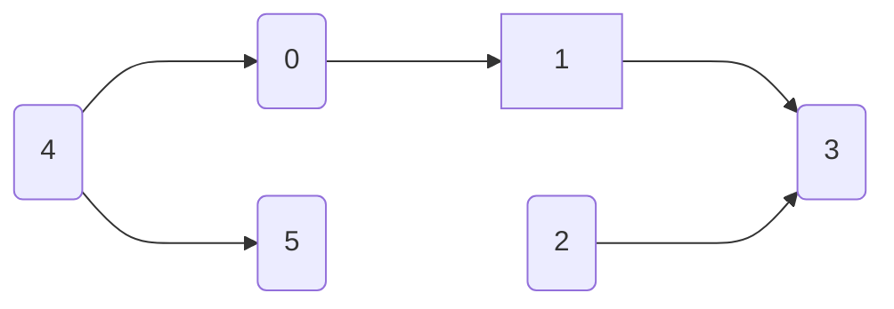

[1466. 重新规划路线](https://leetcode.cn/problems/reorder-routes-to-make-all-paths-lead-to-the-city-zero/)

中等

`n` 座城市，从 `0` 到 `n-1` 编号，其间共有 `n-1` 条路线。因此，要想在两座不同城市之间旅行只有唯一一条路线可供选择（路线网形成一颗树）。去年，交通运输部决定重新规划路线，以改变交通拥堵的状况。

路线用 `connections` 表示，其中 `connections[i] = [a, b]` 表示从城市 `a` 到 `b` 的一条有向路线。

今年，城市 0 将会举办一场大型比赛，很多游客都想前往城市 0 。

请你帮助重新规划路线方向，使每个城市都可以访问城市 0 。返回需要变更方向的最小路线数。

题目数据 **保证** 每个城市在重新规划路线方向后都能到达城市 0 。

**示例 1：**

****

**输入：** n = 6, connections = `[[0,1],[1,3],[2,3],[4,0],[4,5]]`  
**输出：** 3  
**解释：** 更改以红色显示的路线的方向，使每个城市都可以到达城市 0 。  

**示例 2：**

****

**输入：** n = 5, connections = `[[1,0],[1,2],[3,2],[3,4]]`  
**输出：** 2  
**解释：** 更改以红色显示的路线的方向，使每个城市都可以到达城市 0 。  

**示例 3：**

**输入：** n = 3, connections = `[[1,0],[2,0]]`  
**输出：** 0

**提示：**

- `2 <= n <= 5 * 10⁴`
- `connections.length == n-1`
- `connections[i].length == 2`
- `0 <= connections[i][0], connections[i][1] <= n-1`
- `connections[i][0] != connections[i][1]`
---- ----

### BFS

[【重新规划路线】bfs - Ikaruga](https://leetcode.cn/problems/reorder-routes-to-make-all-paths-lead-to-the-city-zero/solutions/)

```cpp
class Solution {
public:
    int minReorder(int n, vector<vector<int>>& connections) {
        vector<vector<int>> conn(n, vector<int>());
        int size = connections.size();
        for (int i = 0; i < size; i++) {
            conn[connections[i][0]].push_back(i);
            conn[connections[i][1]].push_back(i);
        }
        vector<bool> vi(size, false);
        int ans = 0;
        queue<int> queue;
        queue.push(0);

        while (!queue.empty()) {
            auto q = queue.front();
            queue.pop();

            for (auto idx: conn[q]) {
                if (vi[idx]) continue;
                vi[idx] = true;

                int a = connections[idx][0]; // start
                int b = connections[idx][1];
                ans += (a == q); // q == a 表示有个从q开始的路径，需要转向+1
                a = (a == q) ? b: a; // 如果有从a到b的路径，将b加入queue；
                queue.push(a);
            }
        }
        return ans;
    }
};
```
### DFS
```cpp
class Solution {
public:
    int minReorder(int n, vector<vector<int>>& connections) {
        // 构建图的邻接表
        vector<vector<int>> forward(n); // 原始方向
        vector<vector<int>> backward(n); // 反向方向
        
        for (const auto& conn : connections) {
            forward[conn[0]].push_back(conn[1]);
            backward[conn[1]].push_back(conn[0]);
        }
        
        vector<bool> visited(n, false);
        int changes = 0;
        
        // DFS 函数
        auto dfs = [&](auto&& dfs, int node) -> void {
            visited[node] = true;
            for (int neighbor : forward[node]) {
                if (!visited[neighbor]) {
                    changes++; // 需要改变方向
                    dfs(dfs, neighbor);
                }
            }
            for (int neighbor : backward[node]) {
                if (!visited[neighbor]) {
                    dfs(dfs, neighbor);
                }
            }
        };
        
        // 从节点 0 开始 DFS
        dfs(dfs, 0);
        
        return changes;
    }
};
```

`n = 6 connections = {{0, 1}, {1, 3}, {2, 3}, {4, 0}, {4, 5}}`



**步骤**：

| 0    | 1    | 2    | 3       | 4       | 5   |
| ---- | ---- | ---- | ------- | ------- | --- |
| {1}, | {3}, | {3}, | {},     | {0, 5}, | {}  |
| {4}, | {0}, | {},  | {1, 2}, | {},     | {4} |

1. 构建图：
    
    - `forward`:  { {1}, {3}, {3}, {}, {0, 5}, {} }
    - `backward`: { {4}, {0}, {}, {1, 2}, {}, {4} }
2. DFS 遍历：
    
    - 从节点 0 开始：
        - 访问节点 0，标记为已访问。
        - 遇到邻居节点 1，需要改变方向，计数器加一，递归访问节点 1。
            - 访问节点 1，标记为已访问。
            - 遇到邻居节点 3，需要改变方向，计数器加一，递归访问节点 3。
                - 访问节点 3，标记为已访问。
                - 没有未访问的邻居，返回。
            - 遇到反向邻居节点 0，已经访问过，跳过。
        - 遇到反向邻居节点 4，递归访问节点 4。
            - 访问节点 4，标记为已访问。
            - 遇到邻居节点 0，已经访问过，跳过。
            - 遇到邻居节点 5，需要改变方向，计数器加一，递归访问节点 5。
                - 访问节点 5，标记为已访问。
                - 没有未访问的邻居，返回。
        - 遇到反向邻居节点 2，递归访问节点 2。
            - 访问节点 2，标记为已访问。
            - 遇到邻居节点 3，已经访问过，跳过。
            - 没有未访问的邻居，返回。

最终计数器 `changes` 为 3，表示需要改变方向的道路数量。

#Leetcode-75; #graph; #depth-first-search;